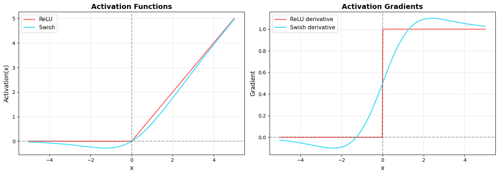
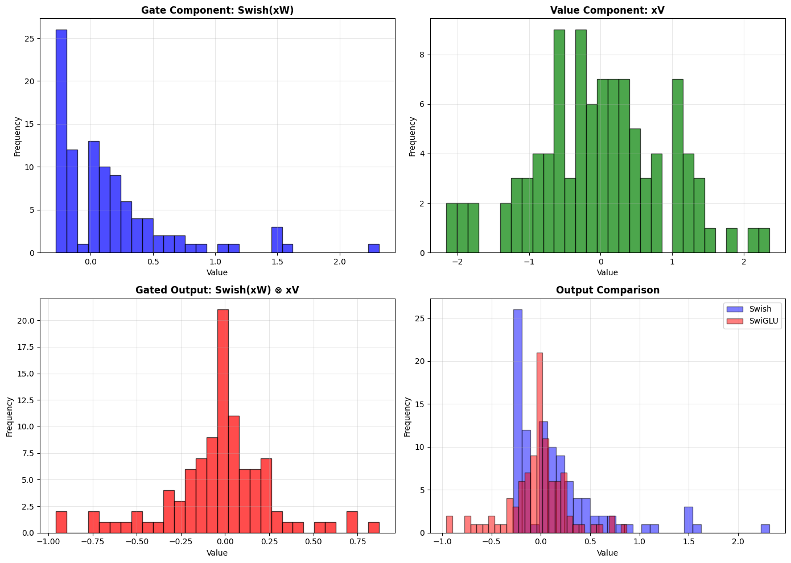

# Understanding SwiGLU in Modern Large Language Models

## What is SwiGLU?

SwiGLU (Swish-Gated Linear Unit) is an activation function used in the feed-forward networks (FFN) of modern transformer-based language models. It was introduced in the paper "GLU Variants Improve Transformer" by Shazeer (2020) and has since become a standard component in state-of-the-art LLMs like PaLM, LLaMA, and DeepSeek. Follow along to see an interactive visualization where you can see the differences of ReLU, Swish, and SwiGLU on a scalar input x.

## Mathematical Definitions

### Sigmoid Function
The sigmoid function σ is defined as:

```
σ(x) = 1 / (1 + e^(-x))
```

**Properties:**
- Output range: (0, 1)
- Smooth, differentiable S-shaped curve
- Derivative: σ'(x) = σ(x)(1 - σ(x))

### GLU (Gated Linear Unit)
Given an input vector **x** ∈ ℝ^d and weight matrices **W**, **V** ∈ ℝ^(d × d_ff), GLU is defined as:

```
GLU(x, W, V) = (xW + b) ⊗ σ(xV + c)
                ↑           ↑
              value    sigmoid gate
```

Where:
- ⊗ denotes element-wise (Hadamard) multiplication
- **b**, **c** ∈ ℝ^d_ff are bias vectors
- σ is the sigmoid activation function
- The **sigmoid gate** σ(xV + c) controls what information passes through

### Swish Function (SiLU)

After GLU demonstrated the power of gating mechanisms, researchers continued searching for better activation functions that could work both standalone and within gated architectures. Swish (also called SiLU) was introduced by Google researchers in 2017 through neural architecture search - essentially, they let AI discover better activation functions automatically. What made Swish special was its **self-gating property**: unlike GLU which uses a separate sigmoid gate, Swish gates the input with itself (x · σ(x)), creating a smoother, more adaptive non-linearity. This self-gating provides several advantages over simple ReLU or even GLU's sigmoid: it has continuous derivatives everywhere (no sharp corners like ReLU), it's unbounded above (preserving large positive values), and crucially, it showed consistent improvements across various deep learning tasks. The success of Swish suggested that combining its smooth, self-gated properties with GLU's explicit gating mechanism could yield even better results - and this hypothesis led directly to the creation of SwiGLU, which replaces GLU's simple sigmoid gate with the more sophisticated Swish activation.

The Swish activation function, parameterized by β, is defined as:

```
Swish_β(x) = x · σ(βx) = x / (1 + e^(-βx))
```

When β = 1, this is also called SiLU (Sigmoid Linear Unit):

```
SiLU(x) = x / (1 + e^(-x))
```

**Properties:**
- Smooth, non-monotonic function
- Self-gated: uses its own value for gating
- Bounded below by a linear function
- As β → ∞, Swish approaches ReLU
- Unbounded above: preserves large positive values
- Derivative: Swish'(x) = Swish(x) + σ(βx)(1 - Swish(x))

### SwiGLU (Swish-Gated Linear Unit)
SwiGLU combines the Swish activation with the GLU gating mechanism, **replacing the sigmoid gate with a Swish gate**:

```
SwiGLU(x, W, V) = Swish(xW + b) ⊗ (xV + c)
                      ↑              ↑
                  Swish gate       value
```

Expanding the Swish component:

```
SwiGLU(x, W, V) = [(xW + b) ⊗ σ(xW + b)] ⊗ (xV + c)
```

Where:
- **x** ∈ ℝ^d_model is the input vector
- **W**, **V** ∈ ℝ^(d_model × d_ff) are learnable weight matrices
- **b**, **c** ∈ ℝ^d_ff are learnable bias vectors
- d_ff is typically (8/3) × d_model for parameter efficiency
- The output dimension is ℝ^d_ff

**Key Innovation:** The Swish gate provides smoother gradients and better performance than the simple sigmoid gate used in GLU.

### Complete SwiGLU FFN
In a transformer, the complete SwiGLU feed-forward network includes an output projection:

```
FFN_SwiGLU(x) = SwiGLU(x, W, V) · W_out + b_out
```

Where:
- **W_out** ∈ ℝ^(d_ff × d_model) projects back to model dimension
- **b_out** ∈ ℝ^d_model is the output bias
- Final output shape matches input: ℝ^d_model

## Why Swish Gate Performs Better Than Sigmoid Gate

### Theoretical Rationale:

**1. Smoother Gradients**
- **Sigmoid**: Has very flat gradients when |x| is large (vanishing gradient problem)
- **Swish**: Has non-zero gradients even for negative values, allowing better gradient flow during backpropagation

**2. Non-Monotonicity**
- **Sigmoid**: Monotonically increasing (always goes up)
- **Swish**: Non-monotonic (has a small "dip" near x ≈ -1.25)
- This non-monotonicity allows the network to learn more complex decision boundaries

**3. Self-Gating Property**
- **Swish(x) = x · σ(x)**: The input gates *itself*
- This creates a richer gating mechanism where the magnitude of x influences how much of x passes through
- Sigmoid gates don't have this self-referential property

**4. Unbounded Above**
- **Sigmoid**: Bounded (0, 1) - compresses all values
- **Swish**: Unbounded above - can preserve large positive values better
- This prevents information loss for important features with large magnitudes

### Empirical Findings (from Shazeer 2020 paper):

**1. Consistent Performance Gains**
- SwiGLU outperformed GLU variants across multiple tasks
- Improvements of 5-8% in perplexity on language modeling benchmarks

**2. Better Training Dynamics**
- Faster convergence during training
- More stable training with fewer optimization issues

**3. Scalability**
- Benefits become more pronounced at larger model scales
- This is why it's adopted in billion+ parameter models (LLaMA, PaLM)

### Practical Intuition:

Think of it this way:
- **Sigmoid gate**: Binary-ish switch (0 or 1) - "pass or block"
- **Swish gate**: Contextual amplifier - "how much should I amplify this based on its own value?"

The Swish gate can say: "This is a large positive value, let's keep it large" or "This is slightly negative, let's attenuate it a bit but not kill it completely" - much more nuanced than sigmoid's simple on/off behavior.


## Interactive Visualization



## The Evolution: From ReLU to SwiGLU

### Traditional Feed-Forward Network (ReLU-based)

In early transformers, the feed-forward network used a simple structure:

```python
import numpy as np
import matplotlib.pyplot as plt

# Traditional FFN with ReLU
def relu(x):
    """
    ReLU (Rectified Linear Unit) activation function.
    
    Args:
        x (np.ndarray): Input array of any shape. Each element is processed independently.
    
    Returns:
        np.ndarray: Output array of same shape as input, where each element is max(0, x).
    """
    return np.maximum(0, x)

def traditional_ffn(x, W1, W2, b1, b2):
    """
    Traditional Feed-Forward Network with ReLU activation.
    
    Formula: FFN(x) = ReLU(xW1 + b1)W2 + b2
    
    Args:
        x (np.ndarray): Input tensor of shape (..., d_model) where ... represents 
                        any number of batch/sequence dimensions and d_model is the model dimension.
        W1 (np.ndarray): First weight matrix of shape (d_model, d_ff) where d_ff 
                         is the hidden dimension (typically 4 * d_model).
        W2 (np.ndarray): Second weight matrix of shape (d_ff, d_model) to project 
                         back to model dimension.
        b1 (np.ndarray): First bias vector of shape (d_ff,).
        b2 (np.ndarray): Second bias vector of shape (d_model,).
    
    Returns:
        np.ndarray: Output tensor of shape (..., d_model), same shape as input x.
    """
    hidden = relu(x @ W1 + b1)
    output = hidden @ W2 + b2
    return output
```

### GLU (Gated Linear Unit)

GLU introduced gating mechanisms, splitting the hidden dimension:

```python
def sigmoid(x):
    """
    Sigmoid activation function.
    
    Args:
        x (np.ndarray): Input array of any shape.
    
    Returns:
        np.ndarray: Output array with values in range (0, 1).
    """
    return 1 / (1 + np.exp(-x))

def glu(x, W, V, b, c):
    """
    GLU (Gated Linear Unit) activation function.
    
    Formula: GLU(x) = (xW + b) ⊗ σ(xV + c)
    where ⊗ is element-wise multiplication and σ is the sigmoid function.
    
    Args:
        x (np.ndarray): Input tensor of shape (..., d_model).
        W (np.ndarray): First weight matrix of shape (d_model, d_ff) for the value component.
        V (np.ndarray): Second weight matrix of shape (d_model, d_ff) for the gate component.
        b (np.ndarray): Bias vector for value component of shape (d_ff,).
        c (np.ndarray): Bias vector for gate component of shape (d_ff,).
    
    Returns:
        np.ndarray: Output tensor of shape (..., d_ff) where the value component is 
                    element-wise multiplied by the sigmoid-gated component.
    """
    # Value component (linear transformation)
    value = x @ W + b
    
    # Gate component (sigmoid activation)
    gate = sigmoid(x @ V + c)
    
    # Element-wise multiplication: value gated by sigmoid
    return value * gate
```

### Swish Activation

```python
def swish(x, beta=1):
    """
    Swish activation function (also known as SiLU - Sigmoid Linear Unit when beta=1).
    
    Formula: Swish(x) = x * σ(βx) where σ is the sigmoid function.
    
    Args:
        x (np.ndarray): Input array of any shape. Each element is processed independently.
        beta (float, optional): Scaling parameter for the sigmoid. Default is 1.
                                Higher beta makes Swish behave more like ReLU,
                                lower beta makes it more linear.
    
    Returns:
        np.ndarray: Output array of same shape as input, with Swish activation applied 
                    element-wise.
    """
    return x * sigmoid(beta * x)
```

### SwiGLU: The Modern Standard

SwiGLU combines the Swish activation function with GLU's gating mechanism:

```python
def swiglu(x, W, V, b, c, beta=1):
    """
    SwiGLU (Swish-Gated Linear Unit) activation function.
    
    Formula: SwiGLU(x) = Swish(xW + b) ⊗ (xV + c)
    where ⊗ is element-wise multiplication.
    
    Args:
        x (np.ndarray): Input tensor of shape (..., d_model).
        W (np.ndarray): First weight matrix of shape (d_model, d_ff) for the gate component.
        V (np.ndarray): Second weight matrix of shape (d_model, d_ff) for the value component.
        b (np.ndarray): Bias vector for gate component of shape (d_ff,).
        c (np.ndarray): Bias vector for value component of shape (d_ff,).
        beta (float, optional): Swish activation parameter. Default is 1.
    
    Returns:
        np.ndarray: Output tensor of shape (..., d_ff) where the Swish-activated gate 
                    component is element-wise multiplied by the linear value component.
    """
    # Gate component (Swish activation) - controls information flow
    gate = swish(x @ W + b, beta)
    
    # Value component (linear transformation) - the actual information
    value = x @ V + c
    
    # Element-wise multiplication: value gated by Swish
    return gate * value
```

## Complete SwiGLU FFN Implementation

Here's a full implementation of a SwiGLU-based feed-forward network:

```python
class SwiGLU_FFN:
    def __init__(self, d_model, d_ff, beta=1):
        """
        SwiGLU Feed-Forward Network
        
        Args:
            d_model (int): Model dimension (input and output dimension). This is typically
                          the hidden size of the transformer (e.g., 512, 768, 1024, etc.).
            d_ff (int): Hidden dimension for the feed-forward layer. For SwiGLU, this is 
                       typically (8/3) * d_model (approximately 2.67x) to maintain similar 
                       parameter count to traditional FFN with 4 * d_model expansion, while 
                       accounting for SwiGLU's third weight matrix. For example, if d_model=512, 
                       d_ff would be around 1365. See the "Parameter Efficiency" section for 
                       detailed explanation.
            beta (float, optional): Parameter for Swish activation function. Default is 1.
                                   Controls the "sharpness" of the activation.
        """
        self.d_model = d_model
        self.d_ff = d_ff
        self.beta = beta
        
        # Initialize weights (in practice, these would be learned during training)
        # For GLU variants, we need two projection matrices for the gating mechanism
        self.W = np.random.randn(d_model, d_ff) * 0.01      # Gate projection weights
        self.V = np.random.randn(d_model, d_ff) * 0.01      # Value projection weights
        self.W_out = np.random.randn(d_ff, d_model) * 0.01  # Output projection weights
        
        self.b = np.zeros(d_ff)          # Gate projection bias
        self.c = np.zeros(d_ff)          # Value projection bias
        self.b_out = np.zeros(d_model)   # Output projection bias
    
    def forward(self, x):
        """
        Forward pass through SwiGLU FFN
        
        Args:
            x (np.ndarray): Input tensor of shape (batch_size, seq_len, d_model) or 
                           (..., d_model) for any number of leading dimensions.
                           Represents the input embeddings or hidden states.
        
        Returns:
            np.ndarray: Output tensor of shape (batch_size, seq_len, d_model) or 
                       (..., d_model), same shape as input. Represents the transformed
                       hidden states after passing through the SwiGLU FFN.
        """
        # Gate component: Swish(xW + b) - controls what information passes through
        gate_linear = x @ self.W + self.b
        gate = swish(gate_linear, self.beta)  # Apply Swish activation to gate
        
        # Value component: xV + c - the actual information to be gated
        value = x @ self.V + self.c
        
        # Gated output: element-wise multiplication of gate and value
        hidden = gate * value
        
        # Project back to model dimension
        output = hidden @ self.W_out + self.b_out
        
        return output

# Example usage
d_model = 512
d_ff = int(8/3 * d_model)  # ~1365, commonly used ratio for SwiGLU
batch_size = 4
seq_len = 10

# Create random input
x = np.random.randn(batch_size, seq_len, d_model)

# Initialize and run SwiGLU FFN
ffn = SwiGLU_FFN(d_model, d_ff)
output = ffn.forward(x)

print(f"Input shape: {x.shape}")
print(f"Output shape: {output.shape}")
print(f"Number of parameters: {(d_model * d_ff * 2) + (d_ff * d_model)}")
```

```
Input shape: (4, 10, 512)
Output shape: (4, 10, 512)
Number of parameters: 2096640
```

## Visualization: Activation Functions and Their Derivatives

```python
# Visualization of activation functions and their derivatives
x = np.linspace(-5, 5, 1000)

# Activations
relu_vals = relu(x)
swish_vals = swish(x)

# Derivatives (computed numerically for visualization)
dx = x[1] - x[0]
relu_grad = np.gradient(relu_vals, dx)
swish_grad = np.gradient(swish_vals, dx)

fig, (ax1, ax2) = plt.subplots(1, 2, figsize=(14, 5))

# Plot activations
ax1.plot(x, relu_vals, label='ReLU', linewidth=2, color='#ff6b6b')
ax1.plot(x, swish_vals, label='Swish', linewidth=2, color='#48dbfb')
ax1.axhline(y=0, color='k', linestyle='--', alpha=0.3)
ax1.axvline(x=0, color='k', linestyle='--', alpha=0.3)
ax1.set_xlabel('x', fontsize=12)
ax1.set_ylabel('Activation(x)', fontsize=12)
ax1.set_title('Activation Functions', fontsize=14, fontweight='bold')
ax1.legend(fontsize=11)
ax1.grid(True, alpha=0.3)

# Plot gradients
ax2.plot(x, relu_grad, label='ReLU derivative', linewidth=2, color='#ff6b6b')
ax2.plot(x, swish_grad, label='Swish derivative', linewidth=2, color='#48dbfb')
ax2.axhline(y=0, color='k', linestyle='--', alpha=0.3)
ax2.axvline(x=0, color='k', linestyle='--', alpha=0.3)
ax2.set_xlabel('x', fontsize=12)
ax2.set_ylabel('Gradient', fontsize=12)
ax2.set_title('Activation Gradients', fontsize=14, fontweight='bold')
ax2.legend(fontsize=11)
ax2.grid(True, alpha=0.3)

plt.tight_layout()
plt.savefig('activation_comparison.png', dpi=300, bbox_inches='tight')
plt.show()

print("Key observations:")
print("- ReLU has a discontinuous gradient at x=0 (sudden jump)")
print("- Swish has smooth, continuous gradients")
print("- Swish allows small negative values to pass through (unlike ReLU)")
```



## Visualization: Gating Mechanism

```python
# Demonstration of gating effect
np.random.seed(42)
sample_input = np.random.randn(100)

# Create weight matrices for demonstration
W_demo = np.random.randn(100, 100) * 0.1
V_demo = np.random.randn(100, 100) * 0.1

# Without gating (traditional)
swish_output = swish(sample_input @ W_demo)

# With gating (SwiGLU)
gate_part = swish_output                      # GATE: Swish-activated component
linear_part = sample_input @ V_demo           # VALUE: Linear component
swiglu_output = gate_part * linear_part       # GATED OUTPUT

fig, axes = plt.subplots(2, 2, figsize=(14, 10))

# Plot gate component
axes[0, 0].hist(gate_part, bins=30, alpha=0.7, color='blue', edgecolor='black')
axes[0, 0].set_title('Gate Component: Swish(xW)', fontsize=12, fontweight='bold')
axes[0, 0].set_xlabel('Value')
axes[0, 0].set_ylabel('Frequency')
axes[0, 0].grid(True, alpha=0.3)

# Plot linear component
axes[0, 1].hist(linear_part, bins=30, alpha=0.7, color='green', edgecolor='black')
axes[0, 1].set_title('Value Component: xV', fontsize=12, fontweight='bold')
axes[0, 1].set_xlabel('Value')
axes[0, 1].set_ylabel('Frequency')
axes[0, 1].grid(True, alpha=0.3)

# Plot gated output
axes[1, 0].hist(swiglu_output, bins=30, alpha=0.7, color='red', edgecolor='black')
axes[1, 0].set_title('Gated Output: Swish(xW) ⊗ xV', fontsize=12, fontweight='bold')
axes[1, 0].set_xlabel('Value')
axes[1, 0].set_ylabel('Frequency')
axes[1, 0].grid(True, alpha=0.3)

# Plot comparison
axes[1, 1].hist(swish_output, bins=30, alpha=0.5, color='blue', 
                label='Swish', edgecolor='black')
axes[1, 1].hist(swiglu_output, bins=30, alpha=0.5, color='red', 
                label='SwiGLU', edgecolor='black')
axes[1, 1].set_title('Output Comparison', fontsize=12, fontweight='bold')
axes[1, 1].set_xlabel('Value')
axes[1, 1].set_ylabel('Frequency')
axes[1, 1].legend()
axes[1, 1].grid(True, alpha=0.3)

plt.tight_layout()
plt.savefig('gating_mechanism.png', dpi=300, bbox_inches='tight')
plt.show()

print("\nGating allows the network to:")
print("- Modulate information flow based on context")
print("- Learn which features to emphasize or suppress")
print("- Create more expressive representations")
```




## Understanding Parameter Efficiency: Why (8/3) × d_model?

A common point of confusion with SwiGLU is the intermediate dimension ratio. Let's clarify this carefully.

### Traditional FFN (ReLU/GELU) - 2 Weight Matrices

A standard feed-forward network has **two weight matrices**:

```python
# Traditional FFN structure
# W1: d_model × d_ff  (expansion)
# W2: d_ff × d_model  (projection back)
# Total parameters: 2 × d_model × d_ff

# Standard practice: d_ff = 4 × d_model
# Example: if d_model = 512, then d_ff = 2048
```

**Parameter count**: `2 × d_model × d_ff = 2 × d_model × (4 × d_model) = 8 × d_model²`

### SwiGLU FFN - 3 Weight Matrices

SwiGLU, as a GLU variant, requires **three weight matrices**:

```python
# SwiGLU FFN structure
# W: d_model × d_ff   (gate path)
# V: d_model × d_ff   (value path)
# W_out: d_ff × d_model  (projection back)
# Total parameters: 3 × d_model × d_ff

# If we naively kept d_ff = 4 × d_model:
# Parameters would be: 3 × d_model × (4 × d_model) = 12 × d_model²
# That's 50% MORE parameters than traditional FFN!
```

### The 2/3 Compensation Rule

To keep parameter count similar to traditional FFN, we apply a **2/3 reduction**:

```
New d_ff = (2/3) × Old d_ff
```

This compensates for having 3 matrices instead of 2:
- 3 matrices with (2/3) size ≈ 2 matrices with full size
- `3 × (2/3) = 2`

### Combining the Rules: The 8/3 Ratio

Modern LLMs (LLaMA, PaLM, Mistral) want to:
1. **Maintain the 4:1 expansion** from original Transformers (proven effective)
2. **Use SwiGLU** for better performance
3. **Keep similar parameter count** for fair comparison

The math:
```
Target expansion ratio: 4 × d_model
Apply GLU compensation: (2/3) × 4 × d_model = (8/3) × d_model ≈ 2.67 × d_model
```

**Concrete example**:
```python
d_model = 512

# Traditional FFN
d_ff_traditional = 4 * d_model = 2048
params_traditional = 2 * 512 * 2048 = 2,097,152 parameters

# SwiGLU FFN
d_ff_swiglu = (8/3) * d_model ≈ 1365
params_swiglu = 3 * 512 * 1365 = 2,097,120 parameters

# Nearly identical parameter counts!
```

### Key Takeaway

**The (8/3) ratio is not arbitrary** - it's the result of:
- Starting with the proven 4:1 expansion ratio
- Applying the 2/3 reduction to account for the third matrix
- Ensuring parameter parity with traditional FFNs

This allows fair performance comparisons: any gains from SwiGLU are due to the activation function itself, not from having more parameters.

## Architecture Comparison

SwiGLU fits into the transformer architecture as a drop-in replacement for the traditional FFN layer. In modern transformers using SwiGLU:

**Transformer Block Structure:**
1. Input Embeddings
2. Multi-Head Attention
3. Add & Norm (residual connection + layer normalization)
4. **Feed-Forward Network (SwiGLU)** ← This is where SwiGLU replaces ReLU/GELU FFN
5. Add & Norm
6. Output to next layer

The key difference is only in step 4, where the FFN activation changes from simple ReLU/GELU to the gated SwiGLU mechanism, providing better gradient flow and expressiveness without changing the overall architecture.

## Real-World Impact

SwiGLU is used in many state-of-the-art models:

- **LLaMA / LLaMA 2 / LLaMA 3**: Meta's open-source language models
- **PaLM / PaLM 2**: Google's pathways language model
- **DeepSeek**: State-of-the-art reasoning model
- **Falcon**: Technology Innovation Institute's LLM
- **Mistral**: Mistral AI's efficient language models

## Summary

**Why SwiGLU was invented:**

1. **Smoother gradients**: Swish activation provides better gradient flow than ReLU and sigmoid
2. **Gating mechanism**: Allows selective information flow and better feature learning
3. **Empirical superiority**: Consistently outperforms ReLU, GELU, and GLU in practice
4. **Parameter efficiency**: Achieves better performance with similar or fewer parameters
5. **Scalability**: Benefits increase with model size, making it ideal for billion+ parameter models

**Key advantages over predecessors:**

| Aspect | ReLU | GLU (Sigmoid) | SwiGLU |
|--------|------|---------------|--------|
| Gradient smoothness | ❌ Discontinuous | ✅ Smooth | ✅ Smooth |
| Negative values | ❌ Blocked | ✅ Gated | ✅ Swish-gated |
| Gating mechanism | ❌ None | ✅ Sigmoid gate | ✅ Swish gate |
| Self-gating | ❌ No | ❌ No | ✅ Yes |
| Unbounded above | ✅ Yes | ❌ No | ✅ Yes |
| Number of matrices | 2 | 3 | 3 |
| Expressiveness | Low | Medium-High | High |
| Performance gain | Baseline | +3-5% | +5-8% |

The innovation of SwiGLU represents the transformer field's evolution toward more sophisticated activation functions that better capture complex patterns in language data, leading to more capable and efficient language models.


## References and Further Reading

### Primary Papers

1. **Shazeer, N. (2020).** "GLU Variants Improve Transformer." *arXiv preprint arXiv:2002.05202*. 
   - [Paper Link](https://arxiv.org/abs/2002.05202)
   - The original paper introducing SwiGLU and comparing various GLU variants.

2. **Ramachandran, P., Zoph, B., & Le, Q. V. (2017).** "Searching for Activation Functions." *arXiv preprint arXiv:1710.05941*.
   - [Paper Link](https://arxiv.org/abs/1710.05941)
   - Introduces Swish activation function discovered through neural architecture search.

3. **Dauphin, Y. N., Fan, A., Auli, M., & Grangier, D. (2017).** "Language Modeling with Gated Convolutional Networks." *International Conference on Machine Learning (ICML)*.
   - [Paper Link](https://arxiv.org/abs/1612.08083)
   - Introduces Gated Linear Units (GLU) for sequence modeling.

### Models Using SwiGLU

4. **Touvron, H., et al. (2023).** "LLaMA: Open and Efficient Foundation Language Models." *arXiv preprint arXiv:2302.13971*.
   - [Paper Link](https://arxiv.org/abs/2302.13971)
   - Meta's LLaMA models use SwiGLU in their feed-forward networks.

5. **Touvron, H., et al. (2023).** "Llama 2: Open Foundation and Fine-Tuned Chat Models." *arXiv preprint arXiv:2307.09288*.
   - [Paper Link](https://arxiv.org/abs/2307.09288)
   - LLaMA 2 continues using SwiGLU architecture.
