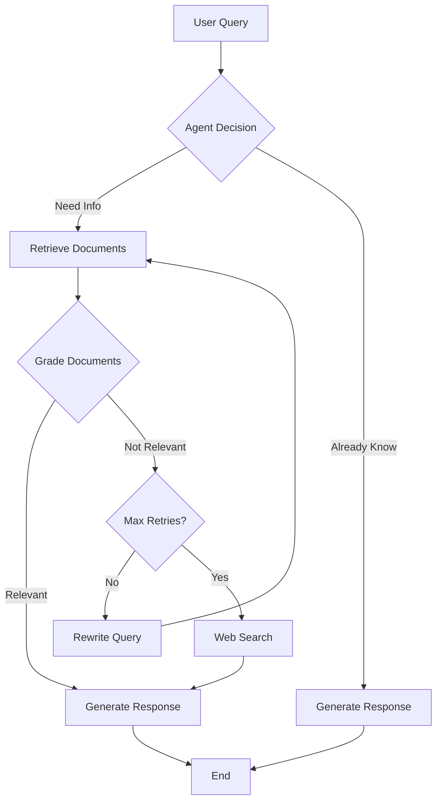

Build a production-ready Agentic RAG system that thinks, corrects itself, and adapts—using LangGraph for orchestration, Ollama for local inference, and fully open-source tools. This tutorial includes complete implementation with document grading, query rewriting, and intelligent fallback mechanisms.


---

## 1. Introduction to LangGraph {#introduction}

**LangGraph** is a low-level orchestration framework developed by LangChain for building stateful, multi-agent applications with Large Language Models (LLMs). Unlike traditional RAG systems that follow a simple retrieve-and-generate pattern, LangGraph enables you to create intelligent agents that can:

- **Make decisions dynamically** during workflow execution
- **Maintain state** across multiple interactions
- **Execute cyclical workflows** with conditional branching
- **Implement human-in-the-loop** patterns
- **Persist conversation history** with built-in checkpointing

### Key Concepts in LangGraph (2025)

LangGraph provides two main APIs as of 2025:

1. **Graph API (StateGraph)**: The traditional approach where you explicitly define nodes, edges, and state
2. **Functional API** (Released Jan 2025): A newer, more Pythonic approach using decorators

For this tutorial, we'll focus on the **Graph API** as it provides more granular control and is better suited for understanding agentic workflows.

### Core Components

- **State**: A TypedDict or Pydantic model that defines the data structure passed between nodes
- **Nodes**: Functions that perform specific operations (retrieve documents, generate responses, grade relevance, etc.)
- **Edges**: Connections between nodes that define the flow
- **Conditional Edges**: Dynamic routing based on the current state
- **Checkpointing**: Built-in persistence for conversation history and state management

---

## 2. What is Agentic RAG? {#what-is-agentic-rag}

### Traditional RAG vs Agentic RAG

**Traditional RAG** follows a simple, linear flow:
```
User Query → Retrieve Documents → Generate Response
```

**Agentic RAG** introduces intelligence and decision-making:
```
User Query → Agent Decision (Should I retrieve?) 
          → Retrieve Documents 
          → Grade Relevance (Are these good?)
          → Rewrite Query (If not relevant)
          → Retry Retrieval OR Web Search
          → Generate Response
```

### Why Agentic RAG?

Traditional RAG systems have several limitations:

1. **No relevance checking**: They blindly use whatever documents are retrieved
2. **No retry logic**: If retrieval fails, the system gives up
3. **No self-correction**: Cannot detect when it's on the wrong track
4. **Limited adaptability**: Cannot decide when to use different tools

Agentic RAG solves these problems by:

- **Grading retrieved documents** for relevance
- **Rewriting queries** when documents aren't helpful
- **Falling back to web search** when local knowledge is insufficient
- **Making intelligent decisions** about which tools to use

---

## 3. Architecture Overview {#architecture}

Our Agentic RAG system will implement the following workflow:



### Components We'll Build

1. **State Management**: Define the graph state with messages and metadata
2. **Vector Store**: Use Chroma (open-source) for document embeddings
3. **Embedding Model**: Use open-source models via Ollama
4. **LLM**: Use Ollama for local, free inference
5. **Retriever Node**: Fetch relevant documents from vector store
6. **Grader Node**: Evaluate document relevance
7. **Rewriter Node**: Reformulate queries for better retrieval
8. **Generator Node**: Create final responses
9. **Web Search Node**: Fallback for missing information
10. **Routing Logic**: Conditional edges for intelligent flow control

---

## 4. Prerequisites & Setup {#prerequisites}

### System Requirements

- **Python**: 3.10 or higher
- **RAM**: Minimum 8GB (16GB recommended for larger models)
- **Storage**: 10GB+ for models and data
- **OS**: Windows, macOS, or Linux

### Installation Steps

```bash
# 1. Install Ollama (for local LLMs)
# Visit https://ollama.com/download and install for your OS
# Or use curl on Linux/Mac:
curl -fsSL https://ollama.com/install.sh | sh

!nohup ollama serve &
!sleep 5

# 2. Pull a local LLM model (we'll use Llama 3.1 8B)
ollama pull llama3.1:8b
# ollama pull phi3:mini  # Small 3.8B model

# 3. Pull an embedding model
ollama pull nomic-embed-text

# 4. Create a virtual environment
python -m venv venv
source venv/bin/activate  # On Windows: venv\Scripts\activate

# 5. Install required Python packages
pip install --upgrade pip
pip install langgraph==0.3.21
pip install langchain==0.3.11
pip install langchain-community==0.3.11
pip install langchain-google-genai==2.0.4
pip install chromadb==0.5.23
pip install beautifulsoup4==4.12.3
pip install duckduckgo-search==6.3.5
```

### Verify Ollama Installation

```bash
# Check if Ollama is running
ollama list

# Test the LLM
ollama run llama3.1:8b "Hello, how are you?"

# Test the embedding model
ollama run nomic-embed-text "This is a test"
```

---

## 5. Complete Implementation {#implementation}

Now let's build our complete Agentic RAG system. I'll provide the full, production-ready code with extensive comments.

### Step 1: Import Dependencies and Setup

```python
"""
Agentic RAG Application with LangGraph
This implementation uses fully open-source tools:
- Ollama for LLM inference (local, free)
- Nomic Embed for embeddings (via Ollama)
- Chroma for vector storage (open-source)
- DuckDuckGo for web search (free)
"""

from typing import Annotated, List, TypedDict, Literal
from langchain_core.messages import HumanMessage, AIMessage, SystemMessage, BaseMessage
from langchain_google_genai import ChatGoogleGenerativeAI, GoogleGenerativeAIEmbeddings
from langchain_community.vectorstores import Chroma
from langchain_community.document_loaders import WebBaseLoader
from langchain_text_splitters import RecursiveCharacterTextSplitter
from langchain_core.prompts import ChatPromptTemplate
from langchain_core.output_parsers import StrOutputParser
from langgraph.graph import StateGraph, END, START
from langgraph.graph.message import add_messages
from langgraph.checkpoint.memory import MemorySaver
from duckduckgo_search import DDGS
import os

# Configure environment
os.environ["USER_AGENT"] = "AgenticRAGBot/1.0"


# ============================================================================
# STEP 2: DEFINE THE STATE
# ============================================================================
# State is the data structure that flows through the graph.
# It contains all information needed by nodes to make decisions.

class AgentState(TypedDict):
    """
    The state of our agentic RAG system.
    
    Attributes:
        messages: Conversation history (user questions, AI responses)
        retrieval_question: The current question used for retrieval
        documents: Retrieved documents from vector store
        generation: The final generated response
        retry_count: Number of times we've rewritten the query
        web_search_needed: Flag indicating if web search is required
    """
    # add_messages is a special reducer that appends new messages to the list
    # instead of replacing the entire list
    messages: Annotated[List[BaseMessage], add_messages]
    retrieval_question: str
    documents: List[str]
    generation: str
    retry_count: int
    web_search_needed: bool


# ============================================================================
# STEP 3: INITIALIZE MODELS AND VECTOR STORE
# ============================================================================

# Option A: Using Ollama (Local, Free)
# from langchain_ollama import ChatOllama, OllamaEmbeddings
# llm = ChatOllama(model="llama3.1:8b", temperature=0)
# embeddings = OllamaEmbeddings(model="nomic-embed-text")

# Option B: Using Google Gemini (Cloud, Low-Cost)
from langchain_google_genai import ChatGoogleGenerativeAI, GoogleGenerativeAIEmbeddings
import os

# Set your API key (get free key at: https://aistudio.google.com/apikey)
os.environ["GOOGLE_API_KEY"] = "your-api-key-here"  # Replace with your key

# Initialize the LLM (using Gemini 2.0 Flash)
llm = ChatGoogleGenerativeAI(
    model="gemini-2.0-flash",  # Fast, cheap, powerful
    temperature=0,  # Set to 0 for more deterministic outputs
)

# Initialize the embedding model (using Google embeddings)
embeddings = GoogleGenerativeAIEmbeddings(
    model="models/text-embedding-004"  # Latest embedding model
)

# Initialize vector store (will be populated with documents)
vectorstore = None  # We'll initialize this after loading documents


# ============================================================================
# STEP 4: LOAD AND INDEX DOCUMENTS
# ============================================================================

def setup_vectorstore(urls: List[str]) -> Chroma:
    """
    Load documents from URLs, split them into chunks, and create a vector store.
    
    This function:
    1. Loads web pages using WebBaseLoader
    2. Splits documents into smaller chunks (for better retrieval)
    3. Creates embeddings for each chunk
    4. Stores everything in a Chroma vector database
    
    Args:
        urls: List of URLs to load and index
        
    Returns:
        Chroma vectorstore instance with indexed documents
    """
    print("Loading documents from URLs...")
    
    # Load documents from web pages
    docs = []
    for url in urls:
        try:
            loader = WebBaseLoader(url)
            docs.extend(loader.load())
            print(f"✓ Loaded: {url}")
        except Exception as e:
            print(f"✗ Failed to load {url}: {e}")
    
    if not docs:
        raise ValueError("No documents were successfully loaded!")
    
    print(f"\nTotal documents loaded: {len(docs)}")
    
    # Split documents into smaller chunks
    # This improves retrieval accuracy and fits within context windows
    text_splitter = RecursiveCharacterTextSplitter(
        chunk_size=500,      # Each chunk is ~500 characters
        chunk_overlap=50,    # 50 character overlap between chunks
        separators=["\n\n", "\n", " ", ""]  # Split on paragraphs first, then sentences
    )
    
    doc_splits = text_splitter.split_documents(docs)
    print(f"Documents split into {len(doc_splits)} chunks")
    
    # Create vector store with embeddings
    print("Creating embeddings and storing in Chroma...")
    vectorstore = Chroma.from_documents(
        documents=doc_splits,
        embedding=embeddings,
        collection_name="agentic-rag-collection",
        persist_directory="./chroma_db"  # Persist to disk
    )
    
    print("✓ Vector store created successfully!\n")
    return vectorstore


# ============================================================================
# STEP 5: RETRIEVER NODE
# ============================================================================

def retrieve_documents(state: AgentState) -> AgentState:
    """
    Retrieve relevant documents from the vector store.
    
    This node:
    1. Takes the current question from state
    2. Performs similarity search in the vector store
    3. Returns the top-k most relevant documents
    4. Updates the state with retrieved documents
    
    Args:
        state: Current agent state containing the question
        
    Returns:
        Updated state with retrieved documents
    """
    print("\n--- RETRIEVE DOCUMENTS ---")
    question = state["retrieval_question"]
    print(f"Query: {question}")
    
    # Perform similarity search (retrieve top 3 most relevant chunks)
    retriever = vectorstore.as_retriever(
        search_kwargs={"k": 3}  # Return top 3 documents
    )
    
    documents = retriever.invoke(question)
    
    # Extract the text content from documents
    doc_contents = [doc.page_content for doc in documents]
    
    print(f"Retrieved {len(doc_contents)} documents")
    for i, doc in enumerate(doc_contents, 1):
        print(f"\nDocument {i} (first 100 chars): {doc[:100]}...")
    
    return {
        **state,
        "documents": doc_contents
    }


# ============================================================================
# STEP 6: DOCUMENT GRADER NODE
# ============================================================================

def grade_documents(state: AgentState) -> AgentState:
    """
    Grade the relevance of retrieved documents to the question.
    
    This node:
    1. Uses the LLM to evaluate each retrieved document
    2. Determines if documents contain information relevant to the question
    3. Filters out irrelevant documents
    4. Sets a flag if web search is needed (when no relevant docs found)
    
    Args:
        state: Current agent state with retrieved documents
        
    Returns:
        Updated state with filtered documents and web_search_needed flag
    """
    print("\n--- GRADE DOCUMENTS ---")
    question = state["retrieval_question"]
    documents = state["documents"]
    
    # Create a prompt for the grader
    grader_prompt = ChatPromptTemplate.from_messages([
        ("system", """You are a grader assessing the relevance of retrieved documents to a user question.
        
Your task: Determine if the document contains keywords or semantic meaning related to the question.

Rules:
- Give a binary score: 'yes' or 'no'
- 'yes' means the document is relevant to the question
- 'no' means the document is not relevant
- Be strict: only mark as 'yes' if there's clear relevance

Return ONLY the word 'yes' or 'no', nothing else."""),
        ("human", "Question: {question}\n\nDocument: {document}\n\nIs this document relevant?")
    ])
    
    grader_chain = grader_prompt | llm | StrOutputParser()
    
    # Grade each document
    filtered_docs = []
    for i, doc in enumerate(documents, 1):
        print(f"\nGrading document {i}...")
        score = grader_chain.invoke({
            "question": question,
            "document": doc
        }).strip().lower()
        
        if "yes" in score:
            print(f"✓ Document {i}: RELEVANT")
            filtered_docs.append(doc)
        else:
            print(f"✗ Document {i}: NOT RELEVANT")
    
    # Determine if we need web search
    web_search_needed = len(filtered_docs) == 0
    
    if web_search_needed:
        print("\n⚠ No relevant documents found. Web search will be triggered.")
    else:
        print(f"\n✓ {len(filtered_docs)} relevant document(s) found.")
    
    return {
        **state,
        "documents": filtered_docs,
        "web_search_needed": web_search_needed
    }


# ============================================================================
# STEP 7: QUERY REWRITER NODE
# ============================================================================

def rewrite_query(state: AgentState) -> AgentState:
    """
    Rewrite the query to improve retrieval results.
    
    This node:
    1. Takes the original question
    2. Uses the LLM to reformulate it for better search results
    3. Updates the retrieval_question in state
    4. Increments retry counter
    
    Args:
        state: Current agent state
        
    Returns:
        Updated state with rewritten query
    """
    print("\n--- REWRITE QUERY ---")
    original_question = state["retrieval_question"]
    retry_count = state.get("retry_count", 0)
    
    print(f"Original query: {original_question}")
    print(f"Retry attempt: {retry_count + 1}")
    
    # Create a prompt for query rewriting
    rewriter_prompt = ChatPromptTemplate.from_messages([
        ("system", """You are a question re-writer. Your task is to reformulate the input question to improve retrieval.
        
Your goal: Convert the question into a better version optimized for semantic search.

Strategies:
- Add relevant synonyms and related terms
- Make the question more specific and detailed
- Remove ambiguity
- Focus on key concepts

Return ONLY the rewritten question, nothing else."""),
        ("human", "Original question: {question}\n\nRewrite this question:")
    ])
    
    rewriter_chain = rewriter_prompt | llm | StrOutputParser()
    
    rewritten_question = rewriter_chain.invoke({
        "question": original_question
    }).strip()
    
    print(f"Rewritten query: {rewritten_question}")
    
    return {
        **state,
        "retrieval_question": rewritten_question,
        "retry_count": retry_count + 1
    }


# ============================================================================
# STEP 8: WEB SEARCH NODE
# ============================================================================

def web_search(state: AgentState) -> AgentState:
    """
    Perform web search when local documents are insufficient.
    
    This node:
    1. Uses DuckDuckGo to search the web (free, no API key required)
    2. Retrieves top search results
    3. Adds web content to documents
    
    Args:
        state: Current agent state
        
    Returns:
        Updated state with web search results
    """
    print("\n--- WEB SEARCH ---")
    question = state["retrieval_question"]
    
    print(f"Searching the web for: {question}")
    
    try:
        # Perform web search using DuckDuckGo
        ddgs = DDGS()
        results = ddgs.text(
            keywords=question,
            max_results=3  # Get top 3 results
        )
        
        # Extract content from search results
        web_docs = []
        for result in results:
            content = f"Title: {result.get('title', 'N/A')}\n"
            content += f"Snippet: {result.get('body', 'N/A')}\n"
            content += f"URL: {result.get('href', 'N/A')}"
            web_docs.append(content)
            print(f"\n✓ Found: {result.get('title', 'N/A')}")
        
        if not web_docs:
            print("⚠ No web results found")
            web_docs = ["No relevant information found via web search."]
        
    except Exception as e:
        print(f"✗ Web search failed: {e}")
        web_docs = [f"Web search unavailable: {str(e)}"]
    
    return {
        **state,
        "documents": web_docs,
        "web_search_needed": False  # Reset flag
    }


# ============================================================================
# STEP 9: GENERATOR NODE
# ============================================================================

def generate_response(state: AgentState) -> AgentState:
    """
    Generate the final response using retrieved documents.
    
    This node:
    1. Takes the question and relevant documents
    2. Uses the LLM to generate a comprehensive answer
    3. Ensures the answer is grounded in the provided context
    4. Adds the response to the conversation history
    
    Args:
        state: Current agent state with documents
        
    Returns:
        Updated state with generated response
    """
    print("\n--- GENERATE RESPONSE ---")
    question = state["retrieval_question"]
    documents = state["documents"]
    
    # Combine documents into context
    context = "\n\n".join(documents)
    
    # Create a RAG prompt
    rag_prompt = ChatPromptTemplate.from_messages([
        ("system", """You are a helpful AI assistant. Use the following context to answer the question.

Rules:
- Base your answer ONLY on the provided context
- If the context doesn't contain enough information, say so clearly
- Be concise but comprehensive (2-4 sentences)
- Cite specific information from the context when possible
- Do not make up information or use knowledge outside the context

Context:
{context}"""),
        ("human", "{question}")
    ])
    
    rag_chain = rag_prompt | llm | StrOutputParser()
    
    # Generate response
    generation = rag_chain.invoke({
        "context": context,
        "question": question
    })
    
    print(f"\nGenerated response: {generation}")
    
    # Add the response to messages
    messages = state["messages"] + [AIMessage(content=generation)]
    
    return {
        **state,
        "generation": generation,
        "messages": messages
    }


# ============================================================================
# STEP 10: ROUTING LOGIC (CONDITIONAL EDGES)
# ============================================================================

def should_continue_retrieval(state: AgentState) -> Literal["rewrite", "websearch", "generate"]:
    """
    Decide what to do after grading documents.
    
    Decision logic:
    - If web search is needed -> go to web search
    - If retry count < 2 and no relevant docs -> rewrite query and retry
    - If retry count >= 2 and no relevant docs -> go to web search
    - If relevant docs found -> generate response
    
    Args:
        state: Current agent state
        
    Returns:
        Next node to execute
    """
    web_search_needed = state.get("web_search_needed", False)
    retry_count = state.get("retry_count", 0)
    has_documents = len(state.get("documents", [])) > 0
    
    if web_search_needed:
        return "websearch"
    elif not has_documents and retry_count < 2:
        return "rewrite"
    elif not has_documents and retry_count >= 2:
        return "websearch"
    else:
        return "generate"


# ============================================================================
# STEP 11: BUILD THE GRAPH
# ============================================================================

def create_graph() -> StateGraph:
    """
    Create and compile the LangGraph workflow.
    
    Graph structure:
    START → retrieve → grade → [rewrite → retrieve] OR [websearch] OR generate → END
    
    Returns:
        Compiled graph ready for execution
    """
    # Initialize the graph with our state
    workflow = StateGraph(AgentState)
    
    # Add nodes
    workflow.add_node("retrieve", retrieve_documents)
    workflow.add_node("grade", grade_documents)
    workflow.add_node("rewrite", rewrite_query)
    workflow.add_node("websearch", web_search)
    workflow.add_node("generate", generate_response)
    
    # Define the flow
    workflow.add_edge(START, "retrieve")          # Start with retrieval
    workflow.add_edge("retrieve", "grade")        # Then grade documents
    
    # Conditional routing after grading
    workflow.add_conditional_edges(
        "grade",
        should_continue_retrieval,
        {
            "rewrite": "rewrite",      # Rewrite query if needed
            "websearch": "websearch",  # Fall back to web search
            "generate": "generate"     # Generate if we have good docs
        }
    )
    
    workflow.add_edge("rewrite", "retrieve")      # After rewrite, retrieve again
    workflow.add_edge("websearch", "generate")    # After web search, generate
    workflow.add_edge("generate", END)            # End after generating
    
    # Compile with memory checkpointing
    memory = MemorySaver()
    graph = workflow.compile(checkpointer=memory)
    
    return graph


# ============================================================================
# STEP 12: MAIN EXECUTION FUNCTION
# ============================================================================

def run_agentic_rag(question: str, graph: StateGraph, thread_id: str = "1"):
    """
    Run the agentic RAG system with a question.
    
    Args:
        question: User's question
        graph: Compiled LangGraph workflow
        thread_id: Conversation thread ID for persistence
        
    Returns:
        Final response from the system
    """
    print("=" * 80)
    print(f"QUESTION: {question}")
    print("=" * 80)
    
    # Create initial state
    initial_state = {
        "messages": [HumanMessage(content=question)],
        "retrieval_question": question,
        "documents": [],
        "generation": "",
        "retry_count": 0,
        "web_search_needed": False
    }
    
    # Execute the graph
    config = {"configurable": {"thread_id": thread_id}}
    
    # Stream the execution to see each step
    final_state = None
    for output in graph.stream(initial_state, config):
        for node_name, node_output in output.items():
            print(f"\n{'='*80}")
            print(f"Node: {node_name}")
            print(f"{'='*80}")
        final_state = node_output
    
    print("\n" + "=" * 80)
    print("FINAL ANSWER")
    print("=" * 80)
    print(final_state["generation"])
    print("=" * 80 + "\n")
    
    return final_state["generation"]


# ============================================================================
# MAIN PROGRAM
# ============================================================================

if __name__ == "__main__":
    print("""
    ╔═══════════════════════════════════════════════════════════════════╗
    ║                                                                   ║
    ║           AGENTIC RAG SYSTEM WITH LANGGRAPH                       ║
    ║           Open-Source • Local • Privacy-First                     ║
    ║                                                                   ║
    ╚═══════════════════════════════════════════════════════════════════╝
    """)
    
    # Step 1: Setup vector store with sample documents
    print("STEP 1: Setting up vector store...")
    print("-" * 80)
    
    # Sample URLs about AI agents (you can replace with your own)
    urls = [
        "https://lilianweng.github.io/posts/2023-06-23-agent/",
        "https://lilianweng.github.io/posts/2023-03-15-prompt-engineering/",
    ]
    
    vectorstore = setup_vectorstore(urls)
    
    # Step 2: Create the graph
    print("\nSTEP 2: Creating LangGraph workflow...")
    print("-" * 80)
    graph = create_graph()
    print("✓ Graph compiled successfully!")
    
    # Step 3: Test with questions
    print("\nSTEP 3: Running test queries...")
    print("-" * 80)
    
    # Test Question 1: Should find answer in documents
    question1 = "What are the key components of an AI agent?"
    run_agentic_rag(question1, graph, thread_id="test-1")
    
    # Test Question 2: Might need query rewriting
    question2 = "How do agents plan their actions?"
    run_agentic_rag(question2, graph, thread_id="test-2")
    
    # Test Question 3: Might need web search (outside document scope)
    question3 = "What is the latest version of LangGraph released in 2025?"
    run_agentic_rag(question3, graph, thread_id="test-3")
    
    print("""
    ╔═══════════════════════════════════════════════════════════════════╗
    ║                                                                   ║
    ║                    EXECUTION COMPLETE!                            ║
    ║                                                                   ║
    ║  You can now modify the code to:                                  ║
    ║  • Add your own documents                                         ║
    ║  • Customize the prompts                                          ║
    ║  • Change the LLM model                                           ║
    ║  • Add more sophisticated grading logic                           ║
    ║  • Implement human-in-the-loop workflows                          ║
    ║                                                                   ║
    ╚═══════════════════════════════════════════════════════════════════╝
    """)
```

---

## 6. Testing the System {#testing}

### How to Run

1. **Save the code** to a file named `agentic_rag.py`

2. **Ensure Ollama is running**:
   ```bash
   # Check if Ollama service is running
   ollama list
   ```

3. **Run the script**:
   ```bash
   python agentic_rag.py
   ```

### What to Expect

The system will:

1. **Load documents** from the specified URLs
2. **Create embeddings** and store them in Chroma
3. **Build the LangGraph** workflow
4. **Execute test queries** showing each step:
   - Retrieval
   - Grading
   - Query rewriting (if needed)
   - Web search (if needed)
   - Generation

### Sample Output

```
==========================================================================
QUESTION: What are the key components of an AI agent?
==========================================================================

--- RETRIEVE DOCUMENTS ---
Query: What are the key components of an AI agent?
Retrieved 3 documents

--- GRADE DOCUMENTS ---
✓ Document 1: RELEVANT
✓ Document 2: RELEVANT
✗ Document 3: NOT RELEVANT

✓ 2 relevant document(s) found.

--- GENERATE RESPONSE ---
Generated response: AI agents consist of three key components: Planning, Memory, and Tool Use...

==========================================================================
FINAL ANSWER
==========================================================================
AI agents consist of three key components: Planning, Memory, and Tool Use...
==========================================================================
```

---

## 7. Advanced Features {#advanced-features}

### Feature 1: Custom Document Sources

Replace the URL list with your own:

```python
urls = [
    "https://your-documentation-site.com/docs/",
    "https://your-blog.com/article-1/",
]
```

Or load from local files:

```python
from langchain_community.document_loaders import TextLoader, PyPDFLoader

loader = TextLoader("your_document.txt")
docs = loader.load()
```

### Feature 2: Human-in-the-Loop

Add interruption points for human review:

```python
# In the graph definition
from langgraph.checkpoint.memory import MemorySaver

# Add interrupt before generation
workflow.add_node("generate", generate_response)
workflow.add_edge("grade", "generate")

# Compile with interrupt
graph = workflow.compile(
    checkpointer=MemorySaver(),
    interrupt_before=["generate"]  # Pause before generating
)
```

### Feature 3: Multiple Vector Stores

Create separate vector stores for different topics:

```python
tech_vectorstore = setup_vectorstore(tech_urls)
medical_vectorstore = setup_vectorstore(medical_urls)

def route_to_vectorstore(state: AgentState) -> str:
    """Route based on question topic"""
    question = state["retrieval_question"]
    # Use LLM to classify the question
    # Return "tech" or "medical"
```

### Feature 4: Better Embedding Models

Try different open-source embedding models:

```python
# BGE M3 (excellent multilingual)
embeddings = OllamaEmbeddings(model="bge-m3")

# or Nomic Embed (optimized for long context)
embeddings = OllamaEmbeddings(model="nomic-embed-text")
```

### Feature 5: Reranking

Add a reranking step after retrieval:

```python
def rerank_documents(state: AgentState) -> AgentState:
    """Rerank documents for better relevance"""
    documents = state["documents"]
    question = state["retrieval_question"]
    
    # Use LLM to score each document
    scores = []
    for doc in documents:
        score = llm.invoke(
            f"Rate relevance 0-10: Q: {question}\nDoc: {doc}"
        )
        scores.append(int(score))
    
    # Sort by score
    sorted_docs = [doc for _, doc in sorted(
        zip(scores, documents), reverse=True
    )]
    
    return {**state, "documents": sorted_docs[:3]}
```

---

## 8. Troubleshooting {#troubleshooting}

### Issue 1: Ollama Connection Error

**Error**: `ConnectionError: Could not connect to Ollama`

**Solution**:
```bash
# Restart Ollama service
ollama serve

# Or check if it's running
ps aux | grep ollama
```

### Issue 2: Out of Memory

**Error**: `RuntimeError: CUDA out of memory`

**Solution**:
- Use a smaller model: `ollama pull llama3.1:8b` instead of larger versions
- Reduce chunk size in text splitter
- Lower the number of retrieved documents (k=2 instead of k=3)

### Issue 3: Slow Generation

**Problem**: Responses take too long

**Solution**:
- Use quantized models (Q4 or Q5)
- Enable GPU acceleration if available
- Reduce max_tokens in generation
- Use smaller models for grading/rewriting

### Issue 4: Poor Retrieval Quality

**Problem**: System retrieves irrelevant documents

**Solution**:
- Improve chunking strategy (adjust chunk_size and overlap)
- Try different embedding models
- Add metadata filtering
- Implement hybrid search (keyword + semantic)

### Issue 5: Web Search Not Working

**Error**: `duckduckgo_search` fails

**Solution**:
```bash
# Update the package
pip install --upgrade duckduckgo-search

# Or use alternative (Brave Search, SerpAPI, etc.)
```

---

## Conclusion

You now have a **fully functional Agentic RAG system** built with:

✅ **LangGraph** for orchestration  
✅ **Ollama** for free, local LLM inference  
✅ **Chroma** for vector storage  
✅ **Open-source embeddings**  
✅ **Intelligent decision-making**  
✅ **Self-correction capabilities**  
✅ **Web search fallback**  

### Next Steps

1. **Customize** the prompts for your domain
2. **Add** more sophisticated grading logic
3. **Implement** conversation memory
4. **Deploy** with FastAPI or Streamlit
5. **Scale** with LangGraph Cloud or self-hosted infrastructure

### Resources

- **LangGraph Docs**: https://docs.langchain.com/langgraph
- **Ollama Models**: https://ollama.com/library
- **Chroma DB**: https://www.trychroma.com/
- **LangChain Academy**: Free course on LangGraph basics

---

**Happy Building! 🚀**

*This tutorial was created with the latest LangGraph APIs (v0.3.21) and best practices as of November 2025.*