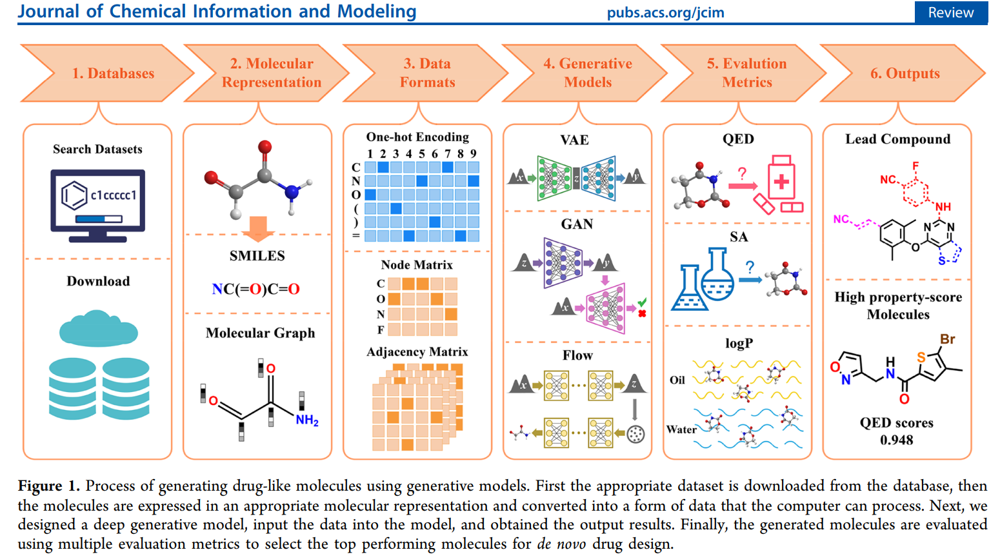

| Characteristic | Detail |
| :--- | :--- |
| **Estimated Reading Time** | 20-30 minutes |
| **Technical Level** | Advanced (requires understanding of deep learning, basic chemistry) |
| **Prerequisites** | [Blogs 1-4](../) in this series recommended but not required |


## 1. Introduction: From Prediction to Generation

### 1.1 Recap: The Journey So Far

Throughout this series, we've built up the foundational components of AI-driven drug discovery:

- **Blog 1**: We explored the biological foundations—proteins, binding sites, and the molecular mechanisms of drug-target interactions
- **Blog 2**: We examined molecular representations—SMILES strings, molecular fingerprints, graph representations, and 3D geometries
- **Blog 3**: We dove into AlphaFold2 and learned how deep learning predicts protein target structures with near-experimental accuracy
- **Blog 4**: We studied Graph Neural Networks and their ability to predict molecular properties like toxicity, solubility, and binding affinity

Now, we're ready to take the most ambitious step: **generating entirely new molecules from scratch**. I have split the generation methods into 3 subparts miniseries, with VAEs and GANs covered in this subpart, Denoising Diffusion in subpart 2 and Autoregressive models in subpart 3. Please note that this is neither an exhaustive review nor an in-depth tutorial of VAEs and GANs, but rather an overview of what a VAE and GAN are and how they have been used to generate molecules. Therefore, this is rather shorter blog than the previous 4 parts. 

### 1.2 The Generative Challenge

In Blog 4, we introduced **discriminative GNN models** that, given a molecule, predict its properties. The question was always: "Is this molecule good?"

Now we flip the script entirely. The generative question is: "Can we create a molecule that is good?" More specifically:

**Moving from evaluation to creation:**
- Previous blog: Given a molecule, predict its properties: $P(property|molecule)$
- This blog: Given desired properties (conditional), generate novel molecules: $P(molecule|property)$ or $P(molecule)$

This represents a fundamental paradigm shift in how we approach drug discovery. Instead of screening millions of existing compounds hoping to find a needle in a haystack, we can now design molecules optimized for our exact requirements.

### 1.3 Why Generation is Harder Than Prediction

Generating valid, useful molecules is extraordinarily challenging for several reasons:

#### Chemical Validity Constraints

Not every arrangement of atoms forms a stable molecule:
- Must satisfy **valence rules** (carbon forms 4 bonds, oxygen forms 2, nitrogen forms 3)
- Must be **synthesizable** in a laboratory setting
- Must avoid reactive or unstable functional groups that would make the molecule impossible to work with
- Must respect stereochemistry and 3D spatial constraints

#### The Multi-Objective Optimization Problem

A good drug candidate must simultaneously optimize many competing properties:

| Property | Target Goal | Why It Matters |
|----------|-------------|----------------|
| **Binding affinity** | High (< 10 nM) | Must strongly bind to target protein |
| **Toxicity** | Low | Safe for human use |
| **ADMET properties** | Optimal range | Absorption, distribution, metabolism, excretion, toxicity |
| **Solubility** | High | Must dissolve in biological fluids |
| **Synthetic accessibility** | High | Must be manufacturable |
| **Drug-likeness** | Pass Lipinski's Rule of Five | Oral bioavailability |
| **Novelty** | High | Avoid IP restrictions, explore new chemical space |

The challenge? These objectives often **conflict**. High binding affinity might come with poor solubility. Large molecules bind better but violate drug-likeness rules. Novel scaffolds may be active but difficult to synthesize.

#### The Exploration-Exploitation Trade-off

- **Exploit**: Stay close to known drugs (safe but incremental improvements)
- **Explore**: Venture into novel chemical space (risky but potentially breakthrough discoveries)

Finding the right balance is crucial. Too conservative and you miss innovations; too aggressive and you generate impractical or unsafe molecules.

### 1.4 What We'll Cover

This blog (Part 1/3) introduces the foundational generative models for molecular design:

1. **Variational Autoencoders (VAEs)**: Learning continuous latent spaces for molecular exploration and optimization
2. **Junction Tree VAE (JT-VAE)**: Structure-aware generation guaranteeing 100% valid molecules
3. **Generative Adversarial Networks (GANs)**: Adversarial training for realistic molecule generation
4. **MolGAN**: Graph-based molecular GAN architecture with reward networks

**Coming in Part 2/3**: Diffusion models for state-of-the-art 3D molecular generation through iterative denoising

**Coming in Part 3/3**: Transformer-based generators for autoregressive SMILES generation (MolGPT, ChemFormer)

By the end, you'll understand how AI doesn't just evaluate molecules—it creates them. See the image below for an overview of the molecule generation process (image adopted from [^1]).



---

## 2. Variational Autoencoders for Molecular Generation (A Brief Overview)

### 2.1 The Core Idea: Learning a Continuous Molecular Space

The fundamental insight behind Variational Autoencoders (VAEs) for molecules is elegant: **map discrete molecular structures into a continuous space where we can do optimization**.

| Challenge | VAE Solution |
|-----------|--------------|
| **Discrete SMILES strings** | Encode into continuous 512-dimensional latent vectors |
| **Hard to interpolate graphs** | Learn smooth latent space where small changes = small molecular changes |
| **Optimization difficulty** | Enable gradient-based property optimization in latent space |
| **Invalid generation** | Decode latent vectors back to valid molecular structures |

Think of it like this: imagine if every possible molecule had coordinates in some high-dimensional space, and similar molecules were close together. That's what VAEs try to learn—a "map of chemistry" where you can walk smoothly from one molecule to another. This is the popular so-called encoding or embedding, widely used and provided by deep neural networks.

### 2.2 VAE Architecture for Molecules

A molecular VAE consists of three main components [^2]:

#### The Encoder: Molecule to Latent Vector

- **Input**: SMILES string or molecular graph
- **Architecture**: Graph Neural Network or RNN/Transformer encoder
- **Output**: Two vectors representing the means ($\boldsymbol{\mu}$) and standard deviations ($\boldsymbol{\sigma}$) of a latent multidimensional (multivariate) distribution
- **Sampling**: Sample latent codes $\boldsymbol{z} \sim \mathcal{N}(\boldsymbol{\mu}, \boldsymbol{\sigma})$ using the **reparameterization trick** for each variable in the multivariate distribution

The reparameterization trick is crucial: instead of directly sampling $\boldsymbol{z}$ (which isn't differentiable), we sample noise $\boldsymbol{\epsilon} \sim \mathcal{N}(\boldsymbol{0}, \boldsymbol{I})$ and compute $\boldsymbol{z} = \boldsymbol{\mu} + \boldsymbol{\sigma} \odot \boldsymbol{\epsilon}$. This maintains differentiability for backpropagation.


#### The Decoder: Latent Vector to Molecule

- **Input**: Latent vector $\boldsymbol{z}$ (typically 256-512 dimensions)
- **Architecture**: RNN decoder (for SMILES) or graph decoder (for molecular graphs)
- **Output**: SMILES string generated character-by-character or molecular graph structure

#### The Loss Function

The VAE is trained to minimize:


$$L = \text{Reconstruction Loss} + \beta \cdot \text{KL Divergence}$$
$$L = -\log P(\mathbf{x}|\mathbf{z}) + \beta \cdot \text{KL}(q(\mathbf{z}|\mathbf{x}) || p(\mathbf{z}))$$


**Two terms balance the objective:**

1.  **Reconstruction loss**: How well can we recreate the input molecule from its latent code?
    * For SMILES: cross-entropy loss on character predictions
    * For graphs: node and edge reconstruction accuracy
2.  **KL divergence**: How close is the learned latent distribution to a standard normal distribution?
    * Prevents "holes" where decoding would produce invalid molecules
    * The **$\beta$** parameter balances reconstruction quality vs. latent space regularity
    * **$q(\mathbf{z}|\mathbf{x})$ (The Approximate Posterior Distribution):** This is the **encoder's distribution**. It is the distribution that the VAE's encoder learns to estimate. It tells us the probability of the latent code $\mathbf{z}$ given the input molecule $\mathbf{x}$. It is usually a simple distribution (like a multivariate Gaussian) whose parameters ($\boldsymbol{\mu}$ and $\boldsymbol{\sigma}$) are the outputs of the encoder network.
    * **$p(\mathbf{z})$ (The Prior Distribution):** This is the **target distribution**. It is a predefined, simple distribution, typically the **standard normal distribution**, $\mathcal{N}(\mathbf{0}, \mathbf{I})$. The KL divergence term forces the encoder's output $q(\mathbf{z}|\mathbf{x})$ to resemble this simple prior, ensuring the latent space is smooth, continuous, and easy to sample from for novel molecule generation.

### 2.3 Implementation: Junction Tree VAE (JT-VAE)

#### Why Naive SMILES VAEs Fail

Early attempts to use VAEs with character-level SMILES generation faced severe problems:
- **90%+ invalid SMILES**: Most generated strings violated chemical syntax
- **No chemical constraints**: Character-level generation doesn't understand valence rules
- **Fragile**: Tiny latent space changes could completely break molecular validity

#### JT-VAE Solution: Structure-Aware Generation

The breakthrough came from **Junction Tree VAE (JT-VAE)** [^3], which generates molecules by assembling chemically valid building blocks rather than character-by-character. In simple terms, the purpose of **(JT)** is to take a messy, interconnected graph of variables (which is hard to analyze) and restructure it into a simplified, tree-like format where calculations are easy and efficient. 

**Key innovations:**
- Represent molecules as **trees of molecular fragments** (like benzene rings, carbonyl groups, etc.)
- Generate by selecting and connecting fragments from a vocabulary of valid substructures
- **Guarantees 100% valid molecule generation** by construction

**How it works:**
1.  Decompose training molecules into junction trees of scaffolds.
2.  Build vocabulary of common valid fragments.
3.  Encoder: Molecule **$\rightarrow$** Junction tree **$\rightarrow$** Latent vector
4.  Decoder: Latent vector **$\rightarrow$** Junction tree **$\rightarrow$** Assembled molecule


Image below adopted from the original article [^3] shows how JT-VAE process happens from a high level overview.





#### Code Structure

Here's a simplified implementation showing the core VAE architecture:

```python
import torch
import torch.nn as nn
import torch.nn.functional as F

class MolecularVAE(nn.Module):
    def __init__(self, vocab_size, latent_dim=512):
        super().__init__()

        # Encoder: SMILES/Graph -> z
        self.encoder = GNNEncoder(
            num_features=128,
            hidden_dim=256,
            latent_dim=latent_dim
        )

        # Decoder: z -> SMILES
        self.decoder = SMILESDecoder(
            latent_dim=latent_dim,
            vocab_size=vocab_size,
            hidden_dim=512
        )

    def encode(self, molecule):
        """Encode molecule to latent distribution parameters"""
        mu, logvar = self.encoder(molecule)
        return mu, logvar

    def reparameterize(self, mu, logvar):
        """Reparameterization trick: z = mu + epsilon * sigma"""
        std = torch.exp(0.5 * logvar)
        eps = torch.randn_like(std)
        return mu + eps * std

    def decode(self, z):
        """Decode latent vector to molecule"""
        return self.decoder(z)

    def forward(self, molecule):
        """Full forward pass: encode -> reparameterize -> decode"""
        mu, logvar = self.encode(molecule)
        z = self.reparameterize(mu, logvar)
        recon_molecule = self.decode(z)
        return recon_molecule, mu, logvar

    def loss_function(self, recon_x, x, mu, logvar, beta=1.0):
        """VAE loss: reconstruction + KL divergence"""
        # Reconstruction loss
        recon_loss = F.cross_entropy(recon_x, x, reduction='sum')

        # KL divergence: -0.5 * sum(1 + logvar - mu^2 - exp(logvar))
        kl_loss = -0.5 * torch.sum(1 + logvar - mu.pow(2) - logvar.exp())

        return recon_loss + beta * kl_loss
```

⚠️ **Note**: I am working on a simple implementation of JT-VAE and will link the code here once completed. A full implementation requires several hundred lines and is beyond the scope of this blog. Stay tuned if interested! ⚠️

### 2.4 Latent Space Optimization

Once trained, the VAE's continuous latent space enables powerful molecular design operations:

#### 1. Interpolation Between Known Drugs

Want to explore molecules that combine features of two known drugs? Interpolate in latent space:

```python
# Encode two drug molecules
z1 = vae.encode(drug_A)
z2 = vae.encode(drug_B)

# Interpolate in latent space
alpha = 0.5  # 50% between A and B
z_interp = alpha * z1 + (1 - alpha) * z2

# Decode to get hybrid molecule
hybrid_molecule = vae.decode(z_interp)

# Can generate entire trajectory
for alpha in np.linspace(0, 1, 20):
    z = alpha * z1 + (1 - alpha) * z2
    molecule = vae.decode(z)
    molecules.append(molecule)
```

This creates a smooth path through chemical space from drug A to drug B, potentially discovering interesting intermediate molecules.

#### 2. Property-Guided Molecular Design

The real power of the molecular VAE lies in using **gradient descent directly on the continuous latent vector $\mathbf{z}$** to design new molecules. This is typically done through **constrained optimization** where we seek to **maximize a primary objective (e.g., binding affinity)** while ensuring **other properties (e.g., LogP, molecular weight) remain within acceptable bounds**. If you only care about one property, the process simplifies to simple maximization.


For example, optimize for one property while constraining others:

```python
def constrained_optimization(vae, initial_molecule, target_property,
                             constraints, steps=100):
    z = vae.encode(initial_molecule)
    z.requires_grad = True
    optimizer = torch.optim.Adam([z], lr=0.01)

    for step in range(steps):
        # Differentiably decode the latent vector (Conceptual Step)
        # NOTE: This line implicitly assumes a differentiable path 
        # (e.g., Gumbel-Softmax) to a structure or property value.
        molecule_representation = vae.decode_to_property_input(z) 

        # Predict property using GNN from Blog 4
        # The property_predictor operates on the differentiable representation
        properties = property_predictor(molecule_representation)

        # Objective: maximize target property
        objective = -properties[target_property]

        # Penalty for violating constraints
        penalty = 0
        for prop, (min_val, max_val) in constraints.items():
            val = properties[prop]
            if val < min_val:
                penalty += (min_val - val) ** 2
            elif val > max_val:
                penalty += (val - max_val) ** 2

        loss = objective + 10.0 * penalty
        loss.backward()
        optimizer.step()
        optimizer.zero_grad()

    return vae.decode(z)

# Example: maximize binding affinity while keeping logP in [1, 3]
optimized = constrained_optimization(
    vae,
    initial_molecule,
    target_property='binding_affinity',
    constraints={'logP': (1.0, 3.0), 'molecular_weight': (0, 500)}
)
```

### 2.5 Limitations of VAEs

Despite their utility, VAEs have several important limitations:

| Limitation | Description | Impact |
| :--- | :--- | :--- |
| **Posterior collapse** | The decoder learns to ignore the latent code ($\mathbf{z}$), relying only on its previous outputs. | The latent space becomes uninformative; optimization and sampling from $\mathbf{z}$ fail to control molecule generation. |
| **Reconstruction quality** | VAEs struggle to model discrete data perfectly, leading to higher token error rates. | Generated molecules often require post-processing to ensure chemical validity (e.g., correcting invalid SMILES strings), though JT-VAE addresses this. |
| **Limited expressiveness** | The assumption of a single Gaussian latent space is too restrictive for complex, multi-modal molecular distributions. | The VAE struggles to capture distinct chemical classes or scaffolds effectively, though JT-VAE mitigates this. |
| **Training instability** | Balancing the $\beta$ parameter (reconstruction vs KL divergence) is a tricky and crucial hyperparameter tuning step. | Suboptimal balancing can lead to either posterior collapse or poor reconstruction. |
| **Mode coverage** | The VAE may only capture high-density regions, failing to represent the full diversity of the training distribution. | The model misses out on exploring novel or sparse regions of chemical space. |

**When to use VAEs:**
- You need **interpretable, continuous latent spaces** for analysis.
- You want to perform **gradient-based optimization** on molecular properties.
- You're working with **smaller datasets** (where very large models are impractical).
- **Smooth interpolation** between known molecules is a desired feature.
- **Training stability** is a priority (compared to GANs).

---

## 3. Generative Adversarial Networks (GANs) (A Brief Overview)

### 3.1 The Adversarial Game

Generative Adversarial Networks take a completely different approach: **two neural networks compete in a game**.

**The players:**

1. **Generator G**: Creates fake molecules from random noise
   - Goal: Fool the discriminator into thinking fake molecules are real
   - Learns to mimic the distribution of real molecules

2. **Discriminator D**: Distinguishes real molecules from generated fakes
   - Goal: Correctly classify real vs. fake molecules
   - Provides learning signal to the generator

**The training dynamics:**

Think of it like an art forger and an art detective:
- The **forger** (generator) tries to create paintings that look authentic
- The **detective** (discriminator) tries to spot the fakes
- As the detective gets better at spotting fakes, the forger improves their technique
- Eventually, the forger becomes so good that the detective can't tell real from fake

**Mathematically:**

$$\min_G \max_D V(D, G) = \mathbb{E}_x[\log D(x)] + \mathbb{E}_z[\log(1 - D(G(z)))]$$

- Discriminator wants to maximize $V$ (correctly classify real as real, fake as fake)
- Generator wants to minimize $V$ (make fake molecules indistinguishable from real)
- At Nash equilibrium: $D(x) = 0.5$ everywhere (can't tell real from fake)

### 3.2 Molecular GAN Architectures

#### MolGAN: Graph-Based Molecular GAN

The successful molecular GAN architecture directly generates molecular graphs [^4].

See the image below for an overview of the MolGAN architecture (image adopted from the original article [^4]).





**Generator Model Architecture:**

```python
class MolecularGenerator(nn.Module):
    def __init__(self, latent_dim=64, max_atoms=45):
        super().__init__()
        self.max_atoms = max_atoms

        # MLP to expand noise vector
        self.mlp = nn.Sequential(
            nn.Linear(latent_dim, 256),
            nn.ReLU(),
            nn.Linear(256, 512),
            nn.ReLU()
        )

        # Generate adjacency matrix (bonds)
        self.edge_generator = nn.Linear(512, max_atoms * max_atoms * 4)
        # 4 edge types: no bond, single, double, triple

        # Generate node features (atoms)
        self.node_generator = nn.Linear(512, max_atoms * 9)
        # 9 atom types: C, N, O, F, P, S, Cl, Br, I

    def forward(self, z):
        # z: random noise [batch_size, latent_dim]
        h = self.mlp(z)

        # Generate edges (adjacency matrix)
        edges = self.edge_generator(h)
        edges = edges.view(-1, self.max_atoms, self.max_atoms, 4)
        adj_matrix = F.gumbel_softmax(edges, tau=0.5, hard=True)

        # Generate nodes (atom types)
        nodes = self.node_generator(h)
        nodes = nodes.view(-1, self.max_atoms, 9)
        node_features = F.gumbel_softmax(nodes, tau=0.5, hard=True)

        return adj_matrix, node_features
```

**Discriminator Architecture:**

```python
class MolecularDiscriminator(nn.Module):
    def __init__(self, max_atoms=45):
        super().__init__()

        # Graph neural network to process molecule
        self.gnn = GraphConvolution(
            in_features=9,    # atom types
            out_features=128,
            num_layers=3
        )

        # Classifier
        self.classifier = nn.Sequential(
            nn.Linear(128 * max_atoms, 256),
            nn.ReLU(),
            nn.Dropout(0.5),
            nn.Linear(256, 1),
            nn.Sigmoid()
        )

    def forward(self, adj_matrix, node_features):
        # Process with GNN
        h = self.gnn(node_features, adj_matrix)

        # Global pooling (flatten)
        h = h.view(h.size(0), -1)

        # Classify: real (1) or fake (0)
        score = self.classifier(h)
        return score
```

**Optional: Reward Network**

MolGAN can include a third network that predicts molecular properties, providing additional training signal:

```python
class RewardNetwork(nn.Module):
    """Predicts molecular properties to guide generation"""
    def __init__(self):
        super().__init__()
        self.property_predictor = GraphPropertyPredictor()

    def forward(self, adj_matrix, node_features):
        # Predict properties: solubility, QED, etc.
        properties = self.property_predictor(adj_matrix, node_features)
        return properties

    def reward(self, properties):
        # Combine multiple properties into single reward
        reward = (
            properties['qed'] +                    # Drug-likeness
            properties['logp'].clamp(-5, 5) / 10 + # Lipophilicity
            properties['synthetic_accessibility']   # SA score
        )
        return reward
```


#### Practical Training Loop

In training, we train the discriminator $D$ and the generator $G$ with the following loss functions in tandem. Usually, we train the discriminator first for some number of epochs, then freeze it and train the generator. We repeat this pattern until the discriminator is no longer able to distinguish real from fake.

For $D$ the loss is:

$$
\mathcal{L}_D = -\left(\log D(\mathbf{x}) + \log(1 - D(G(\mathbf{z})))\right)
$$

where we want $\frac{\partial \mathcal{L}_D}{\partial \mathbf{W}_D}$ (discriminator weights), but **not** $\frac{\partial \mathcal{L}_D}{\partial \mathbf{W}_G}$ (generator weights). When training $D$ we should not care about training $G$. This is where the call to `.detach()` occurs in the function `train_molgan` below. Here $\mathbf{x}$ is real data. $D(G(\mathbf{z}))$ should ideally be zero; otherwise, we get increased loss from the misclassified fake samples (the term $-\log(1 - D(G(\mathbf{z})))$ becomes largely positive in the case of fake misclassifications).


For $G$ the loss is:

$$\mathcal{L}_G = -\log D(G(\mathbf{z})) - \lambda \cdot \text{Reward}(G(\mathbf{z}))$$

we must calculate $\frac{\partial \mathcal{L}_G}{\partial \mathbf{W}_G}$. This gradient flows through $D$ and accumulates in $D$, hence the necessary call to `d_optimizer.zero_grad()` before making a forward pass through $D$ when training it. If $D$ is correctly classifying the fake samples generated by $G$, we must pass a large gradient to $G$. That is why, when measuring the loss $\mathcal{L}_G$, we set the true label of the fake samples to 1s so the loss becomes large for correctly classified samples (see the function `train_molgan` below).


```python
def train_molgan(generator, discriminator, reward_net, dataloader, epochs=100):
    g_optimizer = torch.optim.Adam(generator.parameters(), lr=1e-4)
    d_optimizer = torch.optim.Adam(discriminator.parameters(), lr=1e-4)

    for epoch in range(epochs):
        for real_adj, real_nodes in dataloader:
            batch_size = real_adj.size(0)

            # =====================
            # Train Discriminator
            # =====================
            d_optimizer.zero_grad() # NOTE: discard the accumulated gradients from the generator's
                                    # backward pass below. Remember, generator's loss is measured
                                    # via a forward pass to the Discriminator!

            # Real molecules: should classify as 1
            real_score = discriminator(real_adj, real_nodes)
            d_loss_real = F.binary_cross_entropy(real_score, torch.ones_like(real_score))

            # Fake molecules: should classify as 0
            z = torch.randn(batch_size, 64)
            fake_adj, fake_nodes = generator(z)
            fake_score = discriminator(fake_adj.detach(), fake_nodes.detach()) # NOTE: detach the
                                    # tensors to prevent
                                    # the flow of gradients all the way back to the generator!
            d_loss_fake = F.binary_cross_entropy(fake_score, torch.zeros_like(fake_score))

            d_loss = d_loss_real + d_loss_fake
            d_loss.backward()
            d_optimizer.step()

            # =====================
            # Train Generator
            # =====================
            g_optimizer.zero_grad()

            z = torch.randn(batch_size, 64)
            fake_adj, fake_nodes = generator(z)

            # Fool discriminator: want high scores, i.e. whatever D says, flip it!
            fake_score = discriminator(fake_adj, fake_nodes)
            g_loss_adv = F.binary_cross_entropy(fake_score, torch.ones_like(fake_score))

            # Reward for desired properties
            properties = reward_net(fake_adj, fake_nodes)
            reward = reward_net.reward(properties)
            g_loss_reward = -reward.mean()

            g_loss = g_loss_adv + 0.1 * g_loss_reward
            g_loss.backward()
            g_optimizer.step()

        print(f"Epoch {epoch}: D_loss={d_loss:.4f}, G_loss={g_loss:.4f}")
```

### 3.4 GANs vs VAEs: Trade-offs

Understanding when to use each approach:

| Aspect | GANs | VAEs |
|--------|------|------|
| **Sample quality** | Sharper, more realistic molecules with crisp features | Slightly "averaged" or smoothed samples |
| **Sample diversity** | Risk of mode collapse (limited chemical space coverage) | Better mode coverage (explores full chemical space) |
| **Training stability** | Difficult; highly sensitive to hyperparameters and architecture | More stable and forgiving; easier to train |
| **Latent space** | No natural encoder; latent space not guaranteed to be smooth or meaningful | Structured, continuous, smooth latent space with clear semantics |
| **Latent space optimization** | Difficult; requires training a separate encoder or gradient-based inversion | Easy gradient-based property optimization directly in latent space |
| **External rewards/properties** | Natural integration via auxiliary discriminator heads or reward networks | Multiple flexible approaches: property prediction heads, multi-task decoders, conditional VAE, or RL-based methods |
| **Chemical validity** | Harder to guarantee; often needs post-processing filters or constraints | Easier with structural constraints (especially JT-VAE guarantees 100% validity) |
| **Training time** | Generally faster per iteration (single objective) | Slower (balancing reconstruction and KL divergence) |
| **Likelihood evaluation** | Cannot directly evaluate likelihood of molecules | Can compute approximate likelihood p(x) |
| **Interpolation** | Undefined or non-smooth (no encoder for real molecules) | Smooth, meaningful interpolation between molecules |


**Hybrid approaches** combine the strengths of both architectures:

- **VAE-GAN**: Train a VAE (or JT-VAE) first for latent space structure, then add a GAN discriminator to refine sample quality
- **Adversarially Regularized VAE (ARVAE)**: Add adversarial loss to the VAE decoder to improve sample sharpness while maintaining latent space structure
- **Adversarial Autoencoders (AAE)**: Use adversarial training to match the latent distribution instead of KL divergence


---

## 4. Conclusion and What's Next

In this first part of our three-part series on generative models for molecular design, we've explored the foundational architectures that enable AI to create novel drug molecules from scratch.

### 4.1 Key Takeaways

**Variational Autoencoders (VAEs):**
- Learn continuous latent spaces that enable gradient-based molecular optimization
- Enable smooth interpolation between known molecules to explore chemical space
- JT-VAE guarantees 100% valid molecule generation through structure-aware decoding
- Best for: interpretable latent spaces, property optimization, and smaller datasets

**Generative Adversarial Networks (GANs):**
- Use adversarial training between generator and discriminator networks
- MolGAN directly generates molecular graphs with atom and bond types
- Reward networks enable property-guided generation
- Best for: sharp, realistic samples when training stability can be managed

**VAEs vs. GANs Trade-offs:**
- VAEs: More stable training, interpretable latent spaces, better for optimization
- GANs: Sharper samples, but risk mode collapse and training instability
- Hybrid approaches (VAE-GAN, ARVAE) combine strengths of both

### 4.2 Coming Up Next

This blog laid the groundwork for understanding generative molecular models. In the remaining parts of this series, we'll explore:

**Part 2/3 - Diffusion Models** (Next Blog):
- State-of-the-art denoising diffusion probabilistic models (DDPMs)
- SE(3)-equivariant architectures for 3D molecular generation
- GeoDiff and Torsional Diffusion for conformer generation
- Practical implementation of Torsional Diffusion

**Part 3/3 - Transformer-Based Generators**:
- Autoregressive SMILES generation with transformers
- MolGPT and ChemFormer architectures
- Conditional generation for property control
- Multi-objective optimization in practice
- Comparison of all approaches and when to use each

### 4.3 Resources and Tools

To experiment with the models covered in this blog:

- **RDKit**: Open-source cheminformatics library for molecular manipulation ([rdkit.org](https://www.rdkit.org))
- **PyTorch Geometric**: Graph neural network library for implementing GNN-based models
- **JT-VAE Implementation**: Original implementation available at [wengong-jin/icml18-jtnn](https://github.com/wengong-jin/icml18-jtnn)
- **MolGAN Implementation**: Reference implementation at [nicola-decao/MolGAN](https://github.com/nicola-decao/MolGAN)


---

## References

[^1]: Pang, Chao, et al. "Deep generative models in de novo drug molecule generation." Journal of Chemical Information and Modeling 64.7 (2023): 2174-2194.
    [Review article]

[^2]: Gómez-Bombarelli, Rafael, et al. "Automatic chemical design using a data-driven continuous representation of molecules." ACS central science 4.2 (2018): 268-276.
   [Original molecular VAE paper]

[^3]: Jin, Wengong, Regina Barzilay, and Tommi Jaakkola. "Junction tree variational autoencoder for molecular graph generation." International conference on machine learning. PMLR, 2018.
   [JT-VAE: guarantees valid molecule generation]

[^4]: De Cao, Nicola, and Thomas Kipf. "MolGAN: An implicit generative model for small molecular graphs." arXiv preprint arXiv:1805.11973 (2018).
   [First successful molecular GAN]
