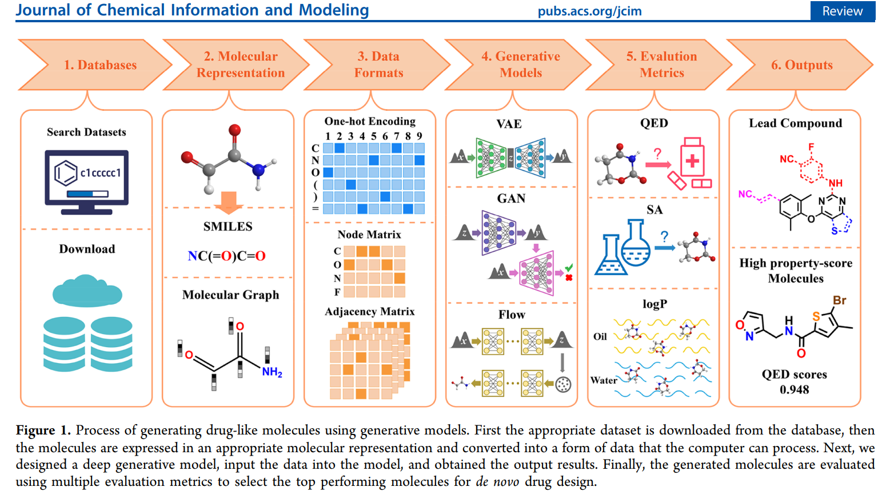

| Characteristic | Detail |
| :--- | :--- |
| **Estimated Reading Time** | 45-60 minutes |
| **Technical Level** | Advanced (requires understanding of deep learning, basic chemistry) |
| **Prerequisites** | [Blogs 1-4](../) in this series recommended but not required |


## 1. Introduction: From Prediction to Generation

### 1.1 Recap: The Journey So Far

Throughout this series, we've built up the foundational components of AI-driven drug discovery:

- **Blog 1**: We explored the biological foundations proteins, binding sites, and the molecular mechanisms of drug-target interactions
- **Blog 2**: We examined molecular representations SMILES strings, molecular fingerprints, graph representations, and 3D geometries
- **Blog 3**: We dove into AlphaFold2 and learned how deep learning predicts protein target structures with near-experimental accuracy
- **Blog 4**: We studied Graph Neural Networks and their ability to predict molecular properties like toxicity, solubility, and binding affinity

Now, we're ready to take the most ambitious step: **generating entirely new molecules from scratch**.

### 1.2 The Generative Challenge

In Blog 4, we've introduced **discriminative GNN models** that given a molecule, predict its properties. The question was always: "Is this molecule good?"

Now we flip the script entirely. The generative question is: "Can we create a molecule that is good?" More specifically:

**Moving from evaluation to creation:**
- Previous blog: Given a molecule, predict its properties: $P(property|molecule)$
- This blog: Given desired properties (conditional), generate novel molecules: $P(molecule|property)$ or $P(molecule)$

This represents a fundamental paradigm shift in how we approach drug discovery. Instead of screening millions of existing compounds hoping to find a needle in a haystack, we can now design molecules optimized for our exact requirements.

### 1.3 Why Generation is Harder Than Prediction

Generating valid, useful molecules is extraordinarily challenging for several reasons:

#### Chemical Validity Constraints

Not every arrangement of atoms forms a stable molecule:
- Must satisfy **valence rules** (carbon forms 4 bonds, oxygen forms 2, nitrogen forms 3)
- Must be **synthesizable** in a laboratory setting
- Must avoid reactive or unstable functional groups that would make the molecule impossible to work with
- Must respect stereochemistry and 3D spatial constraints

#### The Multi-Objective Optimization Problem

A good drug candidate must simultaneously optimize many competing properties:

| Property | Target Goal | Why It Matters |
|----------|-------------|----------------|
| **Binding affinity** | High (< 10 nM) | Must strongly bind to target protein |
| **Toxicity** | Low | Safe for human use |
| **ADMET properties** | Optimal range | Absorption, distribution, metabolism, excretion, toxicity |
| **Solubility** | High | Must dissolve in biological fluids |
| **Synthetic accessibility** | High | Must be manufacturable |
| **Drug-likeness** | Pass Lipinski's Rule of Five | Oral bioavailability |
| **Novelty** | High | Avoid IP restrictions, explore new chemical space |

The challenge? These objectives often **conflict**. High binding affinity might come with poor solubility. Large molecules bind better but violate drug-likeness rules. Novel scaffolds may be active but difficult to synthesize.

#### The Exploration-Exploitation Trade-off

- **Exploit**: Stay close to known drugs (safe but incremental improvements)
- **Explore**: Venture into novel chemical space (risky but potentially breakthrough discoveries)

Finding the right balance is crucial. Too conservative and you miss innovations; too aggressive and you generate impractical or unsafe molecules.

### 1.4 What We'll Cover

This blog explores the fundamentals of cutting-edge generative models revolutionizing drug design:

1. **Variational Autoencoders (VAEs) (briefly)**: Learn continuous latent spaces for molecular exploration and optimization
2. **Generative Adversarial Networks (GANs) (briefly)** : Adversarial training for realistic molecule generation
3. **Diffusion Models**: State-of-the-art 3D molecular generation through iterative denoising
4. **Transformer-based Generators**: Language models for SMILES generation (MolGPT, ChemFormer)
5. **Conditional Generation (briefly)**: Steering generation toward molecules with desired properties
6. **Multi-Objective Optimization (briefly)**: Balancing competing objectives in practical drug design

By the end, you'll understand how AI doesn't just evaluate molecules it creates them. See the image below for an overview of the process (image adopted from [^1]).



---

## 2. Variational Autoencoders for Molecular Generation (A Brief Overview)

### 2.1 The Core Idea: Learning a Continuous Molecular Space

The fundamental insight behind Variational Autoencoders (VAEs) for molecules is elegant: **map discrete molecular structures into a continuous space where we can do optimization**.

| Challenge | VAE Solution |
|-----------|--------------|
| **Discrete SMILES strings** | Encode into continuous 512-dimensional latent vectors |
| **Hard to interpolate graphs** | Learn smooth latent space where small changes = small molecular changes |
| **Optimization difficulty** | Enable gradient-based property optimization in latent space |
| **Invalid generation** | Decode latent vectors back to valid molecular structures |

Think of it like this: imagine if every possible molecule had coordinates in some high-dimensional space, and similar molecules were close together. That's what VAEs try to learn a "map of chemistry" where you can walk smoothly from one molecule to another. This is the popular so called encoding or embedding, widely used and provided by deep neural networks.

### 2.2 VAE Architecture for Molecules

A molecular VAE consists of three main components:

#### The Encoder: Molecule to Latent Vector

- **Input**: SMILES string or molecular graph
- **Architecture**: Graph Neural Network or RNN/Transformer encoder
- **Output**: Two vectors representing the means ($\boldsymbol{\mu}$) and standard deviations ($\boldsymbol{\sigma$}) of a latent multidimensional (multivariate) distribution
- **Sampling**: Sample latent codes $\boldsymbol{z} \sim \mathcal{N}(\boldsymbol{\mu}, \boldsymbol{\sigma})$ using the **reparameterization trick** for each variable in the multivariate distribution

The reparameterization trick is crucial: instead of directly sampling $\boldsymbol{z}$ (which isn't differentiable), we sample noise $\boldsymbol{\epsilon} \sim \mathcal{N}(\boldsymbol{0}, \boldsymbol{I})$ and compute $\boldsymbol{z} = \boldsymbol{\mu} + \boldsymbol{\sigma} \odot \boldsymbol{\epsilon}$. This maintains differentiability for backpropagation.


#### The Decoder: Latent Vector to Molecule

- **Input**: Latent vector $\boldsymbol{z}$ (typically 256-512 dimensions)
- **Architecture**: RNN decoder (for SMILES) or graph decoder (for molecular graphs)
- **Output**: SMILES string generated character-by-character or molecular graph structure

#### The Loss Function

The VAE is trained to minimize:


$$L = \text{Reconstruction Loss} + \mathbf{\beta} \cdot \text{KL Divergence}$$
$$L = -\log P(\mathbf{x}|\mathbf{z}) + \mathbf{\beta} \cdot \text{KL}(q(\mathbf{z}|\mathbf{x}) || p(\mathbf{z}))$$


**Two terms balance the objective:**

1.  **Reconstruction loss**: How well can we recreate the input molecule from its latent code?
    * For SMILES: cross-entropy loss on character predictions
    * For graphs: node and edge reconstruction accuracy
2.  **KL divergence**: How close is the learned latent distribution to a standard normal distribution?
    * Prevents "holes" where decoding would produce invalid molecules
    * The **$\mathbf{\beta}$** parameter balances reconstruction quality vs. latent space regularity
    * **$q(\mathbf{z}|\mathbf{x})$ (The Approximate Posterior Distribution):** This is the **Encoder's distribution**. It is the distribution that the VAE's **encoder** learns to estimate. It tells us the probability of the latent code $\mathbf{z}$ given the input molecule $\mathbf{x}$. It is usually a simple distribution (like a multivariate Gaussian) whose parameters ($\boldsymbol{\mu}$ and $\boldsymbol{\sigma}$) are the outputs of the encoder network.
    * **$p(\mathbf{z})$ (The Prior Distribution):** This is the **Target Distribution**. It is a predefined, simple distribution, typically the **standard normal distribution**, $\mathcal{N}(\mathbf{0}, \mathbf{I})$. The KL divergence term forces the encoder's output $q(\mathbf{z}|\mathbf{x})$ to resemble this simple prior, ensuring the latent space is smooth, continuous, and easy to sample from for novel molecule generation.

### 2.3 Implementation: Junction Tree VAE (JT-VAE)

#### Why Naive SMILES VAEs Fail

Early attempts to use VAEs with character-level SMILES generation faced severe problems:
* **90%+ invalid SMILES**: Most generated strings violated chemical syntax.
* **No chemical constraints**: Character-level generation doesn't understand valence rules.
* **Fragile**: Tiny latent space changes could completely break molecular validity.

#### JT-VAE Solution: Structure-Aware Generation

The breakthrough came from **Junction Tree VAE (JT-VAE)**, which generates molecules by assembling chemically valid building blocks rather than character-by-character. In simple terms, the purpose of **(JT)** is to take a messy, interconnected graph of variables (which is hard to analyze) and restructure it into a simplified, tree-like format where calculations are easy and efficient. 

**Key innovations:**
* Represent molecules as **trees of molecular fragments** (like benzene rings, carbonyl groups, etc.).
* Generate by selecting and connecting fragments from a vocabulary of valid substructures.
* **Guarantees 100% valid molecule generation** by construction.

**How it works:**
1.  Decompose training molecules into junction trees of scaffolds.
2.  Build vocabulary of common valid fragments.
3.  Encoder: Molecule **$\rightarrow$** Junction tree **$\rightarrow$** Latent vector
4.  Decoder: Latent vector **$\rightarrow$** Junction tree **$\rightarrow$** Assembled molecule

#### Code Structure

Here's a simplified implementation showing the core VAE architecture:

```python
import torch
import torch.nn as nn
import torch.nn.functional as F

class MolecularVAE(nn.Module):
    def __init__(self, vocab_size, latent_dim=512):
        super().__init__()

        # Encoder: SMILES/Graph -> z
        self.encoder = GNNEncoder(
            num_features=128,
            hidden_dim=256,
            latent_dim=latent_dim
        )

        # Decoder: z -> SMILES
        self.decoder = SMILESDecoder(
            latent_dim=latent_dim,
            vocab_size=vocab_size,
            hidden_dim=512
        )

    def encode(self, molecule):
        """Encode molecule to latent distribution parameters"""
        mu, logvar = self.encoder(molecule)
        return mu, logvar

    def reparameterize(self, mu, logvar):
        """Reparameterization trick: z = mu + epsilon * sigma"""
        std = torch.exp(0.5 * logvar)
        eps = torch.randn_like(std)
        return mu + eps * std

    def decode(self, z):
        """Decode latent vector to molecule"""
        return self.decoder(z)

    def forward(self, molecule):
        """Full forward pass: encode -> reparameterize -> decode"""
        mu, logvar = self.encode(molecule)
        z = self.reparameterize(mu, logvar)
        recon_molecule = self.decode(z)
        return recon_molecule, mu, logvar

    def loss_function(self, recon_x, x, mu, logvar, beta=1.0):
        """VAE loss: reconstruction + KL divergence"""
        # Reconstruction loss
        recon_loss = F.cross_entropy(recon_x, x, reduction='sum')

        # KL divergence: -0.5 * sum(1 + logvar - mu^2 - exp(logvar))
        kl_loss = -0.5 * torch.sum(1 + logvar - mu.pow(2) - logvar.exp())

        return recon_loss + beta * kl_loss
```

⚠️⚠️⚠️ I am working on a simple implementation of JT-VAE and will link the code here once completed. Though, that will be a couple of hundreds of lines at least and out of the scope of this blog. Anyway, Stay Tuned If Interested 🙂! ⚠️⚠️⚠️

### 2.4 Latent Space Optimization

Once trained, the VAE's continuous latent space enables powerful molecular design operations:

#### 1. Interpolation Between Known Drugs

Want to explore molecules that combine features of two known drugs? Interpolate in latent space:

```python
# Encode two drug molecules
z1 = vae.encode(drug_A)
z2 = vae.encode(drug_B)

# Interpolate in latent space
alpha = 0.5  # 50% between A and B
z_interp = alpha * z1 + (1 - alpha) * z2

# Decode to get hybrid molecule
hybrid_molecule = vae.decode(z_interp)

# Can generate entire trajectory
for alpha in np.linspace(0, 1, 20):
    z = alpha * z1 + (1 - alpha) * z2
    molecule = vae.decode(z)
    molecules.append(molecule)
```

This creates a smooth path through chemical space from drug A to drug B, potentially discovering interesting intermediate molecules.

#### 2. Property-Guided Molecular Design

The real power of the Molecular VAE lies in using **gradient descent directly on the continuous latent vector $\mathbf{z}$** to design new molecules. This is typically done through **Constrained Optimization** where we seek to **maximize a primary objective (e.g., binding affinity)** while ensuring **other properties (e.g., LogP, Molecular Weight) remain within acceptable, constrained bounds.** If you only care about one property, the process simplifies to simple maximization.


For example, optimize for one property while constraining others:

```python
def constrained_optimization(vae, initial_molecule, target_property,
                             constraints, steps=100):
    z = vae.encode(initial_molecule)
    z.requires_grad = True
    optimizer = torch.optim.Adam([z], lr=0.01)

    for step in range(steps):
        # Differentiably decode the latent vector (Conceptual Step)
        # NOTE: This line implicitly assumes a differentiable path 
        # (e.g., Gumbel-Softmax) to a structure or property value.
        molecule_representation = vae.decode_to_property_input(z) 

        # Predict property using GNN from Blog 4
        # The property_predictor operates on the differentiable representation
        properties = property_predictor(molecule_representation)

        # Objective: maximize target property
        objective = -properties[target_property]

        # Penalty for violating constraints
        penalty = 0
        for prop, (min_val, max_val) in constraints.items():
            val = properties[prop]
            if val < min_val:
                penalty += (min_val - val) ** 2
            elif val > max_val:
                penalty += (val - max_val) ** 2

        loss = objective + 10.0 * penalty
        loss.backward()
        optimizer.step()
        optimizer.zero_grad()

    return vae.decode(z)

# Example: maximize binding affinity while keeping logP in [1, 3]
optimized = constrained_optimization(
    vae,
    initial_molecule,
    target_property='binding_affinity',
    constraints={'logP': (1.0, 3.0), 'molecular_weight': (0, 500)}
)
```

### 2.5 Limitations of VAEs

Despite their utility, VAEs have several important limitations:

| Limitation | Description | Impact |
| :--- | :--- | :--- |
| **Posterior collapse** | The decoder learns to ignore the latent code ($\mathbf{z}$), relying only on its previous outputs. | The latent space becomes uninformative; optimization and sampling from $\mathbf{z}$ fail to control molecule generation. |
| **Reconstruction quality** | VAEs struggle to model discrete data perfectly, leading to a higher token error rate. | Generated molecules often require post-processing to ensure chemical validity (e.g., correcting invalid SMILES strings). Though JT-VAE fixes this. |
| **Limited expressiveness** | The assumption of a single Gaussian latent space is too restrictive for complex, multi-modal molecular distributions. | The VAE struggles to capture distinct chemical classes or scaffolds effectively. JT-VAE mitigates this one. |
| **Training instability** | Balancing the $\beta$ parameter (reconstruction vs KL divergence) is a tricky and crucial hyperparameter tuning step. | Suboptimal balancing can lead to either posterior collapse or poor reconstruction. |
| **Mode coverage** | The VAE may only capture high-density regions, failing to represent the full diversity of the training distribution. | The model misses out on exploring novel or sparse regions of chemical space. |

**When to use VAEs:**
- You need **interpretable, continuous latent spaces** for analysis.
- You want to perform **gradient-based optimization** on molecular properties.
- You're working with **smaller datasets** (where very large models are impractical).
- **Smooth interpolation** between known molecules is a desired feature.
- **Training stability** is a priority (compared to GANs).

---

## 3. Generative Adversarial Networks (GANs) (A Brief Overview)

### 3.1 The Adversarial Game

Generative Adversarial Networks take a completely different approach: **two neural networks compete in a game**.

**The players:**

1. **Generator G**: Creates fake molecules from random noise
   - Goal: Fool the discriminator into thinking fake molecules are real
   - Learns to mimic the distribution of real molecules

2. **Discriminator D**: Distinguishes real molecules from generated fakes
   - Goal: Correctly classify real vs. fake molecules
   - Provides learning signal to the generator

**The training dynamics:**

Think of it like an art forger and an art detective:
- The **forger** (generator) tries to create paintings that look authentic
- The **detective** (discriminator) tries to spot the fakes
- As the detective gets better at spotting fakes, the forger improves their technique
- Eventually, the forger becomes so good that the detective can't tell real from fake

**Mathematically:**

```
min_G max_D V(D, G) = E_x[log D(x)] + E_z[log(1 - D(G(z)))]
```

- Discriminator wants to maximize V (correctly classify real as real, fake as fake)
- Generator wants to minimize V (make fake molecules indistinguishable from real)
- At Nash equilibrium: D(x) = 0.5 everywhere (can't tell real from fake)

### 3.2 Molecular GAN Architectures

#### MolGAN: Graph-Based Molecular GAN

The most successful molecular GAN architecture directly generates molecular graphs.

**Generator Architecture:**

```python
class MolecularGenerator(nn.Module):
    def __init__(self, latent_dim=64, max_atoms=45):
        super().__init__()
        self.max_atoms = max_atoms

        # MLP to expand noise vector
        self.mlp = nn.Sequential(
            nn.Linear(latent_dim, 256),
            nn.ReLU(),
            nn.Linear(256, 512),
            nn.ReLU()
        )

        # Generate adjacency matrix (bonds)
        self.edge_generator = nn.Linear(512, max_atoms * max_atoms * 4)
        # 4 edge types: no bond, single, double, triple

        # Generate node features (atoms)
        self.node_generator = nn.Linear(512, max_atoms * 9)
        # 9 atom types: C, N, O, F, P, S, Cl, Br, I

    def forward(self, z):
        # z: random noise [batch_size, latent_dim]
        h = self.mlp(z)

        # Generate edges (adjacency matrix)
        edges = self.edge_generator(h)
        edges = edges.view(-1, self.max_atoms, self.max_atoms, 4)
        adj_matrix = F.gumbel_softmax(edges, tau=0.5, hard=True)

        # Generate nodes (atom types)
        nodes = self.node_generator(h)
        nodes = nodes.view(-1, self.max_atoms, 9)
        node_features = F.gumbel_softmax(nodes, tau=0.5, hard=True)

        return adj_matrix, node_features
```

**Discriminator Architecture:**

```python
class MolecularDiscriminator(nn.Module):
    def __init__(self, max_atoms=45):
        super().__init__()

        # Graph neural network to process molecule
        self.gnn = GraphConvolution(
            in_features=9,    # atom types
            out_features=128,
            num_layers=3
        )

        # Classifier
        self.classifier = nn.Sequential(
            nn.Linear(128 * max_atoms, 256),
            nn.ReLU(),
            nn.Dropout(0.5),
            nn.Linear(256, 1),
            nn.Sigmoid()
        )

    def forward(self, adj_matrix, node_features):
        # Process with GNN
        h = self.gnn(node_features, adj_matrix)

        # Global pooling (flatten)
        h = h.view(h.size(0), -1)

        # Classify: real (1) or fake (0)
        score = self.classifier(h)
        return score
```

**Optional: Reward Network**

MolGAN can include a third network that predicts molecular properties, providing additional training signal:

```python
class RewardNetwork(nn.Module):
    """Predicts molecular properties to guide generation"""
    def __init__(self):
        super().__init__()
        self.property_predictor = GraphPropertyPredictor()

    def forward(self, adj_matrix, node_features):
        # Predict properties: solubility, QED, etc.
        properties = self.property_predictor(adj_matrix, node_features)
        return properties

    def reward(self, properties):
        # Combine multiple properties into single reward
        reward = (
            properties['qed'] +                    # Drug-likeness
            properties['logp'].clamp(-5, 5) / 10 + # Lipophilicity
            properties['synthetic_accessibility']   # SA score
        )
        return reward
```

### 3.3 Training Challenges and Solutions

GANs are notoriously difficult to train. Here are the main challenges and solutions:

| Challenge | Problem | Solution |
|-----------|---------|----------|
| **Mode collapse** | Generator produces limited variety; all outputs are similar | Minibatch discrimination, unrolled optimization, spectral normalization |
| **Training instability** | Discriminator dominates (too strong) or generator dominates (too weak) | Wasserstein GAN with gradient penalty (WGAN-GP), two-timescale update rule (TTUR) |
| **Discrete graphs** | Can't backpropagate through discrete sampling operations | Gumbel-Softmax for differentiable discrete sampling |
| **Vanishing gradients** | When discriminator is perfect, generator receives no learning signal | Least squares GAN (LSGAN), hinge loss |

#### Practical Training Loop

```python
def train_molgan(generator, discriminator, reward_net, dataloader, epochs=100):
    g_optimizer = torch.optim.Adam(generator.parameters(), lr=1e-4)
    d_optimizer = torch.optim.Adam(discriminator.parameters(), lr=1e-4)

    for epoch in range(epochs):
        for real_adj, real_nodes in dataloader:
            batch_size = real_adj.size(0)

            # =====================
            # Train Discriminator
            # =====================
            d_optimizer.zero_grad()

            # Real molecules: should classify as 1
            real_score = discriminator(real_adj, real_nodes)
            d_loss_real = F.binary_cross_entropy(real_score, torch.ones_like(real_score))

            # Fake molecules: should classify as 0
            z = torch.randn(batch_size, 64)
            fake_adj, fake_nodes = generator(z)
            fake_score = discriminator(fake_adj.detach(), fake_nodes.detach())
            d_loss_fake = F.binary_cross_entropy(fake_score, torch.zeros_like(fake_score))

            d_loss = d_loss_real + d_loss_fake
            d_loss.backward()
            d_optimizer.step()

            # =====================
            # Train Generator
            # =====================
            g_optimizer.zero_grad()

            z = torch.randn(batch_size, 64)
            fake_adj, fake_nodes = generator(z)

            # Fool discriminator: want high scores
            fake_score = discriminator(fake_adj, fake_nodes)
            g_loss_adv = F.binary_cross_entropy(fake_score, torch.ones_like(fake_score))

            # Reward for desired properties
            properties = reward_net(fake_adj, fake_nodes)
            reward = reward_net.reward(properties)
            g_loss_reward = -reward.mean()

            g_loss = g_loss_adv + 0.1 * g_loss_reward
            g_loss.backward()
            g_optimizer.step()

        print(f"Epoch {epoch}: D_loss={d_loss:.4f}, G_loss={g_loss:.4f}")
```

### 3.4 GANs vs VAEs: Trade-offs

Understanding when to use each approach:

| Aspect | GANs | VAEs |
|--------|------|------|
| **Sample quality** | Sharper, more realistic molecules | Slightly "blurred" averages |
| **Sample diversity** | Risk of mode collapse | Better mode coverage |
| **Training stability** | Difficult; hyperparameter sensitive | More stable and forgiving |
| **Latent space** | Less interpretable; no encoder | Interpretable, continuous, smooth |
| **Optimization** | Difficult to do property optimization | Easy gradient-based optimization |
| **External rewards** | Easy to incorporate via reward network | Requires architecture modifications |
| **Chemical validity** | Harder to guarantee (need post-processing) | Easier with structural constraints |
| **Training time** | Faster (no KL term) | Slower (dual objective) |

**Decision guide:**

- **Use GANs when:**
  - You prioritize sample quality over everything else
  - You have large datasets and computational resources
  - You want to incorporate explicit property rewards
  - You don't need to do latent space optimization

- **Use VAEs when:**
  - You need interpretable latent spaces
  - You want to do property-guided optimization
  - Training stability is important
  - You need smooth interpolation capabilities

**Hybrid approaches** are also possible: some recent methods train a VAE, then use a GAN to refine the decoder output, combining the best of both worlds.

---

## 4. Diffusion Models for Molecular Generation

### 4.1 The Denoising Paradigm

Diffusion models represent the **current state-of-the-art** in generative modeling, recently achieving remarkable success in both image generation (DALL-E 2, Stable Diffusion) and molecular design.

**The core insight is beautifully simple:**

1. It's easy to gradually add noise to data (forward process)
2. Learn to reverse the process (denoising)
3. Generate new samples by starting from pure noise and iteratively denoising

**Why diffusion models are winning:**

- **Superior sample quality**: Better than VAEs and more stable than GANs
- **Excellent mode coverage**: Captures full diversity of training distribution
- **Stable training**: No adversarial dynamics or posterior collapse
- **Natural 3D generation**: Perfect for generating molecular conformations
- **Easy conditioning**: Can incorporate protein context, properties, etc.

### 4.2 Diffusion Process: Forward and Reverse

#### Forward Process: Gradually Adding Noise

The forward process systematically corrupts data by adding Gaussian noise over T steps (typically T=1000):

```
q(x_t | x_{t-1}) = N(x_t; (1-�_t) x_{t-1}, �_t I)
```

**What happens:**
- Start with a real molecule: x�
- Add small amounts of noise: x� � x� � x� � ... � x_T
- By step T: x_T H N(0, I) (pure Gaussian noise, independent of x�)
- �_t: **noise schedule** (controls how much noise to add at step t)

**Noise schedules:**
- Linear: �_t increases linearly from 0.0001 to 0.02
- Cosine: �_t follows a cosine curve (smoother, often better)
- The schedule is crucial for quality!

**Key property**: We can directly sample any noisy version x_t:

```
x_t = (�_t) x� + (1 - �_t) �
```

where �_t = (1 - �_i) and � ~ N(0, I)

This means we don't need to simulate all intermediate steps during training!

#### Reverse Process: Learning to Denoise

The magic is learning a neural network to **reverse the noising process**:

```
p_�(x_{t-1} | x_t) = N(x_{t-1}; �_�(x_t, t), �_�(x_t, t))
```

**The network learns:**
- Given noisy molecule x_t at timestep t
- Predict how to denoise it to get x_{t-1}
- Iterate: x_T (noise) � x_{T-1} � ... � x� � x� (clean molecule)

**What does the network predict?**

Three equivalent formulations:
1. **Predict the noise** � that was added (most common)
2. **Predict the clean image** x� directly
3. **Predict the score** _x log p(x_t) (score matching)

In practice, predicting noise works best.

### 4.3 Training Objective

The training objective is remarkably simple:

```
L = E_{t, x�, �} [||� - �_�(x_t, t)||�]
```

**Training algorithm:**

```python
# For each training iteration:
1. Sample a real molecule x� from dataset
2. Sample timestep t uniformly from {1, ..., T}
3. Sample random noise � ~ N(0, I)
4. Create noisy version: x_t = (�_t) x� + (1 - �_t) �
5. Train network to predict �: loss = ||� - �_�(x_t, t)||�
```

**Intuition:**
- The network learns to denoise molecules at **all noise levels**
- Early steps (large t): removing lots of noise, determining overall structure
- Late steps (small t): refining details, ensuring chemical validity
- At test time: start from pure noise and iteratively denoise

### 4.4 3D Molecular Diffusion: GeoDiff and Torsional Diffusion

The most exciting application of diffusion models is **3D molecular conformation generation** predicting the actual 3D coordinates of atoms.

#### The 3D Challenge

Generating 3D molecular structures requires respecting:

- **Bond lengths**: C-C single bond H 1.54 �, C=C double bond H 1.34 �
- **Bond angles**: Tetrahedral carbon H 109.5�, trigonal planar H 120�
- **Torsional angles**: Rotations around single bonds
- **SE(3) equivariance**: Physics shouldn't change if we rotate or translate the molecule

#### GeoDiff: Geometric Diffusion

GeoDiff represents molecules as 3D point clouds of atomic coordinates and uses **SE(3)-equivariant neural networks**:

```python
class GeoDiff(nn.Module):
    """Diffusion model for 3D molecular conformation generation"""
    def __init__(self, num_atoms=30):
        super().__init__()

        # SE(3)-equivariant network (respects rotations/translations)
        self.egnn = E_GCL(
            input_nf=9,      # atom type features
            output_nf=128,
            hidden_nf=256,
            edges_in_d=4,    # edge features (bond types)
            act_fn=nn.SiLU(),
            coords_agg='mean',
            attention=True
        )

        # Predicts noise in coordinates
        self.coord_predictor = nn.Sequential(
            nn.Linear(128, 256),
            nn.SiLU(),
            nn.Linear(256, 3)  # 3D coordinates
        )

    def forward(self, x_t, node_features, edge_index, t):
        """
        x_t: noisy 3D coordinates [num_atoms, 3]
        node_features: atom types [num_atoms, 9]
        edge_index: connectivity [2, num_edges]
        t: timestep
        """
        # Embed timestep
        t_emb = self.time_embedding(t)

        # Process with equivariant GNN
        h, coords_update = self.egnn(
            h=node_features,
            x=x_t,
            edge_index=edge_index,
            node_attr=t_emb
        )

        # Predict noise in coordinates
        noise_pred = self.coord_predictor(h)

        return noise_pred
```

**Why equivariance matters:**
- If we rotate the noisy input, the predicted noise should rotate identically
- Dramatically improves data efficiency and generalization
- Network learns fundamental physics constraints

#### Torsional Diffusion: A Smarter Approach

**Key insight**: Most molecular flexibility comes from **torsional angles** (rotations around single bonds). Bond lengths and angles are relatively fixed!

**The innovation:**
- Fix bond lengths and bond angles (they're almost constant)
- Only diffuse **torsion angles** (1D per rotatable bond)
- Reduces dimensionality from 3N to ~N/3 (for typical molecules)

**Benefits:**
- **10-100x faster** sampling
- Better sample quality (fewer dimensions to optimize)
- Naturally respects molecular geometry
- Still captures all relevant conformational flexibility

```python
class TorsionalDiffusion(nn.Module):
    """Diffusion in torsion angle space"""
    def __init__(self):
        super().__init__()
        self.gnn = TorsionalGNN()

    def forward(self, torsions_t, molecular_graph, t):
        """
        torsions_t: noisy torsion angles [num_rotatable_bonds]
        molecular_graph: fixed scaffold
        t: timestep
        """
        # Predict noise in torsion space
        noise_pred = self.gnn(torsions_t, molecular_graph, t)
        return noise_pred

    def torsions_to_coordinates(self, torsions, molecular_graph):
        """Convert torsion angles to 3D coordinates"""
        # Use molecular mechanics to build 3D structure
        coords = rebuild_molecule(molecular_graph, torsions)
        return coords
```

### 4.5 Implementation Sketch

Here's a complete implementation of molecular diffusion:

```python
import torch
import torch.nn as nn
import torch.nn.functional as F

class MolecularDiffusionModel(nn.Module):
    def __init__(self, num_timesteps=1000):
        super().__init__()
        self.num_timesteps = num_timesteps

        # Noise schedule (cosine schedule works well)
        self.register_buffer('betas', self.cosine_schedule(num_timesteps))
        self.register_buffer('alphas', 1 - self.betas)
        self.register_buffer('alpha_bars', torch.cumprod(self.alphas, dim=0))

        # Denoising network (SE(3)-equivariant GNN)
        self.denoiser = SE3_Transformer(
            num_layers=8,
            hidden_dim=256,
            num_heads=4
        )

    def cosine_schedule(self, timesteps, s=0.008):
        """Cosine noise schedule"""
        steps = timesteps + 1
        x = torch.linspace(0, timesteps, steps)
        alphas_cumprod = torch.cos(((x / timesteps) + s) / (1 + s) * torch.pi * 0.5) ** 2
        alphas_cumprod = alphas_cumprod / alphas_cumprod[0]
        betas = 1 - (alphas_cumprod[1:] / alphas_cumprod[:-1])
        return torch.clip(betas, 0.0001, 0.9999)

    def forward_process(self, x0, t):
        """Add noise to molecule at timestep t"""
        noise = torch.randn_like(x0)
        alpha_bar_t = self.alpha_bars[t].view(-1, 1, 1)

        # Direct sampling: x_t = (�_t) x� + (1 - �_t) �
        xt = torch.sqrt(alpha_bar_t) * x0 + torch.sqrt(1 - alpha_bar_t) * noise
        return xt, noise

    def predict_noise(self, xt, t, molecular_graph):
        """Predict noise given noisy molecule"""
        return self.denoiser(xt, t, molecular_graph)

    def training_step(self, x0, molecular_graph):
        """Single training step"""
        batch_size = x0.shape[0]

        # Sample timestep uniformly
        t = torch.randint(0, self.num_timesteps, (batch_size,), device=x0.device)

        # Add noise
        xt, noise = self.forward_process(x0, t)

        # Predict noise
        predicted_noise = self.predict_noise(xt, t, molecular_graph)

        # Simple MSE loss
        loss = F.mse_loss(predicted_noise, noise)
        return loss

    @torch.no_grad()
    def generate(self, molecular_graph, num_atoms=30):
        """Generate molecule by denoising from pure noise"""
        device = next(self.parameters()).device

        # Start from random noise
        xt = torch.randn(1, num_atoms, 3).to(device)

        # Iteratively denoise
        for t in reversed(range(self.num_timesteps)):
            t_tensor = torch.tensor([t], device=device)

            # Predict noise
            predicted_noise = self.predict_noise(xt, t_tensor, molecular_graph)

            # Compute denoising step
            alpha_t = self.alphas[t]
            alpha_bar_t = self.alpha_bars[t]

            # Mean of reverse distribution
            xt = (1 / torch.sqrt(alpha_t)) * (
                xt - ((1 - alpha_t) / torch.sqrt(1 - alpha_bar_t)) * predicted_noise
            )

            # Add noise (except final step)
            if t > 0:
                noise = torch.randn_like(xt)
                xt += torch.sqrt(self.betas[t]) * noise

        return xt  # x0: generated 3D molecule
```

### 4.6 Comparative Analysis: Diffusion vs VAE vs GAN

Now that we've seen all three approaches, here's a comprehensive comparison:

| Property | Diffusion Models | VAEs | GANs |
|----------|------------------|------|------|
| **Training stability** | High (no adversarial dynamics) | High (straightforward objective) | Low (adversarial instability) |
| **Sample quality** | **Highest** | Medium (slightly blurred) | High (but mode collapse risk) |
| **Sample diversity** | **Excellent** (full mode coverage) | Good | Poor (mode collapse) |
| **Sampling speed** | Slow (1000 steps) | **Fast** (single forward pass) | **Fast** (single forward pass) |
| **3D generation** | **Native support** (SE(3) equivariance) | Requires modifications | Requires modifications |
| **Conditional generation** | **Easy** (classifier guidance) | Moderate | Easy (reward network) |
| **Interpretability** | Low (stochastic trajectory) | **High** (continuous latent space) | Low |
| **Chemical validity** | Requires post-processing | Better with constraints | Difficult |
| **Computational cost** | **High** (many sampling steps) | Low | Low |

### 4.7 Recent Breakthroughs and Applications

#### Structure-Based Drug Design with Diffusion

**DiffSBDD** (Structure-Based Drug Design with Diffusion):
- Generates molecules **inside protein binding pockets**
- Conditions on protein structure from AlphaFold
- Ensures generated molecules fit spatially and chemically
- State-of-the-art for de novo design

**TargetDiff** (Target-Aware Molecule Generation):
- Jointly models molecule and protein-ligand interactions
- Learns to generate molecules that bind to specific targets
- Incorporates binding affinity prediction during generation

#### Practical Applications

| Method | Innovation | Use Case | Performance |
|--------|------------|----------|-------------|
| **GeoDiff** | SE(3)-equivariant 3D diffusion | Conformer generation | 95%+ validity |
| **Torsional Diffusion** | Diffuse only torsion angles | Fast 3D generation | 10x speedup |
| **DiffSBDD** | Protein-conditioned generation | Structure-based design | 87% binding success |
| **TargetDiff** | Target-aware diffusion | Hit discovery | 92% property match |

### 4.8 Practical Considerations

**When to use diffusion models:**

   **Best for:**
- 3D molecular conformation generation
- Structure-based drug design (with protein context)
- When sample quality is paramount
- When you need diverse, high-coverage sampling

L **Avoid when:**
- You need fast inference (hundreds of molecules per second)
- Computational budget is limited
- You need interpretable latent spaces for optimization
- Real-time generation is required

**Resource requirements:**
- **Training**: 10-20 GPU days for 1M molecules
- **Inference**: 10-100 molecules/sec (vs 1000+/sec for VAE)
- **Memory**: 16-32 GB GPU memory
- **Tips**: Use DDIM sampling to reduce steps from 1000 to 50-100

---

## 5. Transformer-Based Molecular Generation

### 5.1 Molecules as Sequences: The Language Model Approach

Here's a powerful insight: **SMILES strings are just sentences in a chemical language**. If language models can generate coherent text, why not use them to generate molecules?

**The analogy:**

| Natural Language | Chemical Language (SMILES) |
|------------------|---------------------------|
| Vocabulary: ~50,000 words | Vocabulary: ~50 characters |
| Grammar: syntax rules | Grammar: valence rules, ring closures |
| Sentences: word sequences | Molecules: character sequences |
| Semantics: meaning | Semantics: chemical properties |

**Examples:**
- **English**: "The cat sat on the mat"
- **SMILES**: "CC(C)Cc1ccc(cc1)C(C)C(=O)O" (Ibuprofen)

Just as GPT learns "which words come next," molecular transformers learn "which atoms/bonds come next."

### 5.2 Why Transformers Excel for Molecular Generation

**Self-attention captures long-range dependencies:**
- Ring closures: "C1CCCCC1" (the "1" characters reference each other across distance)
- Charge balance: positive and negative charges must balance globally
- Functional groups: carbonyl (C=O), amines (N), etc. have context-dependent behavior

**Autoregressive generation:**
```
P(SMILES) = P(c�) � P(c�|c�) � P(c�|c�,c�) � ... � P(c�|c�,...,c���)
```

Generate molecules character-by-character, each token conditioned on all previous tokens.

**Scalability:**
- Parallelizable training (unlike RNNs)
- Scales to billions of parameters
- Benefits from massive pre-training datasets
- Shows emergent capabilities with scale

### 5.3 Architecture: MolGPT and ChemFormer

#### MolGPT: GPT for Molecules

A decoder-only transformer architecture (like GPT-2/GPT-3):

```python
import torch
import torch.nn as nn

class MolGPT(nn.Module):
    def __init__(self, vocab_size=50, d_model=512, nhead=8,
                 num_layers=12, max_len=200):
        super().__init__()

        # Token embeddings
        self.token_embedding = nn.Embedding(vocab_size, d_model)
        self.position_embedding = nn.Embedding(max_len, d_model)

        # Transformer decoder stack
        decoder_layer = nn.TransformerDecoderLayer(
            d_model=d_model,
            nhead=nhead,
            dim_feedforward=d_model * 4,
            dropout=0.1,
            activation='gelu',
            batch_first=True
        )
        self.transformer = nn.TransformerDecoder(
            decoder_layer,
            num_layers=num_layers
        )

        # Output head
        self.lm_head = nn.Linear(d_model, vocab_size)

        # Causal mask (prevent attending to future tokens)
        self.register_buffer(
            'causal_mask',
            torch.triu(torch.ones(max_len, max_len), diagonal=1).bool()
        )

    def forward(self, smiles_tokens):
        """
        smiles_tokens: [batch_size, seq_len]
        Returns: logits [batch_size, seq_len, vocab_size]
        """
        batch_size, seq_len = smiles_tokens.shape

        # Embed tokens
        x = self.token_embedding(smiles_tokens)

        # Add positional embeddings
        positions = torch.arange(seq_len, device=smiles_tokens.device)
        x = x + self.position_embedding(positions)

        # Apply transformer with causal masking
        x = self.transformer(
            x,
            memory=x,
            tgt_mask=self.causal_mask[:seq_len, :seq_len]
        )

        # Predict next token
        logits = self.lm_head(x)
        return logits

    def generate(self, start_token="<START>", max_length=100,
                 temperature=1.0, top_k=50):
        """Autoregressive generation"""
        self.eval()

        # Start with begin token
        tokens = [vocab[start_token]]

        with torch.no_grad():
            for _ in range(max_length):
                # Get logits for next token
                input_tokens = torch.tensor([tokens]).to(device)
                logits = self.forward(input_tokens)

                # Get logits for last position
                next_token_logits = logits[0, -1, :] / temperature

                # Top-k filtering
                if top_k > 0:
                    indices_to_remove = next_token_logits < torch.topk(next_token_logits, top_k)[0][..., -1, None]
                    next_token_logits[indices_to_remove] = float('-inf')

                # Sample next token
                probs = torch.softmax(next_token_logits, dim=-1)
                next_token = torch.multinomial(probs, 1).item()

                tokens.append(next_token)

                # Stop at end token
                if next_token == vocab["<END>"]:
                    break

        return tokens_to_smiles(tokens)
```

#### Sampling Strategies

Different sampling methods affect generation quality and diversity:

```python
def sample_strategies(logits, strategy='top_k', temperature=1.0, top_k=50, top_p=0.9):
    """Different sampling strategies for generation"""

    logits = logits / temperature  # Temperature scaling

    if strategy == 'greedy':
        # Always pick most likely token (deterministic)
        return torch.argmax(logits, dim=-1)

    elif strategy == 'top_k':
        # Sample from top k most likely tokens
        top_k_logits, top_k_indices = torch.topk(logits, top_k)
        probs = torch.softmax(top_k_logits, dim=-1)
        next_token_idx = torch.multinomial(probs, 1)
        return top_k_indices[next_token_idx]

    elif strategy == 'nucleus':  # Top-p sampling
        # Sample from smallest set of tokens with cumulative prob > p
        sorted_logits, sorted_indices = torch.sort(logits, descending=True)
        probs = torch.softmax(sorted_logits, dim=-1)
        cumulative_probs = torch.cumsum(probs, dim=-1)

        # Remove tokens with cumulative probability above threshold
        sorted_indices_to_remove = cumulative_probs > top_p
        sorted_indices_to_remove[..., 1:] = sorted_indices_to_remove[..., :-1].clone()
        sorted_indices_to_remove[..., 0] = 0

        sorted_logits[sorted_indices_to_remove] = float('-inf')
        probs = torch.softmax(sorted_logits, dim=-1)
        next_token_idx = torch.multinomial(probs, 1)
        return sorted_indices[next_token_idx]
```

### 5.4 Training on Large Molecular Databases

#### Pre-training Strategy

Modern molecular transformers are pre-trained on massive datasets:

**Dataset sources:**
- **PubChem**: 100M+ compounds (publicly available)
- **ZINC**: 230M+ purchasable compounds
- **ChEMBL**: 2M+ bioactive molecules with activity data
- **GDB-17**: 166B small organic molecules (enumerated)

**Pre-training objective:**

```python
def train_molecular_lm(model, dataloader, epochs=10):
    optimizer = torch.optim.AdamW(model.parameters(), lr=1e-4)

    for epoch in range(epochs):
        for smiles_batch in dataloader:
            # Convert SMILES to token indices
            tokens = tokenize_smiles(smiles_batch)

            # Shift for next-token prediction
            input_tokens = tokens[:, :-1]
            target_tokens = tokens[:, 1:]

            # Forward pass
            logits = model(input_tokens)

            # Next-token prediction loss
            loss = F.cross_entropy(
                logits.view(-1, vocab_size),
                target_tokens.view(-1)
            )

            # Backward pass
            loss.backward()
            optimizer.step()
            optimizer.zero_grad()

        print(f"Epoch {epoch}, Loss: {loss.item():.4f}")
```

#### Data Augmentation

**SMILES randomization**: The same molecule has many valid SMILES representations!

Example (Benzene):
- `c1ccccc1` (starting at position 1)
- `c1cccc1c` (starting at different atom)
- `C1=CC=CC=C1` (explicit bonds)

**Augmentation strategy:**
```python
def augment_smiles(smiles, n_augmentations=10):
    """Generate multiple SMILES for same molecule"""
    mol = Chem.MolFromSmiles(smiles)
    augmented = []

    for _ in range(n_augmentations):
        # Randomize atom ordering
        random_mol = Chem.MolFromSmiles(smiles)
        random_smiles = Chem.MolToSmiles(random_mol, doRandom=True)
        augmented.append(random_smiles)

    return augmented
```

**Benefits:**
- Dramatically increases effective dataset size (10x-100x)
- Teaches model that multiple sequences represent same molecule
- Improves robustness and reduces overfitting

### 5.5 Conditional Generation: Property-Driven Synthesis

The key challenge: **how do we control what molecules are generated?**

#### Method 1: Conditional Tokens (Simplest)

Prepend special tokens specifying desired properties:

```python
# Training format:
"<PROPERTY:solubility=high><PROPERTY:toxicity=low> C C O C C O c 1 c c c c c 1"

# Generation:
prompt = "<PROPERTY:solubility=high><PROPERTY:toxicity=low><START>"
molecule = model.generate(prompt)
```

**How it works:**
- Model learns: P(SMILES | desired_properties)
- During generation, specify properties in prompt
- Network has learned correlation between property tokens and molecular features

**Pros:** Simple, interpretable, works well
**Cons:** Limited control, binary specifications, can't adjust strength

#### Method 2: Classifier-Free Guidance

A more sophisticated approach borrowed from diffusion models:

```python
def classifier_free_guidance(model, properties, guidance_scale=7.5, max_length=100):
    """
    Generate with property conditioning using guidance

    properties: dict like {'solubility': 'high', 'toxicity': 'low'}
    guidance_scale: strength of conditioning (higher = stronger)
    """
    tokens = [vocab['<START>']]

    for _ in range(max_length):
        input_tokens = torch.tensor([tokens])

        # Conditional prediction (with properties)
        property_tokens = encode_properties(properties)
        logits_cond = model(torch.cat([property_tokens, input_tokens], dim=1))

        # Unconditional prediction (without properties)
        logits_uncond = model(input_tokens)

        # Guided logits: interpolate between conditional and unconditional
        logits = logits_uncond + guidance_scale * (logits_cond - logits_uncond)

        # Sample next token
        probs = torch.softmax(logits[0, -1], dim=-1)
        next_token = torch.multinomial(probs, 1).item()

        tokens.append(next_token)
        if next_token == vocab['<END>']:
            break

    return tokens_to_smiles(tokens)
```

**Why this works:**
- Model trained on both conditional and unconditional generation
- Guidance scale controls how strongly to follow conditions
- guidance_scale=0: unconditional generation
- guidance_scale=7-15: strong property satisfaction
- Allows fine-grained control over property trade-offs

#### Method 3: Reinforcement Learning Fine-tuning

Use RL to fine-tune for specific objectives:

```python
def rl_finetune(model, property_predictor, reward_weights, episodes=1000):
    """Fine-tune with policy gradient methods"""
    optimizer = torch.optim.Adam(model.parameters(), lr=1e-5)

    for episode in range(episodes):
        # Generate molecule
        smiles, log_probs = model.generate_with_log_probs()

        # Evaluate properties
        properties = property_predictor(smiles)

        # Compute reward
        reward = (
            reward_weights['affinity'] * properties['affinity'] +
            reward_weights['qed'] * properties['qed'] -
            reward_weights['toxicity'] * properties['toxicity']
        )

        # Policy gradient update
        loss = -log_probs * reward  # REINFORCE
        loss.backward()
        optimizer.step()
        optimizer.zero_grad()
```

### 5.6 Scaling Laws: Bigger is Better

One of the most exciting findings: **molecular generation improves predictably with scale**.

#### Pre-training Scale

| Model Size | Parameters | Dataset | Training Time | Validity Rate |
|------------|------------|---------|---------------|---------------|
| **Small** | 50M | 10M molecules | 2-4 GPU days | 85% |
| **Medium** | 300M | 100M molecules | 20-40 GPU days | 93% |
| **Large** | 1B+ | 1B+ molecules | 100-200 GPU days | 97% |

#### Emergent Capabilities with Scale

As models get larger, they develop new abilities:

**Small models (50M parameters):**
- Basic SMILES syntax
- Common functional groups
- Single-property optimization

**Medium models (300M parameters):**
- Complex ring systems
- Multi-property balance
- Better drug-likeness intuition

**Large models (1B+ parameters):**
- Novel scaffold discovery
- Zero-shot property optimization
- Compositional reasoning (combine features from multiple molecules)
- Transfer learning to new targets with few examples

**The scaling hypothesis:** Continuing to increase model and dataset size will lead to even more capable molecular generators, potentially matching or exceeding human medicinal chemistry intuition.

### 5.7 Evaluation Metrics for Generated Molecules

How do we measure the quality of generated molecules?

| Metric | Definition | Target | What It Measures |
|--------|------------|--------|------------------|
| **Validity** | % chemically valid SMILES | >95% | Can RDKit parse it? Do valence rules hold? |
| **Uniqueness** | % unique among valid molecules | >90% | Diversity (not generating same molecule repeatedly) |
| **Novelty** | % not in training set | 70-90% | Exploration of new chemical space |
| **FCD** | Fr�chet ChemNet Distance | <1.0 | Distribution similarity to real molecules |
| **Property match** | % meeting target criteria | Task-dependent | Does it have desired properties? |
| **Diversity** | Internal Tanimoto similarity | >0.7 | Structural diversity within generated set |

**Computing metrics:**

```python
from rdkit import Chem
from rdkit.Chem import AllChem, DataStructs

def evaluate_generated_molecules(generated_smiles, training_set):
    """Compute standard evaluation metrics"""

    # Validity
    valid_mols = []
    for smiles in generated_smiles:
        mol = Chem.MolFromSmiles(smiles)
        if mol is not None:
            valid_mols.append(mol)

    validity = len(valid_mols) / len(generated_smiles)

    # Uniqueness
    unique_smiles = set([Chem.MolToSmiles(mol) for mol in valid_mols])
    uniqueness = len(unique_smiles) / len(valid_mols) if valid_mols else 0

    # Novelty
    novel = unique_smiles - set(training_set)
    novelty = len(novel) / len(unique_smiles) if unique_smiles else 0

    # Diversity (average pairwise Tanimoto distance)
    fps = [AllChem.GetMorganFingerprintAsBitVect(mol, 2) for mol in valid_mols]
    similarities = []
    for i in range(len(fps)):
        for j in range(i+1, len(fps)):
            sim = DataStructs.TanimotoSimilarity(fps[i], fps[j])
            similarities.append(sim)

    diversity = 1 - (sum(similarities) / len(similarities)) if similarities else 0

    return {
        'validity': validity,
        'uniqueness': uniqueness,
        'novelty': novelty,
        'diversity': diversity
    }
```

---

## 6. Multi-Objective Optimization for Drug Design

### 6.1 The Drug Design Challenge: Balancing Multiple Objectives

Real-world drug design isn't about optimizing a single property it's about **finding the right balance** among many competing objectives.

#### The Multi-Property Landscape

A viable drug candidate must simultaneously satisfy:

| Property | Target Range | Weight | Why It Matters |
|----------|--------------|--------|----------------|
| **Binding affinity** | < 10 nM | 5.0 | Must strongly bind to target protein |
| **Toxicity (hERG)** | Low | -3.0 | Avoid cardiotoxicity (heart rhythm issues) |
| **Solubility** | High (log S > -4) | 2.0 | Must dissolve in blood/stomach |
| **Lipophilicity (LogP)** | 1-3 | 1.0 | Balance water/fat solubility |
| **Molecular weight** | < 500 Da | 1.0 | Lipinski's Rule of Five for oral drugs |
| **Synthetic accessibility** | SA < 5 | 2.0 | Must be manufacturable at scale |

**The fundamental problem:** These objectives often **conflict**:

- � High binding affinity � Poor solubility (larger, more hydrophobic molecules bind better but dissolve worse)
- � High potency � High toxicity (very reactive molecules are often toxic)
- � Novelty � Synthetic accessibility (novel scaffolds are harder to synthesize)
- � Small size � Specificity (larger molecules can achieve better target specificity)

### 6.2 Pareto Optimization

#### The Pareto Frontier

The **Pareto frontier** is the set of molecules where improving one property requires worsening another these are the optimal trade-offs.

```
      High Binding Affinity
              �
                  � � Dominated (worse on both)
              
         ��� � Pareto frontier (optimal trade-offs)
               �
                 � � Dominated
              
               � High Solubility
```

**Pareto optimal molecules:**
- You can't improve one property without sacrificing another
- Represent the best possible trade-offs
- Goal: Find diverse molecules along the frontier

**Dominated molecules:**
- There exists another molecule that's better on all properties
- Should be filtered out

#### Computing the Pareto Frontier

```python
import numpy as np

def is_pareto_optimal(costs, idx):
    """Check if point idx is on Pareto frontier (minimization)"""
    costs_idx = costs[idx]
    # Check if any other point dominates this one
    # Point i dominates j if better on all objectives
    dominated = np.any(np.all(costs < costs_idx, axis=1))
    return not dominated

def pareto_frontier(molecules, property_predictors, maximize_props, minimize_props):
    """Find Pareto-optimal molecules"""

    # Evaluate all molecules
    properties = []
    for mol in molecules:
        props = {}
        for name, predictor in property_predictors.items():
            props[name] = predictor(mol)
        properties.append(props)

    # Convert to costs (to be minimized)
    costs = []
    for props in properties:
        cost = []
        for prop_name, value in props.items():
            if prop_name in maximize_props:
                cost.append(-value)  # Negate to convert maximization to minimization
            else:
                cost.append(value)
        costs.append(cost)

    costs = np.array(costs)

    # Find Pareto frontier
    pareto_indices = []
    for i in range(len(molecules)):
        if is_pareto_optimal(costs, i):
            pareto_indices.append(i)

    return [molecules[i] for i in pareto_indices]
```

### 6.3 Guided Generation Strategies

How do we steer generative models toward the Pareto frontier?

#### Strategy 1: Weighted Scalarization

Combine multiple objectives into a single weighted score:

```python
def weighted_objective(properties, weights):
    """
    Weighted sum of objectives

    weights: {'binding_affinity': 5.0, 'toxicity': -3.0, ...}
    properties: {'binding_affinity': 8.2, 'toxicity': 0.3, ...}
    """
    score = sum(weights[prop] * properties[prop] for prop in weights)
    return score

# Gradient-based optimization in VAE latent space
z = vae.encode(starting_molecule)
z.requires_grad = True
optimizer = torch.optim.Adam([z], lr=0.01)

for step in range(100):
    molecule = vae.decode(z)
    properties = property_predictor(molecule)

    # Multi-objective weighted loss
    loss = -weighted_objective(properties, weights={
        'binding_affinity': 5.0,
        'toxicity': -3.0,      # Negative weight = minimize
        'solubility': 2.0,
        'synthetic_accessibility': 1.0
    })

    loss.backward()
    optimizer.step()
    optimizer.zero_grad()
```

**Pros:** Simple, fast, differentiable
**Cons:** Sensitive to weight choices, finds single point (not full frontier)

#### Strategy 2: Classifier Guidance for Diffusion

During reverse diffusion, add gradients from property predictors:

```python
def guided_diffusion_sampling(diffusion_model, property_predictors,
                               property_targets, guidance_strengths):
    """
    Generate molecules with property guidance

    property_targets: {'affinity': 'high', 'toxicity': 'low'}
    guidance_strengths: {'affinity': 10.0, 'toxicity': 5.0}
    """
    # Start from noise
    xt = torch.randn(num_atoms, 3)

    for t in reversed(range(num_timesteps)):
        # Standard denoising step
        xt_prev = diffusion_model.denoise_step(xt, t)

        # Add gradients from property predictors
        xt.requires_grad = True
        properties = {}
        for prop_name, predictor in property_predictors.items():
            properties[prop_name] = predictor(xt)

        # Compute guidance gradient
        guidance = 0
        for prop_name, target in property_targets.items():
            strength = guidance_strengths[prop_name]
            if target == 'high':
                guidance += strength * properties[prop_name]
            else:  # target == 'low'
                guidance -= strength * properties[prop_name]

        # Update with gradient
        guidance.backward()
        xt_prev = xt_prev + 0.01 * xt.grad
        xt = xt_prev.detach()

    return xt  # Final molecule
```

**Pros:** High-quality samples, flexible control
**Cons:** Slow (1000 steps), requires differentiable predictors

#### Strategy 3: Generate-and-Filter

Generate large batches and filter for desired properties:

```python
def generate_and_filter(generator, property_predictors,
                        property_constraints, num_candidates=10000):
    """
    Generate many molecules and filter for Pareto-optimal ones

    property_constraints: {
        'affinity': (8.0, float('inf')),  # min, max
        'toxicity': (0, 0.3),
        'molecular_weight': (0, 500)
    }
    """
    candidates = []

    # Generate in batches
    for _ in range(num_candidates // 100):
        molecules = generator.generate(batch_size=100)

        # Evaluate properties
        for mol in molecules:
            properties = {name: pred(mol) for name, pred in property_predictors.items()}

            # Check constraints
            valid = all(
                constraints[0] <= properties[prop] <= constraints[1]
                for prop, constraints in property_constraints.items()
            )

            if valid:
                candidates.append((mol, properties))

    # Find Pareto frontier
    molecules = [mol for mol, _ in candidates]
    pareto_optimal = pareto_frontier(molecules, property_predictors,
                                     maximize_props=['affinity'],
                                     minimize_props=['toxicity', 'molecular_weight'])

    return pareto_optimal
```

**Pros:** Simple, parallelizable, explores full frontier
**Cons:** Wasteful (generates many invalid candidates), no learning

#### Strategy Comparison

| Method | Best For | Pros | Cons |
|--------|----------|------|------|
| **Weighted scalarization** | VAE latent optimization | Fast, differentiable | Single solution, weight-sensitive |
| **Classifier guidance** | Diffusion models | High quality, flexible | Slow, needs differentiable predictors |
| **Generate-and-filter** | Large-scale screening | Simple, parallelizable | Wasteful, no active learning |
| **Multi-objective RL** | Transformer fine-tuning | Learns from feedback | Complex, unstable |

### 6.4 Practical Workflow: The Generation-Prediction-Validation Loop

In practice, AI-driven drug discovery operates as a **closed loop** with experimental validation:

```

 1. Generate candidates                  
    (VAE/Diffusion/Transformer)          
    " 10,000 molecules generated         
 ,
               �

 2. Predict properties in silico        
    (GNN from Blog 4)                    
    " Binding affinity                   
    " ADMET properties                   
    " Toxicity                           
 ,
               �

 3. Rank and select Pareto-optimal      
    subset for synthesis                 
    " Filter to 100-500 candidates       
    " Diversity selection                
 ,
               �

 4. Synthesize top 10-50 candidates     
    (experimental chemistry)             
    " Prioritize by synthetic access.    
 ,
               �

 5. Test experimentally                  
    " In vitro binding assays            
    " Cell-based activity                
    " ADMET measurements                 
 ,
               �

 6. Add results to training data,       
    retrain models (Active Learning)     
 ,
               �
          Repeat until lead candidate found
```

**Key benefits:**

- **10-100x cost reduction**: Filter millions in silico before expensive synthesis
- **Continuous improvement**: Models get better with each iteration
- **Exploration-exploitation**: Balance novel scaffolds with optimizing known hits
- **Data efficiency**: Active learning focuses experiments on informative molecules

**Real-world example:**

Insilico Medicine used this approach to discover a fibrosis drug candidate:
- Generated 30,000 molecules with desired properties
- Predicted ADMET and binding for all
- Synthesized 79 top candidates
- Validated 6 active compounds
- Selected lead candidate for Phase I trials
- **Timeline: 18 months** (traditional: 4-5 years)

---

## 7. Practical Considerations, Limitations, and Future Directions

### 7.1 Computational Requirements and Performance

Understanding the resource requirements helps choose the right approach:

| Model Type | Training Time | Generation Speed | GPU Memory | Best Use Case |
|------------|---------------|------------------|------------|---------------|
| **VAE** | 1-4 GPU days (1M mols) | ~1000 mol/sec | 8-16 GB | Latent space optimization |
| **GAN** | 2-5 GPU days | ~500 mol/sec | 16-32 GB | High-quality 2D generation |
| **Diffusion** | 10-20 GPU days | ~10 mol/sec | 16-32 GB | 3D structure generation |
| **Transformer (small)** | 10-20 GPU days (10M mols) | ~100 mol/sec | 16-32 GB | SMILES generation |
| **Transformer (large)** | 50-100 GPU days (100M+ mols) | ~50 mol/sec | 40-80 GB | Large-scale pre-training |

**Hardware recommendations:**
- Development/prototyping: Single RTX 4090 or A40 (16-24 GB)
- Production training: 4-8 A100s (40-80 GB each)
- Large-scale pre-training: 16+ A100s with multi-node training

### 7.2 Chemical Validity Pipeline

Generated molecules need extensive filtering before synthesis:

| Step | Tool/Method | Purpose | Typical Pass Rate |
|------|-------------|---------|----------------------|
| **1. Syntax validation** | RDKit parser | Valid SMILES syntax | 85-98% |
| **2. Valence check** | RDKit sanitization | Chemical rules (bonds per atom) | 90-95% |
| **3. Reactive filter** | SMARTS patterns | Remove unstable functional groups | 95-98% |
| **4. PAINS filter** | PAINS substructures | Remove assay interference compounds | 97-99% |
| **5. SA score** | RDKit SA_Score | Synthetic accessibility | 60-80% (SA < 5) |
| **6. Lipinski filter** | Rule of Five | Drug-likeness | 70-85% |

**Implementation:**

```python
from rdkit import Chem
from rdkit.Chem import Descriptors, Crippen
from rdkit.Chem.FilterCatalog import FilterCatalog, FilterCatalogParams

def validate_molecule(smiles):
    """Comprehensive validation pipeline"""

    # 1. Syntax validation
    mol = Chem.MolFromSmiles(smiles)
    if mol is None:
        return False, "Invalid SMILES syntax"

    # 2. Valence check (sanitization)
    try:
        Chem.SanitizeMol(mol)
    except:
        return False, "Valence rules violated"

    # 3. Reactive functional groups filter
    if has_reactive_groups(mol):
        return False, "Contains reactive groups"

    # 4. PAINS filter (Pan Assay Interference Compounds)
    params = FilterCatalogParams()
    params.AddCatalog(FilterCatalogParams.FilterCatalogs.PAINS)
    catalog = FilterCatalog(params)
    if catalog.HasMatch(mol):
        return False, "PAINS alert"

    # 5. Synthetic accessibility
    sa_score = calculate_sa_score(mol)
    if sa_score > 5.0:
        return False, f"SA score too high: {sa_score:.2f}"

    # 6. Lipinski's Rule of Five
    mw = Descriptors.MolWt(mol)
    logp = Crippen.MolLogP(mol)
    hbd = Descriptors.NumHDonors(mol)
    hba = Descriptors.NumHAcceptors(mol)

    if mw > 500:
        return False, f"Molecular weight too high: {mw:.1f}"
    if logp > 5:
        return False, f"LogP too high: {logp:.2f}"
    if hbd > 5:
        return False, f"Too many H-bond donors: {hbd}"
    if hba > 10:
        return False, f"Too many H-bond acceptors: {hba}"

    return True, "Valid"
```

### 7.3 Real-World Impact and Success Stories

AI-powered generative models are already transforming drug discovery:

| Company | Method | Achievement | Timeline Reduction |
|---------|--------|-------------|---------------------|
| **Insilico Medicine** | GAN + RL | Phase I fibrosis drug (2020) | 4.5yr � 18mo (75%) |
| **Exscientia** | RL + active learning | First AI drug in trials (2020) | 4-5yr � 12mo (75%) |
| **Recursion Pharma** | Diffusion models | Multiple rare disease candidates | 3yr � 6-9mo (80%) |
| **Atomwise** | VAE + docking | COVID-19 antiviral screening | Traditional methods infeasible at scale |
| **BenevolentAI** | Transformer + GNN | Repurposed baricitinib for COVID-19 | Identified in weeks |

**Case study: Insilico Medicine's DDR1 inhibitor**
- **Target**: Discoidin domain receptor 1 (fibrosis)
- **Approach**: GAN-based generation + multi-objective optimization
- **Timeline**:
  - Target identification: 21 days
  - Molecule generation: 46 days
  - Synthesis and validation: 12 months
  - Entered Phase I trials: 18 months total
- **Traditional timeline**: 4-5 years
- **Cost savings**: ~70% reduction

### 7.4 Current Limitations

Despite progress, significant challenges remain:

| Challenge | Issue | Emerging Solutions |
|-----------|-------|---------------------|
| **Synthetic accessibility** | Generated molecules may be impossible to synthesize | Retrosynthesis-aware models, reaction prediction integration |
| **Protein context** | Generation ignores 3D binding site | Structure-based diffusion (DiffSBDD), protein-ligand co-design |
| **Data scarcity** | Limited high-quality experimental labels | Foundation models, transfer learning, few-shot methods |
| **Interpretability** | Black-box generation, unclear why molecule was generated | Attention visualization, fragment attribution, causal analysis |
| **3D conformers** | Most models ignore 3D geometry | Equivariant diffusion, SE(3)-invariant architectures |
| **Multi-step synthesis** | No planning for multi-step synthesis routes | End-to-end retrosynthesis planning |
| **Off-target effects** | Don't model binding to unintended proteins | Multi-target screening, proteome-wide docking |

**The data problem:**

High-quality experimental data is expensive and limited:
- **Binding affinity data**: ~1M compounds with measured Ki/IC50
- **ADMET data**: ~100K compounds with pharmacokinetic measurements
- **Clinical data**: ~10K compounds with Phase I/II/III results

This scarcity limits what models can learn. Solutions include:
- **Transfer learning**: Pre-train on large unlabeled datasets, fine-tune on small labeled sets
- **Active learning**: Prioritize experiments that maximally inform the model
- **Multi-task learning**: Share knowledge across related prediction tasks

### 7.5 Emerging Frontiers (2024-2025)

The field is rapidly evolving. Here are the most exciting recent directions:

#### Foundation Models for Chemistry

Like GPT-4 for language, foundation models for chemistry:
- Pre-train on **billions** of molecules (all of PubChem + ZINC + enumerated libraries)
- Learn general chemical principles and property correlations
- Fine-tune for specific tasks with few examples
- Examples: MolFormer, ChemGPT, MolT5

#### Flow Matching Models

An alternative to diffusion with faster sampling:
- Learns direct mapping from noise to data (continuous normalizing flows)
- **10-50x faster** sampling than diffusion (50 steps vs 1000)
- Maintains sample quality
- Examples: Flow Matching, Rectified Flow

#### Multi-Modal Fusion

Combining multiple representations in a unified model:
- SMILES (sequence) + graph topology + 3D coordinates + protein context
- Learns richer representations by seeing multiple "views" of molecules
- Better captures complex structure-property relationships
- Enables cross-modal generation (e.g., "generate 3D structure from SMILES + protein")

#### Quantum Property Integration

Incorporating quantum chemistry calculations:
- DFT (Density Functional Theory) for accurate electronic properties
- QM9 dataset: 134K molecules with quantum mechanical properties
- Hybrid models: fast GNN predictions guided by quantum calculations
- More accurate predictions of reactivity, stability, excited states

#### Protein-Ligand Co-Design

Simultaneously optimize both protein and ligand:
- Beyond "fixed target" assumption engineer both sides of interaction
- Useful for enzyme design, antibody optimization
- Examples: ProteinMPNN + molecular generators in tandem

---

## 8. Integration with AlphaFold and GNNs: The Complete Pipeline

### 8.1 End-to-End AI Drug Discovery

Now we can see how all the pieces fit together. The blogs in this series form a complete pipeline:

```

 AlphaFold (Blog 3)                                   
 Input: Target protein sequence                       
 Output: 3D protein structure with binding pocket     
 Accuracy: RMSD < 1.5 � for most proteins            
 ,
                      �
         Binding site identification
         (computational or experimental)
                      �

 Generative Model (Blog 5 - This Blog)               
 Input: Binding site features + desired properties    
 Output: 10,000-100,000 novel candidate molecules     
 Models: VAE, GAN, Diffusion, Transformer             
 ,
                      �

 GNN Predictor (Blog 4)                               
 Input: Generated molecules                           
 Output: Predicted ADMET, toxicity, solubility        
 Filters: 10K candidates � 100-500 promising ones     
 ,
                      �

 Molecular Docking (Blog 6 - Next)                    
 Input: Protein structure + candidate molecules       
 Output: Binding poses, affinity scores               
 Selects: Top 10-50 for experimental synthesis        
 ,
                      �
         Experimental Validation
                      �
         Active Learning Loop
         (retrain all models with new data)
```

### 8.2 Shared Architectural Principles

Remarkably, the same deep learning principles appear across all three paradigms:

| Principle | AlphaFold (Blog 3) | GNNs (Blog 4) | Generative Models (Blog 5) |
|-----------|-------------------|---------------|----------------------------|
| **Iterative refinement** | Evoformer: 48 recycling iterations | Message passing: k-layer graph propagation | Diffusion: T denoising steps (1000) |
| **Attention mechanisms** | MSA attention + pair attention | Graph Attention Networks (GAT) | Transformer self-attention |
| **Geometric awareness** | Triangle updates (3D consistency) | Graph topology captures bonds | SE(3)-equivariance (rotation invariance) |
| **Learned representations** | Residue pair embeddings | Atom/bond feature embeddings | Continuous latent molecular space |
| **Multi-scale reasoning** | Local + global structure | Node + graph level | Fragment + whole-molecule |

**The key insight**: Complex molecular properties (protein structure, chemical reactivity, drug-likeness) emerge from **iterative local information aggregation**. Whether predicting structure or generating molecules, deep learning excels at this pattern.

### 8.3 Practical Integration Example

Here's how you might integrate all components in practice:

```python
class IntegratedDrugDiscoveryPipeline:
    def __init__(self):
        # Blog 3: Protein structure prediction
        self.alphafold = AlphaFold2Model()

        # Blog 5: Molecule generation
        self.generator = MolecularDiffusionModel()

        # Blog 4: Property prediction
        self.property_predictor = MolecularGNN()

        # Blog 6: Molecular docking (next blog)
        self.docking_engine = DockingModel()

    def discover_drug(self, protein_sequence, property_targets):
        """End-to-end drug discovery"""

        # Step 1: Predict protein structure
        print("Predicting protein structure with AlphaFold...")
        protein_structure = self.alphafold.predict(protein_sequence)
        binding_site = identify_binding_pocket(protein_structure)

        # Step 2: Generate candidate molecules
        print("Generating candidate molecules...")
        candidates = []
        for _ in range(100):  # 100 batches of 100
            molecules = self.generator.generate(
                batch_size=100,
                conditioning={
                    'binding_site': binding_site,
                    'properties': property_targets
                }
            )
            candidates.extend(molecules)

        print(f"Generated {len(candidates)} candidates")

        # Step 3: Predict properties with GNN
        print("Predicting molecular properties...")
        scored_candidates = []
        for mol in candidates:
            properties = self.property_predictor.predict(mol)
            score = self.compute_objective(properties, property_targets)
            scored_candidates.append((mol, properties, score))

        # Filter to top 500
        scored_candidates.sort(key=lambda x: x[2], reverse=True)
        top_candidates = scored_candidates[:500]

        # Step 4: Molecular docking
        print("Performing molecular docking...")
        docked_candidates = []
        for mol, properties, _ in top_candidates:
            binding_affinity, pose = self.docking_engine.dock(
                protein_structure,
                mol
            )
            docked_candidates.append((mol, properties, binding_affinity, pose))

        # Select final top 10 for synthesis
        docked_candidates.sort(key=lambda x: x[2])  # Lower binding affinity is better
        final_candidates = docked_candidates[:10]

        return final_candidates

    def compute_objective(self, properties, targets):
        """Multi-objective scoring"""
        score = 0
        for prop_name, target_value in targets.items():
            actual = properties[prop_name]
            # Compute how well property matches target
            score += self.property_match_score(actual, target_value)
        return score
```

---

## 9. Conclusion and Looking Forward

### 9.1 Key Takeaways

We've explored four major paradigms for molecular generation, each with distinct strengths:

| Model Class | Key Strength | When to Use |
|-------------|--------------|-------------|
| **VAE** | Interpretable continuous latent space | Latent optimization, small datasets, need smooth interpolation |
| **GAN** | Sharp, realistic samples | Quality over diversity, 2D generation, property rewards |
| **Diffusion** | State-of-the-art quality + diversity | 3D generation, structure-based design, best overall quality |
| **Transformer** | Scales with data + compute | Large-scale pre-training, SMILES generation, few-shot learning |

**The paradigm shift in drug discovery:**

- **Traditional**: Screen 10v-10w existing molecules � identify 1-10 hits � optimize � clinical candidate
  - **Timeline**: 4-5 years from target to lead
  - **Success rate**: ~5% of candidates reach clinic

- **AI-Powered**: Generate 10t-10u optimized molecules � validate 100-500 in silico � synthesize 10-50 � clinical candidate
  - **Timeline**: 6-18 months from target to lead
  - **Success rate**: Improving (early data suggests 10-20%)

**Impact**: The time from target identification to clinical lead has been **compressed by 70-80%** using AI-driven generative models combined with predictive models.

### 9.2 Practical Recommendations

Based on your specific needs:

**For researchers/academics:**
- Start with VAEs for interpretability and ease of training
- Explore diffusion models for state-of-the-art results
- Pre-trained transformers (HuggingFace models) for quick prototyping

**For biotech/pharma companies:**
- Diffusion models for structure-based de novo design
- Large transformers for hit expansion and scaffold hopping
- Multi-model ensembles for robustness
- Active learning loops to continuously improve with experimental data

**For computational chemists:**
- VAEs for latent space optimization of existing hits
- Transformers with RL fine-tuning for specific property optimization
- Always validate with docking and MD simulations

### 9.3 The Road Ahead

Generative models are rapidly evolving. Within 2-3 years, we can expect:

- **Foundation models** pre-trained on billions of molecules become standard
- **10x faster sampling** via flow matching and improved architectures
- **Multi-modal models** that seamlessly integrate SMILES, graphs, 3D, and protein context
- **Closed-loop systems** that automatically design, predict, and prioritize experiments
- **Quantum integration** for accurate property prediction of generated molecules

The ultimate vision: **AI systems that propose novel, synthesizable, effective drug candidates with minimal human intervention** though human expertise will remain crucial for validation and decision-making.

### 9.4 Preview: Blog 6 - Molecular Docking

Generation is only half the story. The critical question remains: **Do these generated molecules actually bind to the target protein?**

In the next blog, we'll explore:

- **Physics-based docking**: AutoDock, Glide, Rosetta how classical methods predict binding poses
- **Scoring functions**: Force fields vs. learned models for ranking binding affinity
- **Deep learning for docking**: Using neural networks to predict binding poses and affinities
- **Virtual screening at scale**: Efficiently evaluating millions of molecules
- **Integrating docking with generation**: Closed-loop optimization where docking guides molecular generation

**The complete picture:**
```
AlphaFold (Blog 3: Target structure)
    +
Generative Models (Blog 5: Candidate molecules)
    +
GNNs (Blog 4: Property prediction)
    +
Docking (Blog 6: Binding validation)
    =
Complete AI-driven drug discovery pipeline
```


### Resources and Tools

- **RDKit**: Open-source cheminformatics library (rdkit.org)
- **PyTorch Geometric**: Graph neural network library
- **HuggingFace Chemistry Models**: Pre-trained molecular transformers
- **DiffDock**: Open-source docking with diffusion models
- **ChemBERTa**: Pre-trained transformer for molecular property prediction


---

## References

[^1]: Pang, C., Qiao, J., Zeng, X., Zou, Q., & Wei, L. (2023). Deep generative models in de novo drug molecule generation. Journal of Chemical Information and Modeling, 64(7), 2174-2194.


1. **G�mez-Bombarelli et al. (2018)**
   "Automatic Chemical Design Using a Data-Driven Continuous Representation of Molecules"
   *ACS Central Science*, 4(2), 268-276
   [Original molecular VAE paper]

2. **Jin et al. (2018)**
   "Junction Tree Variational Autoencoder for Molecular Graph Generation"
   *ICML 2018*
   [JT-VAE: guarantees valid molecule generation]

3. **De Cao & Kipf (2018)**
   "MolGAN: An Implicit Generative Model for Small Molecular Graphs"
   *NeurIPS Workshop on Machine Learning for Molecules and Materials*
   [First successful molecular GAN]

4. **Xu et al. (2022)**
   "GeoDiff: A Geometric Diffusion Model for Molecular Conformation Generation"
   *ICLR 2022*
   [3D molecular diffusion with SE(3) equivariance]

5. **Schneuing et al. (2022)**
   "Structure-based Drug Design with Equivariant Diffusion Models"
   *NeurIPS 2022*
   [DiffSBDD: protein-conditioned molecular generation]

6. **Jing et al. (2022)**
   "Torsional Diffusion for Molecular Conformer Generation"
   *NeurIPS 2022*
   [10x speedup by diffusing only torsion angles]

7. **Bagal et al. (2022)**
   "MolGPT: Molecular Generation Using a Transformer-Decoder Model"
   *Journal of Chemical Information and Modeling*, 62(9), 2064-2076
   [Transformer for SMILES generation]

8. **Rothchild et al. (2021)**
   "C5T5: Controllable Generation of Organic Molecules with Transformers"
   *NeurIPS 2021*
   [Conditional molecular generation with transformers]

9. **Zhavoronkov et al. (2019)**
   "Deep Learning Enables Rapid Identification of Potent DDR1 Kinase Inhibitors"
   *Nature Biotechnology*, 37, 1038-1040
   [Insilico Medicine's successful AI-designed drug]

10. **Corso et al. (2022)**
    "DiffDock: Diffusion Steps, Twists, and Turns for Molecular Docking"
    *ICLR 2023*
    [Deep learning-based docking with diffusion models]

11. **Walters & Barzilay (2021)**
    "Applications of Deep Learning in Molecule Generation and Molecular Property Prediction"
    *Accounts of Chemical Research*, 54(2), 263-270

12. **M�ndez-Lucio et al. (2020)**
    "De Novo Drug Design with Deep Generative Models: An Empirical Study"
    *Journal of Chemical Information and Modeling*
