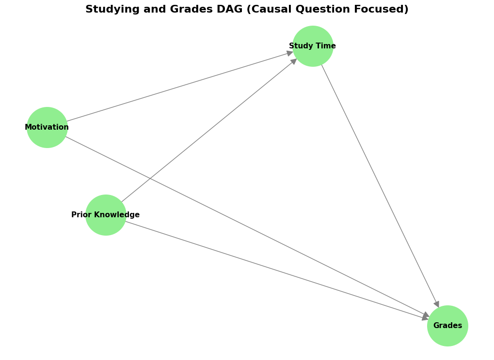
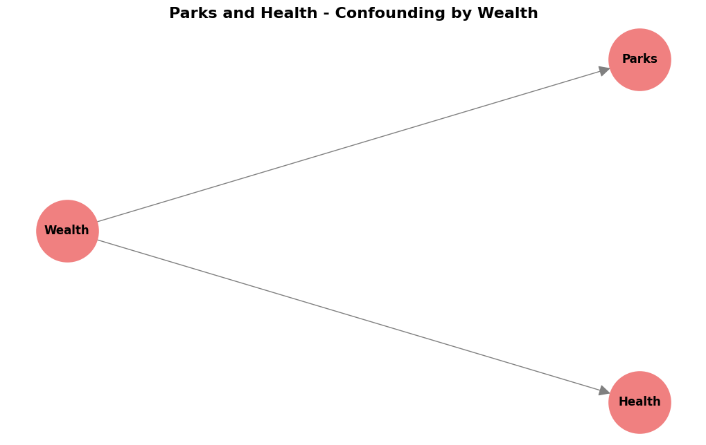

## I. Introduction

In my [last blog post](https://saeedmehrang.github.io/blogs/correlation-to-causation/), "From Correlation to Causation: Humanity's Timeless Quest to Understand 'Why'", I explored how humans have always tried to understand "why" things happen. We want to know about cause and effect, not just things that happen together (correlation). This quest is essential for everything—from making better decisions in medicine and policy to building truly intelligent AI systems.

But how do we figure out cause and effect when we can't run experiments? When we can't do a clinical trial or an A/B test, we need a different approach. This is where **DAGs (Directed Acyclic Graphs)** become very useful. DAGs help us write down everything we know about a problem—all our assumptions about what causes what.

DAGs serve two important purposes:

First, they help experts **communicate and discuss** the problem. By drawing a DAG, everyone can see the assumptions clearly and agree on them. Once everyone is on the same page, we can identify which variables to include in our analysis (the "adjustment set" or confounders). Sometimes, a simple statistical model like logistic regression is all we need afterwards!

Second, DAGs can guide us in building more complex models like Bayesian Networks or Graphical Causal Models. These models can do causal inference, probability calculations, and predictions. The DAG provides the structure for these models.

Once you have a DAG, it becomes a powerful tool for figuring out **how** to estimate causal effects. Different patterns in your DAG tell you which method to use. The most common approach is called **backdoor adjustment**—this is when you identify and control for confounders (variables that affect both cause and effect) to "block" the non-causal paths between them. Think of these as back routes that create fake correlations. By closing these backdoor paths through statistical adjustment, you isolate the true causal effect. In many cases, this is all you need!

But what if you have unmeasured confounders you can't control for? DAGs help here too. If you have an **instrumental variable** (a variable that affects the cause but only influences the effect through the cause), you can use IV methods instead. If you can identify a **mediator** (a variable sitting between cause and effect), you might be able to use **front-door adjustment** even when confounders are unmeasured. The beautiful thing about DAGs is that they show you exactly which method will work for your specific problem. By looking at the structure of your DAG, you can determine whether your causal effect is even identifiable—and if it is, which statistical approach to use. We'll explore these concepts more in future posts, but for now, let's focus on understanding what DAGs are and how to build them.

Think of DAGs like roadmaps. But instead of showing you how to get to a place, they show you how causes lead to effects. They are visual roadmaps for understanding causality.

This post will make DAGs easy to understand. We'll see what they are, how to read them, and how you can use them to think more clearly about cause and effect in your own work.

## II. What Exactly is a DAG?

DAG sounds complicated, but it's not! Let's break it down:

- **D stands for Directed.** This means there is a direction. Think of arrows. In a DAG, arrows show the direction of cause and effect—cause flows to effect.

- **A stands for Acyclic.** This means "no cycles". Imagine roads that only go one way and never loop back to where they started. In DAGs, cause and effect flow in one direction, without circular loops within the graph. (Real life can have feedback loops, but DAGs simplify things to help us reason clearly).

- **G stands for Graph.** A graph is just a picture with points and lines. In DAGs, the points are called **nodes** and the lines with arrows are called **edges**.

So, a DAG is a **Directed Acyclic Graph**—a picture using arrows to show cause-and-effect relationships without any loops going back.

### The Building Blocks

**Nodes:** These are circles or boxes in the picture. Each node represents a **variable**—something we can measure or think about. Examples: "Weather", "Ice Cream Sales", "Study Time", "Health", "Income".

**Edges (Arrows):** These are the arrows connecting the nodes. An arrow from node A to node B (A → B) means that A is a direct cause of B in our model. We can also say "A influences B" or "A leads to B".

**No Arrow?** If there is no arrow between two nodes, that's important too! It means we're saying there is no direct causal relationship between them in our DAG. They might still be related in other ways (like through a common cause), but not directly causing each other according to how we drew our DAG.

**Important Note:** A DAG is a visual guide for you to encode your understanding of cause-and-effect relationships within a problem. This DAG may not be directly transferred into a formal Graphical Causal Model like a Bayesian Network—it can be, but it doesn't have to be! Think of it as your working blueprint for causal thinking.

## III. Reading a DAG: Deciphering the Visual Language of Causality

The direction of the arrow is **VERY** important. **A → B is not the same as B → A!**

- **A → B** means A causes B.
- **B → A** means B causes A.

### Paths in a DAG

A **path** is like following the arrows. Imagine you are walking along the arrows in the DAG.

**Causal Pathways:** When you follow the arrows, you see how cause flows through the system.

- **Direct Effect:** A → B. This is a direct cause. A directly causes B.

- **Indirect Effect:** A → C → B. This is an indirect cause. A causes C, and then C causes B. So, A influences B through C. Think about it like this: Exercise → Fitness → Health. Exercise makes you fitter, and being fit makes you healthier. Exercise has an indirect effect on health through fitness.

### Example 1: The Ice Cream and Shark Attacks DAG

Remember a classic spurious correlation example: Ice cream sales and shark attacks both go up during summer months. But ice cream does not cause shark attacks! The real cause is warm weather.

Let's draw a DAG for this. We have these variables:
- **W = Warm Weather** (Temperature)
- **I = Ice Cream Sales**
- **S = Shark Attacks**

What are the causal relationships?
- Warm weather (W) makes people buy more ice cream (I). So, **W → I**.
- Warm weather (W) also brings more people to the beach, leading to more shark attacks (S). So, **W → S**.
- Does ice cream (I) directly cause shark attacks (S) or vice versa? No to both. So, **no arrow between I and S**.

Here's the Python code to create this DAG:

```python
import networkx as nx
import matplotlib.pyplot as plt

# Create a Directed Graph
G_icecream = nx.DiGraph()

# Add nodes
G_icecream.add_nodes_from(["Warm Weather", "Ice Cream Sales", "Shark Attacks"])

# Add edges representing causal relationships
G_icecream.add_edges_from([("Warm Weather", "Ice Cream Sales"), ("Warm Weather", "Shark Attacks")])

# Layout for better visualization
pos_icecream = nx.spring_layout(G_icecream, seed=42)

# Draw the DAG
plt.figure(figsize=(10, 6))
nx.draw(G_icecream, pos_icecream, with_labels=True, node_size=4000, 
        node_color="skyblue", font_size=12, font_weight="bold", 
        arrowsize=25, edge_color="gray", linewidths=2)
plt.title("Ice Cream and Shark Attacks DAG", fontsize=16, fontweight="bold")
plt.axis('off')
plt.tight_layout()
plt.show()
```

**Output:**


Look at this DAG. "Warm Weather" (W) has arrows pointing to both "Ice Cream Sales" (I) and "Shark Attacks" (S). This shows that warm weather is a common cause for both. There is no arrow between "Ice Cream Sales" and "Shark Attacks". This visually tells us that eating ice cream is not a direct cause of shark attacks. The reason they are correlated is because of the common cause—warm weather bringing people to beaches and ice cream shops simultaneously. The implication of this is that an intervention on Ice Cream Sales will not affect the number of Shark Attacks. This sounds obvious to us humans! but there are complex scenarios where without drawing a DAG we may make a false assumption about the causal structure of the probem and as a result design a study where we intervene on the wrong variable that has no causal path to the outcome variable!

## IV. Building Your Own DAG: A Purposeful Approach for Causal Inference

Now, how do you make your own DAG? It's not automatic! You need to use your **domain knowledge**—what you know about the real world and how things work. DAGs are a way to write down what you believe about cause and effect.

Here are the steps to build a DAG, especially when you want to understand cause and effect for a specific question:

### Step 1: Define Your Causal Question Clearly

First, know what you want to find out. What causal effect are you interested in? For example:
- "Does this medicine cause improvement in health?"
- "Does this new policy cause more jobs?"
- "Does study time cause better grades?"

Having a clear question helps you choose the right variables for your DAG.

### Step 2: Identify Key Variables Relevant to Your Question

Think about the important factors related to your question. List the variables that are likely to be directly involved in the cause and effect you're thinking about.

### Step 3: Focus on Potential Confounders

**Confounders are very important!** Confounders are variables that can mess up your understanding of cause and effect. They can make it look like there is a causal relationship when there isn't, or hide a real causal relationship. 

Think about variables that could influence both your possible "cause" and your "effect". List these potential confounders. Some you can measure, some you might not be able to measure (unmeasured confounders). **Mentioning unmeasured confounders in your DAG is necessary**—it helps you understand the limits of your analysis.

### Step 4: Consider Instrumental Variables (if applicable)

An instrumental variable (IV) is a special variable in causal inference that helps estimate causal effects when confounding is present. In a DAG, an IV is a variable that affects the exposure (treatment) but only influences the outcome through that exposure—not directly or through any other path. Think of it like this: IV → Exposure → Outcome, with no backdoor paths from IV to Outcome. For example, distance to a hospital might be an IV for studying the effect of medical treatment on health—it affects whether someone receives treatment but doesn't directly affect health outcomes except through treatment receipt.


### Step 5: Decide on Mediators (Context-Dependent)

**Mediators** are variables that are in between the cause and effect, like in our "Exercise → Fitness → Health" example. 

- Only include mediators in your DAG if you want to understand **how** the cause leads to the effect—the mechanism.
- If you just want to know the **total effect** of the cause on the effect, you might not need to show mediators in your first DAG.
- You can add them later if you want to study the breakdown of the total causal effect.

**Advanced note:** There's a scenario where a mediator can be a lifesaver—when you have unmeasured confounders that make the causal effect unidentifiable. In this case, you may be able to use "front-door adjustment" to estimate the causal effect. (More on adjustment techniques in future posts!)

### Step 6: Draw the Arrows Based on Assumed Causal Directions

Now, draw your DAG! Connect the variables with arrows. Think about the direction of cause and effect based on what you know.

### Step 7: Check for Cycles

Make sure there are no cycles! No loops going back in your DAG. You can do this programmatically using the networkx library with `nx.is_directed_acyclic_graph()`.

### Step 8: Refine and Simplify (Keep it Focused)

Look at your DAG. Is it too complicated? Are there variables that aren't really important for your question or for understanding possible biases like confounding? Try to make it simpler and clearer. 

You don't need to put every single detail in your DAG. Focus on what's important for answering your causal question and for dealing with potential confounding. Keep it as minimal as possible, only add nodes that are important with this order of priority, both measured and unmeasured confounders, mediators if there is an unmeasured confounder preventing the backdoor adjustment, and lastly instrumental variables.

### Example 2: Studying and Grades DAG

Let's think about student grades. What causes good grades?

**Causal Question:** "What is the causal effect of study time on grades?" We want to know if studying causes better grades.

Let's think about variables:
- **S = Study Time** (This is our "cause" we're interested in)
- **G = Grades** (This is our "effect" or outcome)
- **P = Prior Knowledge** (Students who already know more about the subject find it easier to study and also get better grades. So, prior knowledge could be a confounder).
- **M = Motivation** (Students who are more motivated might study more and also be more likely to get good grades. Motivation could also be a confounder).

We could also think about "Understanding Concepts" as a mediator (Study Time → Understanding → Grades), but for now, let's keep it simpler and focus on potential confounders for the total effect of study time on grades.

Here's the code:

```python
import networkx as nx
import matplotlib.pyplot as plt

# Create a Directed Graph
G_grades = nx.DiGraph()

# Add nodes
G_grades.add_nodes_from(["Study Time", "Grades", "Prior Knowledge", "Motivation"])

# Add edges representing causal relationships
G_grades.add_edges_from([
    ("Prior Knowledge", "Study Time"),
    ("Prior Knowledge", "Grades"),
    ("Motivation", "Study Time"),
    ("Motivation", "Grades"),
    ("Study Time", "Grades")
])

# Layout for visualization
pos_grades = nx.spring_layout(G_grades, seed=42)

# Draw the DAG
plt.figure(figsize=(10, 7))
nx.draw(G_grades, pos_grades, with_labels=True, node_size=3500, 
        node_color="lightgreen", font_size=11, font_weight="bold", 
        arrowsize=20, edge_color="gray", linewidths=2)
plt.title("Studying and Grades DAG (Causal Question Focused)", 
          fontsize=16, fontweight="bold")
plt.axis('off')
plt.tight_layout()
plt.show()

# Check if it's acyclic
print(f"Is this a valid DAG? {nx.is_directed_acyclic_graph(G_grades)}")
```

**Output:**



Look at this DAG. "Prior Knowledge" (P) and "Motivation" (M) both have arrows pointing to "Study Time" (S) and "Grades" (G). This shows they are **potential confounders**. They can affect both study time and grades. The arrow from "Study Time" (S) to "Grades" (G) represents the causal effect we want to understand. 

By drawing this DAG, we can see clearly which variables might cause problems when we try to measure the causal effect of study time on grades. To estimate the true causal effect, we would need to account for (or "adjust for") Prior Knowledge and Motivation.

## V. DAGs and Confounding: Spotting Hidden Influences

We just mentioned confounding. **Confounding is a big problem** in understanding cause and effect. It happens when a third variable—the confounder—influences both the thing that looks like the "cause" and the thing that looks like the "effect". This can create a fake correlation, or hide a real effect.

DAGs are very good at showing confounding! You can see the confounder in the DAG.

### Example 3: Parks and Health

Remember the example about parks and health from my last post? Cities with more parks often have healthier people. Does this mean parks cause better health? Not necessarily!

Let's think about a possible confounder: **City Wealth**.

- **P = Number of Parks**
- **H = Population Health**
- **W = City Wealth** (How wealthy is the city?)

Wealthier cities can afford to build more parks (**W → P**). Wealthier cities also have better healthcare, better food, less pollution, etc., which all lead to better health (**W → H**). So, wealth can influence both parks and health.

Here's the DAG:

```python
import networkx as nx
import matplotlib.pyplot as plt

# Create a Directed Graph
G_parks = nx.DiGraph()

# Add nodes
G_parks.add_nodes_from(["Parks", "Health", "Wealth"])

# Add edges representing causal relationships
G_parks.add_edges_from([("Wealth", "Parks"), ("Wealth", "Health")])

# We could also add a direct effect from Parks to Health if we believe it exists
# G_parks.add_edge("Parks", "Health")

# Layout for better visualization
pos_parks = nx.spring_layout(G_parks, seed=42)

# Draw the DAG
plt.figure(figsize=(10, 6))
nx.draw(G_parks, pos_parks, with_labels=True, node_size=4000, 
        node_color="lightcoral", font_size=12, font_weight="bold", 
        arrowsize=25, edge_color="gray", linewidths=2)
plt.title("Parks and Health - Confounding by Wealth", 
          fontsize=16, fontweight="bold")
plt.axis('off')
plt.tight_layout()
plt.show()
```

**Output:**



Displays a graph with "Wealth" node with arrows pointing to both "Parks" and "Health" nodes. No direct arrow between "Parks" and "Health" in this simplified version.

In this DAG, "Wealth" (W) is a **confounder**. It causes both "Parks" (P) and "Health" (H). The correlation we see between parks and health might be partly (or entirely) because of wealth, not because parks directly cause better health. DAGs help us see these confounding pathways clearly.

To know if parks have a direct effect on health, we would need to account for wealth in our analysis—or better yet, conduct an experiment where we randomly assign parks to cities (though that's not very practical!).

## VI. Creating DAGs from Domain Knowledge: A Practical Guide

To summarize, when you create DAGs for causal questions, remember these key things to **include**:

✅ **Always include your Exposure (Cause) and Outcome (Effect) variables.** These are central to your question.

✅ **Prioritize Confounders!** Think hard about potential confounders—variables that affect both your exposure and outcome. Include both measured and even potential unmeasured confounders in your DAG. Showing unmeasured confounders helps you understand the limits of your analysis.

✅ **Include Instrumental Variables** if you're using IV methods.

✅ **Include Mediators** only if you need to understand the mechanism—the "how" of the causal effect. For just the total effect, you might not need them in your first DAG.

### What to Keep Out (to keep it simple and useful):

❌ Variables that aren't really related to your causal question or to potential confounding.

❌ Too much detail about mechanisms if you don't need it for your main causal question.

❌ Causes that are very far removed from the effect you're studying. Keep it focused on the direct causal pathway you're interested in.

### Making it Better

Creating DAGs is not a one-time thing. It's **iterative**. Start with a simple DAG, and then make it better as you learn more. Talk to experts in the area, get feedback on your DAG, and revise it.

Think about our Ice Cream and Heatstroke example again. If our question is "Does eating ice cream cause heatstroke?", our DAG focused on the confounder "Heat" and the exposure/outcome. We didn't need to include things like "Ice Cream Flavor Preference" or "Time of Day" because they're probably not important confounders for this specific causal question. Keep your DAG focused on what matters for your question!

## VII. A Word of Caution: DAGs are Models, Not Reality

It's important to remember: **DAGs are models. They are not perfect pictures of reality.** They are based on your assumptions. If your assumptions are wrong, your DAG will be wrong, and you might draw wrong conclusions.

DAGs are **simplifications**. Real life is very complex. DAGs do NOT need to show every single detail if they are use for measuing causal effects (though, there are cases where you would need to add as much details to the DAG, and that is when you want to make highly accurate probabilistic inferences or prediction, which is different from causal effect estimation!). Also, sometimes different DAG structures can look the same from just data alone (this is called **Markov Equivalence**—I mentioned this in my previous post, and it's a topic for another day!).

This is why domain knowledge is so important. The quality of your causal conclusions depends on the quality of your DAG, which depends on your understanding of the system you're studying.

## VIII. Conclusion: DAGs—Your First Step Towards Causal Clarity

DAGs are a fantastic first step to think about cause and effect more clearly. They help you:

✨ **Visualize your assumptions** about how things are causally related.

✨ **Understand the causal structure** you're assuming.

✨ **Spot potential confounders** that could bias your analysis.

✨ **Communicate your reasoning** to others clearly.

DAGs are often the **starting point for more advanced causal inference methods**. They guide you to ask the right questions and think about the right analysis. In my previous post, I mentioned that understanding causality is critical not just for science but also for developing truly intelligent AI systems. DAGs are one of the foundational tools that make this possible.

So, start drawing DAGs! For any problem where you're thinking about cause and effect, try to sketch a DAG. You might be surprised how much clearer your thinking becomes! 

In future posts, we'll see how to use DAGs for even more powerful causal inference techniques, including:
- How to identify which variables to "adjust for" (control for) in your analysis
- Different types of biases (selection bias, collider bias)
- More advanced concepts like front-door and back-door adjustment
- How to use DAGs with modern machine learning methods

In future blog posts, I'll introduce you to **DoWhy**, a powerful Python library developed by Microsoft Research for causal inference. DoWhy takes the concepts we're learning—DAGs, confounders, and causal effects—and makes them practical and code-based. With DoWhy, you can encode your DAG, automatically identify the right adjustment sets, choose the best estimation method, and even validate your results through sensitivity analysis. It bridges the gap between drawing a DAG and actually computing causal effects from your data. DoWhy also works seamlessly with EconML (another Microsoft library for causal machine learning), making it possible to use advanced methods like double machine learning and causal forests. Whether you're analyzing medical data, business metrics, or policy impacts, DoWhy provides a structured workflow that ensures you're thinking causally every step of the way. Stay tuned for hands-on tutorials where we'll use DoWhy to turn the DAGs we draw into real causal insights!

## IX. References and Further Learning

**What If (Free Online Book):** https://miguelhernan.org/whatifbook
- A comprehensive and accessible introduction to causal inference

**The Book of Why:** https://www.amazon.com/Book-Why-Science-Cause-Effect/dp/046509760X
- Judea Pearl's groundbreaking work on causal reasoning, written for a general audience

**Course:** https://www.edx.org/learn/data-analysis/harvard-university-causal-diagrams-draw-your-assumptions-before-your-conclusions
- Harvard's excellent course on causal diagrams

**NetworkX Documentation:** https://networkx.org/documentation/stable/
- For learning more about creating and analyzing graphs in Python

---

I hope this blog post makes DAGs easier to understand! Drawing your first DAG is like taking your first step into the world of causal thinking. It might feel awkward at first, but with practice, it becomes second nature. Let me know if you have any questions or if you'd like me to review a DAG you've created!