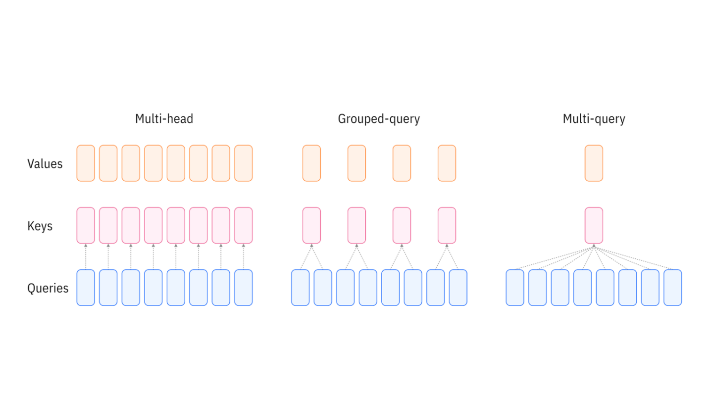

# In a Nutshell

The image below (borrowed from [IBM's blog post on GQA](https://www.ibm.com/think/topics/grouped-query-attention)) schematically illustrates how Grouped-Query Attention differes from the vanila Multi-Head Attention.

As shown in the diagram, the evolution from Multi-Head Attention (MHA) to Grouped-Query Attention (GQA) represents a trade-off between computational efficiency and model expressiveness. In standard MHA (left), each of the *h* query heads has its own dedicated key and value head, resulting in *h* independent attention computations. Multi-Query Attention (MQA, right) takes this to the opposite extreme by using a single shared key-value pair across all query heads, maximizing memory efficiency but potentially limiting the model's ability to capture diverse attention patterns. GQA (center) strikes a balance by organizing query heads into groups, where each group shares a single key-value head. This means that instead of *h* KV heads (MHA) or just 1 KV head (MQA), we use *g* KV heads where 1 < *g* < *h*. This grouping paradigm drops the KV cache size proportionally (by a factor of *h/g*) while maintaining much of the representational power of full multi-head attention, making it particularly valuable for deploying large language models with long context windows.



# Introduction

Transformer models have revolutionized natural language processing, but as they scale to handle longer contexts and larger model sizes, memory becomes a critical bottleneck. Grouped-Query Attention (GQA) offers an elegant solution to this problem, providing a middle ground between the expressiveness of Multi-Head Attention and the efficiency of Multi-Query Attention.

In this post, we'll explore what GQA is, why it matters, and how to implement it in PyTorch. We'll compare it directly with vanilla Multi-Head Attention through both conceptual explanations and working code.

## The Memory Problem in Large Language Models

During inference, language models use a technique called KV caching to avoid recomputing attention for previously generated tokens. While this speeds up generation significantly, the cache can become enormous:

**For a model with:**
- 32 attention heads
- 128 head dimension
- 8,192 token context
- 40 layers

The KV cache alone requires approximately **1.3 GB per sample** (in float16). For batch inference or longer contexts, this quickly becomes prohibitive.

## Multi-Head Attention: The Original Approach

Let's start by understanding standard Multi-Head Attention (MHA) as introduced in the original Transformer paper "Attention is All You Need" (Vaswani et al., 2017).

### The Architecture

In MHA, we have:
- **Query heads**: Multiple sets of query projections (e.g., 32 heads)
- **Key heads**: The same number of key projections (32 heads)
- **Value heads**: The same number of value projections (32 heads)

Each query head has its own corresponding key and value head, providing maximum expressiveness but requiring storage for all KV pairs.

### PyTorch Implementation

Here's a complete implementation of Multi-Head Attention:

```python
import torch
import torch.nn as nn
import math

class MultiHeadAttention(nn.Module):
    def __init__(self, d_model, num_heads):
        """
        Args:
            d_model: Dimension of the model (e.g., 512, 768, etc.)
            num_heads: Number of attention heads (e.g., 8, 12, etc.)
        """
        super().__init__()
        assert d_model % num_heads == 0, "d_model must be divisible by num_heads"
        
        self.d_model = d_model
        self.num_heads = num_heads
        self.head_dim = d_model // num_heads  # Dimension per head
        
        # Linear projections for Q, K, V
        # Each projects from d_model to d_model (which will be split into heads)
        self.q_proj = nn.Linear(d_model, d_model)
        self.k_proj = nn.Linear(d_model, d_model)
        self.v_proj = nn.Linear(d_model, d_model)
        
        # Output projection
        self.out_proj = nn.Linear(d_model, d_model)
        
        # Scaling factor for dot products
        self.scale = math.sqrt(self.head_dim)
    
    def forward(self, x, mask=None):
        """
        Args:
            x: Input tensor of shape (batch_size, seq_len, d_model)
            mask: Optional mask tensor
        
        Returns:
            Output tensor of shape (batch_size, seq_len, d_model)
        """
        batch_size, seq_len, _ = x.shape
        
        # Apply linear projections
        Q = self.q_proj(x)  # (batch_size, seq_len, d_model)
        K = self.k_proj(x)  # (batch_size, seq_len, d_model)
        V = self.v_proj(x)  # (batch_size, seq_len, d_model)
        
        # Reshape and transpose for multi-head attention
        # Split d_model into num_heads * head_dim
        Q = Q.view(batch_size, seq_len, self.num_heads, self.head_dim).transpose(1, 2)
        K = K.view(batch_size, seq_len, self.num_heads, self.head_dim).transpose(1, 2)
        V = V.view(batch_size, seq_len, self.num_heads, self.head_dim).transpose(1, 2)
        # Shape: (batch_size, num_heads, seq_len, head_dim)
        
        # Compute attention scores
        scores = torch.matmul(Q, K.transpose(-2, -1)) / self.scale
        # Shape: (batch_size, num_heads, seq_len, seq_len)
        
        # Apply mask if provided
        if mask is not None:
            scores = scores.masked_fill(mask == 0, float('-inf'))
        
        # Apply softmax to get attention weights
        attn_weights = torch.softmax(scores, dim=-1)
        
        # Apply attention weights to values
        attn_output = torch.matmul(attn_weights, V)
        # Shape: (batch_size, num_heads, seq_len, head_dim)
        
        # Concatenate heads
        attn_output = attn_output.transpose(1, 2).contiguous()
        attn_output = attn_output.view(batch_size, seq_len, self.d_model)
        
        # Apply output projection
        output = self.out_proj(attn_output)
        
        return output
```

### Key Implementation Details

**Why split d_model across heads?**
Instead of giving each head the full `d_model` dimensions (which would be extremely expensive), we split `d_model` evenly across heads. This keeps the total parameter count at O(d_model²) regardless of the number of heads, while allowing different heads to learn different attention patterns.

**The attention computation:**
1. Project input to Q, K, V using learned weight matrices
2. Reshape to split across multiple heads
3. Compute scaled dot-product attention: softmax((Q @ K^T) / √d_k) @ V
4. Concatenate head outputs
5. Apply final output projection

## Multi-Query Attention: Maximum Efficiency

Before discussing GQA, it's worth mentioning Multi-Query Attention (MQA), introduced by Shazeer (2019). MQA takes the efficiency approach to the extreme:

- **Query heads**: Multiple (e.g., 32 heads)
- **Key heads**: Just 1 (shared across all queries)
- **Value heads**: Just 1 (shared across all queries)

This dramatically reduces the KV cache size but can hurt model quality since all query heads must share the same keys and values.

## Grouped-Query Attention: The Best of Both Worlds

Grouped-Query Attention (GQA), introduced by Ainslie et al. (2023) in the context of scaling Transformer models, provides a balanced approach. Instead of having one KV head (MQA) or num_heads KV heads (MHA), GQA uses an intermediate number of KV heads.

### The Architecture

In GQA:
- **Query heads**: Multiple (e.g., 32 heads)
- **Key-Value groups**: Fewer groups (e.g., 8 groups)
- Each group of query heads shares the same key and value heads

For example, with 32 query heads and 8 KV heads, every 4 query heads share one KV head.

### Benefits

1. **Reduced memory**: KV cache is proportionally smaller than MHA
2. **Better quality than MQA**: More expressive than single shared KV
3. **Faster inference**: Less memory bandwidth required
4. **Maintained training efficiency**: Minimal impact on training speed

### PyTorch Implementation

Here's a complete implementation of Grouped-Query Attention:

```python
class GroupedQueryAttention(nn.Module):
    def __init__(self, d_model, num_query_heads, num_kv_heads):
        """
        Args:
            d_model: Dimension of the model (e.g., 512, 768, etc.)
            num_query_heads: Number of query heads (e.g., 32)
            num_kv_heads: Number of key-value heads (e.g., 8)
                         Must divide num_query_heads evenly
        """
        super().__init__()
        assert d_model % num_query_heads == 0, "d_model must be divisible by num_query_heads"
        assert num_query_heads % num_kv_heads == 0, "num_query_heads must be divisible by num_kv_heads"
        
        self.d_model = d_model
        self.num_query_heads = num_query_heads
        self.num_kv_heads = num_kv_heads
        self.num_queries_per_kv = num_query_heads // num_kv_heads
        self.head_dim = d_model // num_query_heads
        
        # Query projection: still projects to full d_model
        self.q_proj = nn.Linear(d_model, d_model)
        
        # Key and Value projections: project to fewer dimensions
        # Only num_kv_heads worth of dimensions instead of num_query_heads
        self.kv_dim = num_kv_heads * self.head_dim
        self.k_proj = nn.Linear(d_model, self.kv_dim)
        self.v_proj = nn.Linear(d_model, self.kv_dim)
        
        # Output projection
        self.out_proj = nn.Linear(d_model, d_model)
        
        # Scaling factor
        self.scale = math.sqrt(self.head_dim)
    
    def forward(self, x, mask=None):
        """
        Args:
            x: Input tensor of shape (batch_size, seq_len, d_model)
            mask: Optional mask tensor
        
        Returns:
            Output tensor of shape (batch_size, seq_len, d_model)
        """
        batch_size, seq_len, _ = x.shape
        
        # Apply linear projections
        Q = self.q_proj(x)  # (batch_size, seq_len, d_model)
        K = self.k_proj(x)  # (batch_size, seq_len, kv_dim) <- Smaller!
        V = self.v_proj(x)  # (batch_size, seq_len, kv_dim) <- Smaller!
        
        # Reshape queries for multiple heads
        Q = Q.view(batch_size, seq_len, self.num_query_heads, self.head_dim).transpose(1, 2)
        # Shape: (batch_size, num_query_heads, seq_len, head_dim)
        
        # Reshape keys and values for fewer heads
        K = K.view(batch_size, seq_len, self.num_kv_heads, self.head_dim).transpose(1, 2)
        V = V.view(batch_size, seq_len, self.num_kv_heads, self.head_dim).transpose(1, 2)
        # Shape: (batch_size, num_kv_heads, seq_len, head_dim)
        
        # Repeat K and V to match the number of query heads
        # Each KV head is shared by num_queries_per_kv query heads
        K = K.repeat_interleave(self.num_queries_per_kv, dim=1)
        V = V.repeat_interleave(self.num_queries_per_kv, dim=1)
        # Shape: (batch_size, num_query_heads, seq_len, head_dim)
        
        # Now the rest is identical to Multi-Head Attention
        scores = torch.matmul(Q, K.transpose(-2, -1)) / self.scale
        
        if mask is not None:
            scores = scores.masked_fill(mask == 0, float('-inf'))
        
        attn_weights = torch.softmax(scores, dim=-1)
        attn_output = torch.matmul(attn_weights, V)
        
        # Concatenate heads
        attn_output = attn_output.transpose(1, 2).contiguous()
        attn_output = attn_output.view(batch_size, seq_len, self.d_model)
        
        # Apply output projection
        output = self.out_proj(attn_output)
        
        return output
```

## Side-by-Side Comparison

Let's compare the two implementations directly:

### Projection Layers

**Multi-Head Attention:**
```python
self.q_proj = nn.Linear(d_model, d_model)
self.k_proj = nn.Linear(d_model, d_model)
self.v_proj = nn.Linear(d_model, d_model)
```

**Grouped-Query Attention:**
```python
self.q_proj = nn.Linear(d_model, d_model)
self.k_proj = nn.Linear(d_model, self.kv_dim)  # Smaller!
self.v_proj = nn.Linear(d_model, self.kv_dim)  # Smaller!
```

### Reshaping

**Multi-Head Attention:**
```python
Q = Q.view(batch_size, seq_len, self.num_heads, self.head_dim).transpose(1, 2)
K = K.view(batch_size, seq_len, self.num_heads, self.head_dim).transpose(1, 2)
V = V.view(batch_size, seq_len, self.num_heads, self.head_dim).transpose(1, 2)
```

**Grouped-Query Attention:**
```python
Q = Q.view(batch_size, seq_len, self.num_query_heads, self.head_dim).transpose(1, 2)
K = K.view(batch_size, seq_len, self.num_kv_heads, self.head_dim).transpose(1, 2)
V = V.view(batch_size, seq_len, self.num_kv_heads, self.head_dim).transpose(1, 2)

# Expand K and V to match Q
K = K.repeat_interleave(self.num_queries_per_kv, dim=1)
V = V.repeat_interleave(self.num_queries_per_kv, dim=1)
```

The key difference is that GQA uses `repeat_interleave` to expand the smaller number of KV heads to match the query heads. This sharing is what gives us the memory savings.

## Performance Comparison

Let's quantify the benefits with a concrete example:

```python
# Configuration
d_model = 4096
num_query_heads = 32
num_kv_heads = 8
seq_len = 2048
num_layers = 32

# KV cache size per layer (in elements, for both K and V)
mha_cache = num_query_heads * (d_model // num_query_heads) * seq_len * 2
gqa_cache = num_kv_heads * (d_model // num_query_heads) * seq_len * 2

# Total cache size for all layers
mha_total = mha_cache * num_layers
gqa_total = gqa_cache * num_layers

print(f"MHA KV cache: {mha_total / 1e6:.1f}M elements")
print(f"GQA KV cache: {gqa_total / 1e6:.1f}M elements")
print(f"Memory reduction: {mha_total / gqa_total:.1f}x")
```

Output:
```
MHA KV cache: 536.9M elements
GQA KV cache: 134.2M elements
Memory reduction: 4.0x
```

With float16 precision, this translates to approximately **1 GB saved** for MHA vs GQA in this configuration.

## Real-World Adoption

GQA has been widely adopted in modern LLMs:
* **Llama 2 and Llama 3** (Meta): Use GQA with 8 KV heads for their 70B parameter models; Llama 3 also uses GQA for the 8B variant
* **Mistral** (Mistral AI): Employs GQA with 8 KV heads for efficient inference
* **Falcon** (TII): Uses multi-query attention (MQA, equivalent to GQA with 1 KV head) for the 7B model, and GQA with 8 groups for the 40B and 175B models

The empirical results show that GQA maintains model quality very close to standard multi-head attention while providing substantial memory and speed benefits during inference.

## When to Use GQA

**Use GQA when:**
- Deploying large models where memory is a constraint
- Serving models at scale with long context windows
- Inference speed and throughput are critical
- You need a good balance between quality and efficiency

**Stick with standard MHA when:**
- Training smaller models where memory isn't a bottleneck
- Maximum model quality is the only priority
- You're working with short context lengths

## Conclusion

Grouped-Query Attention represents a pragmatic evolution in transformer architecture design. By allowing multiple query heads to share key-value heads, it achieves a sweet spot between the expressiveness of Multi-Head Attention and the efficiency of Multi-Query Attention.

The implementation is straightforward—requiring only modifications to the projection dimensions and the addition of a `repeat_interleave` operation—making it easy to integrate into existing codebases. As language models continue to scale in size and context length, techniques like GQA will become increasingly important for making these models practical to deploy.

## References and Further Reading

### Papers

1. **Vaswani, A., et al.** (2017). "Attention is All You Need." *NeurIPS 2017*.  
   [https://arxiv.org/abs/1706.03762](https://arxiv.org/abs/1706.03762)  
   *The original Transformer paper introducing Multi-Head Attention.*

2. **Shazeer, N.** (2019). "Fast Transformer Decoding: One Write-Head is All You Need."  
   [https://arxiv.org/abs/1911.02150](https://arxiv.org/abs/1911.02150)  
   *Introduces Multi-Query Attention (MQA).*

3. **Ainslie, J., et al.** (2023). "GQA: Training Generalized Multi-Query Transformer Models from Multi-Head Checkpoints."  
   [https://arxiv.org/abs/2305.13245](https://arxiv.org/abs/2305.13245)  
   *The paper that formally introduces Grouped-Query Attention.*

4. **Touvron, H., et al.** (2023). "Llama 2: Open Foundation and Fine-Tuned Chat Models."  
   [https://arxiv.org/abs/2307.09288](https://arxiv.org/abs/2307.09288)  
   *Describes the use of GQA in Llama 2.*

### Additional Resources

5. **Hugging Face Transformers Documentation**  
   [https://huggingface.co/docs/transformers](https://huggingface.co/docs/transformers)  
   *Practical implementations of various attention mechanisms.*

6. **The Illustrated Transformer** by Jay Alammar  
   [https://jalammar.github.io/illustrated-transformer/](https://jalammar.github.io/illustrated-transformer/)  
   *Excellent visual explanation of transformer architecture.*

---

*The complete code from this tutorial is available as a standalone script. Feel free to experiment with different configurations of query heads and KV heads to see the trade-offs firsthand!*