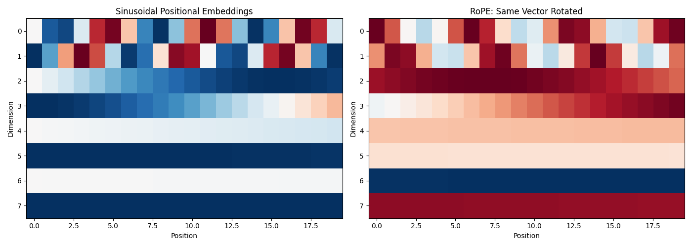
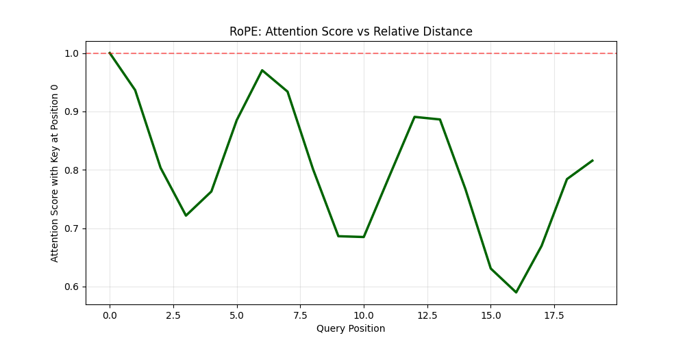
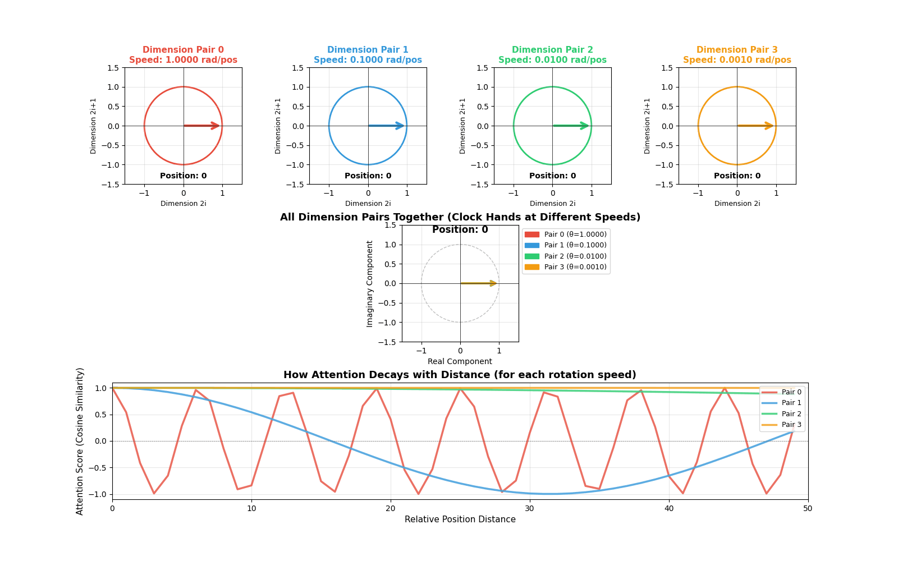

## Introduction

This is a blog post as part of my personal LLM learning and knowledge refreshing. I hope other readers find it useful as well. The code in this blog is a simplified version for educational purposes. For a more optimized and production ready code, see https://meta-pytorch.org/torchtune/stable/_modules/torchtune/modules/position_embeddings.html

If you are learning about modern language models like LLaMA or GPT, you probably heard about something called RoPE. RoPE stands for **Rotary Position Embedding**. It is a way to help the model understand the position of words in a sentence.

In this article, I will explain RoPE in simple terms. I will show you how it is different from the old method used in the original Transformer paper ("Attention is All You Need"). And I will give you code examples with visualizations so you can really understand it.

## What Are Positional Embeddings?

First, let me explain why we need positional embeddings at all.

When a Transformer model reads a sentence, it looks at all words at the same time. But this creates a problem: the model does not know which word comes first and which word comes second. The sentence "dog bites man" and "man bites dog" have the same words, but very different meanings!

So we need to tell the model: "This word is in position 1, this word is in position 2," and so on. This is what positional embeddings do.

## The Old Way: Sinusoidal Position Embeddings

The original Transformer paper by Vaswani et al. (2017) used something called **sinusoidal positional embeddings**. Let me explain how it works.

### How Sinusoidal Embeddings Work

Imagine you have embedding dimension `d_model = 8`. This means each word is represented by 8 numbers.

The idea is simple:
- Put **4 sine waves** at even positions (indices 0, 2, 4, 6)
- Put **4 cosine waves** at odd positions (indices 1, 3, 5, 7)
- Each wave has a different frequency (some oscillate fast, some slow)
- Each wave has length equal to `max_len` (maximum sequence length)

The formula looks like this:

```
PE(pos, 2i) = sin(pos / 10000^(2i/d))
PE(pos, 2i+1) = cos(pos / 10000^(2i/d))
```

Where:
- `pos` is the position (0, 1, 2, 3, ...)
- `i` is the dimension index
- `d` is `d_model`

Each position gets a unique pattern of sine and cosine values. This pattern is then **added** to the word embedding before it goes into the model.

Here is the code:

```python
def sinusoidal_embeddings(max_len, d_model):
    position = np.arange(max_len)[:, np.newaxis]
    div_term = np.exp(np.arange(0, d_model, 2) * -(np.log(10000.0) / d_model))
    
    pe = np.zeros((max_len, d_model))
    pe[:, 0::2] = np.sin(position * div_term)  # Even indices
    pe[:, 1::2] = np.cos(position * div_term)  # Odd indices
    return pe
```

### The Problem with Sinusoidal Embeddings

Sinusoidal embeddings tell the model: **"I am at position 5"** (absolute position). But often, what matters more is the relative distance between words. For example, in the sentence "The cat sat on the mat," the word "cat" is close to "sat" (distance = 1), but far from "mat" (distance = 4).

Sinusoidal embeddings do not naturally encode this relative distance.

## The New Way: Rotary Position Embeddings (RoPE)

RoPE was introduced in 2021 in the paper "RoFormer: Enhanced Transformer with Rotary Position Embedding." It has become very popular in modern language models.

### The Core Idea: Rotation

Instead of adding position information, RoPE **rotates** the query and key vectors by an angle that depends on their position.

Think of it like a clock:
- At 12 o'clock, the hour hand points straight up (angle = 0°)
- At 3 o'clock, it has rotated 90 degrees
- At 6 o'clock, it has rotated 180 degrees

RoPE does the same thing to vectors! Each position gets rotated by a certain angle.

### Why Rotation Encodes Relative Position

Here is the magic part: when you compute the dot product between two rotated vectors, the result depends only on the **difference** in their rotation angles, not the absolute angles.

**Example:**
- Vector at position 0: rotated by 0°
- Vector at position 5: rotated by 50°
- Vector at position 10: rotated by 100°

When you compute attention between position 5 and position 0:
- Angle difference = 50° - 0° = 50°

When you compute attention between position 10 and position 5:
- Angle difference = 100° - 50° = 50° (same!)

Both pairs are 5 positions apart, so they get similar attention scores! This is **relative position encoding**.

### Multiple Rotation Speeds

Now here is an important detail: RoPE does not use just one rotation angle per position. It uses **multiple angles** - one for each pair of dimensions.

For `d_model = 8`, we have 4 dimension pairs:
- Dimensions (0, 1) → one rotation angle
- Dimensions (2, 3) → another rotation angle
- Dimensions (4, 5) → another rotation angle
- Dimensions (6, 7) → another rotation angle

And each pair rotates at a different speed:

```python
theta = 10000 ** (-2 * np.arange(0, d_model // 2) / d_model)
```

This gives us something like:
- θ₀ ≈ 1.0 (fast rotation)
- θ₁ ≈ 0.1 (slower)
- θ₂ ≈ 0.01 (even slower)
- θ₃ ≈ 0.001 (very slow)

Why multiple speeds? Just like a clock has an hour hand (slow), minute hand (medium), and second hand (fast), RoPE uses multiple rotation speeds to capture positional information at different scales:
- **Fast rotations**: Good for nearby words (short-range dependencies)
- **Slow rotations**: Good for distant words (long-range dependencies)

### The Rotation Formula

To rotate a 2D point (x₁, x₂) by angle θ, we use the rotation matrix:

```
x₁' = x₁ * cos(θ) - x₂ * sin(θ)
x₂' = x₁ * sin(θ) + x₂ * cos(θ)
```

This is a standard formula from linear algebra. RoPE applies this rotation to each pair of dimensions independently.

Here is the code:

```python
def apply_rope(x, position, d_model):
    # Calculate rotation speeds for each dimension pair
    theta = 10000 ** (-2 * np.arange(0, d_model // 2) / d_model)
    
    # Calculate angles for this position
    m_theta = position * theta
    
    # Apply rotation to each dimension pair
    x_rotated = x.copy()
    for i in range(d_model // 2):
        x1 = x[2*i]
        x2 = x[2*i + 1]
        
        cos_val = np.cos(m_theta[i])
        sin_val = np.sin(m_theta[i])
        
        x_rotated[2*i] = x1 * cos_val - x2 * sin_val
        x_rotated[2*i + 1] = x1 * sin_val + x2 * cos_val
    
    return x_rotated
```

Notice that `m_theta[i]` is the angle for dimension pair `i`. As position increases, these angles increase linearly (but at different rates). This is exactly like clock hands rotating!

### Understanding Radians

The angles are measured in **radians**. A radian is just another way to measure angles:
- 2π radians = 360° = one full rotation around a circle
- π radians = 180° = half rotation
- π/2 radians = 90° = quarter rotation

So when position = 10 and θ = 0.5:
- Angle = 10 × 0.5 = 5 radians
- This is 5/(2π) ≈ 0.8 full rotations around the circle

The fast-rotating dimensions complete many full rotations as position increases, while slow-rotating dimensions barely move.

## Visualizing the Difference

Let me show you a visualization that compares both methods. Here is the complete code:

```python
import numpy as np
import matplotlib.pyplot as plt

# Setup
d_model = 8
seq_len = 20

# Sinusoidal embeddings
def sinusoidal_embeddings(max_len, d_model):
    position = np.arange(max_len)[:, np.newaxis]
    div_term = np.exp(np.arange(0, d_model, 2) * -(np.log(10000.0) / d_model))
    pe = np.zeros((max_len, d_model))
    pe[:, 0::2] = np.sin(position * div_term)
    pe[:, 1::2] = np.cos(position * div_term)
    return pe

# RoPE
def apply_rope(x, position, d_model):
    theta = 10000 ** (-2 * np.arange(0, d_model // 2) / d_model)
    m_theta = position * theta
    x_rotated = x.copy()
    for i in range(d_model // 2):
        x1 = x[2*i]
        x2 = x[2*i + 1]
        cos_val = np.cos(m_theta[i])
        sin_val = np.sin(m_theta[i])
        x_rotated[2*i] = x1 * cos_val - x2 * sin_val
        x_rotated[2*i + 1] = x1 * sin_val + x2 * cos_val
    return x_rotated

# Generate embeddings
sin_embeddings = sinusoidal_embeddings(seq_len, d_model)

# For RoPE, rotate a sample vector at each position
sample_query = np.random.randn(d_model)
sample_query = sample_query / np.linalg.norm(sample_query)
rope_embeddings = []
for pos in range(seq_len):
    rope_vec = apply_rope(sample_query, pos, d_model)
    rope_embeddings.append(rope_vec)
rope_embeddings = np.array(rope_embeddings)

# Visualize
fig, axes = plt.subplots(1, 2, figsize=(14, 5))

# Sinusoidal
axes[0].imshow(sin_embeddings.T, aspect='auto', cmap='RdBu')
axes[0].set_xlabel('Position')
axes[0].set_ylabel('Dimension')
axes[0].set_title('Sinusoidal Positional Embeddings')

# RoPE
axes[1].imshow(rope_embeddings.T, aspect='auto', cmap='RdBu')
axes[1].set_xlabel('Position')
axes[1].set_ylabel('Dimension')
axes[1].set_title('RoPE: Same Vector Rotated')

plt.tight_layout()
plt.show()
```




**Left plot (Sinusoidal)**: Each position has its own unique pattern. These patterns are added to the input.

**Right plot (RoPE)**: The same vector is rotated at each position. You can see wave-like patterns because rotation creates oscillations.

## How RoPE Affects Attention Scores

Now let me show you something very important: how RoPE makes attention scores depend on relative distance.

### What Are We Measuring?

I will create a simple experiment:
1. Take a key vector at position 0
2. Take query vectors at different positions (0, 1, 2, 3, ...)
3. Apply RoPE to both
4. Compute the dot product (this is the attention score before softmax)

This shows us: **"If I have a word at position 0, how much attention does it get from words at other positions?"**

Here is the code:

```python
def compute_rope_attention_pattern(query_vector, max_len, d_model):
    scores = []
    for pos in range(max_len):
        # Apply RoPE to query at this position
        q_rotated = apply_rope(query_vector, pos, d_model)
        # Apply RoPE to key at position 0
        k_rotated = apply_rope(query_vector, 0, d_model)
        # Compute dot product (attention score)
        score = np.dot(q_rotated, k_rotated)
        scores.append(score)
    return np.array(scores)

# Calculate attention pattern
attention_pattern = compute_rope_attention_pattern(sample_query, seq_len, d_model)

# Visualize
plt.figure(figsize=(10, 5))
plt.plot(attention_pattern, linewidth=2.5, color='darkgreen')
plt.axhline(y=attention_pattern[0], color='red', linestyle='--', alpha=0.5)
plt.xlabel('Query Position')
plt.ylabel('Attention Score with Key at Position 0')
plt.title('RoPE: Attention Score vs Relative Distance')
plt.grid(True, alpha=0.3)
plt.show()

print(f"Score at position 0 (distance=0): {attention_pattern[0]:.3f}")
print(f"Score at position 5 (distance=5): {attention_pattern[5]:.3f}")
print(f"Score at position 10 (distance=10): {attention_pattern[10]:.3f}")
```



### What This Shows

Notice that even though we use the **same vector** for both query and key, the attention scores are different at each position! Why?

Because at each position, the vector is rotated by a different angle:
- Position 0: rotated by 0°
- Position 5: rotated by some angle × 5
- Position 10: rotated by some angle × 10

The dot product between two rotated versions of the same vector equals **cos(angle_difference)**. As the angle difference increases, cosine decreases, so the attention score decreases.

**Key insight**: Attention naturally decays with distance! Words that are far apart attend to each other less than words that are close together. This happens automatically, without the model needing to learn it.

## Visualizing Rotations: The Clock Analogy

To really understand RoPE, I created an animation that shows how vectors rotate at different speeds. 

[**INSERT GIF HERE: rope_animation.gif**]

*Animation showing four dimension pairs rotating at different speeds as position increases. The top row shows individual circles for each dimension pair. The middle shows all rotations combined (like multiple clock hands). The bottom shows how attention scores decay with distance for each rotation speed.*

### What You See in the Animation

**Top row (Individual circles)**: Each circle represents one dimension pair. Watch how they rotate at different speeds:
- **Red (Dimension pair 0)**: Rotates very fast - completes many full rotations
- **Blue (Dimension pair 1)**: Rotates slower
- **Green (Dimension pair 2)**: Rotates even slower  
- **Orange (Dimension pair 3)**: Rotates very slowly - barely moves

This is exactly like clock hands! The "second hand" (red) moves fast, the "hour hand" (orange) moves slowly.

**Middle (Combined view)**: Shows all dimension pairs together. You can see how the model encodes position information at multiple timescales. Fast rotations help distinguish nearby positions, slow rotations help distinguish distant positions.

**Bottom (Attention decay)**: This is the most important part! It shows how the attention score (cosine similarity) changes with distance:
- Fast rotations (red): Oscillate quickly - capture short-range dependencies
- Slow rotations (orange): Decay slowly - capture long-range dependencies

The combination of all these rotation speeds gives the model rich information about both nearby and distant words.

### Code for the Animation

Here is the code to create this visualization:

```python
import numpy as np
import matplotlib.pyplot as plt
from matplotlib.animation import FuncAnimation
from matplotlib.patches import Circle, FancyArrowPatch
import matplotlib.patches as mpatches

from IPython.display import HTML

# Setup for RoPE rotation visualization
d_model = 8  # 4 dimension pairs
num_pairs = d_model // 2

# Calculate theta values (rotation speeds for each dimension pair)
theta = 10000 ** (-2 * np.arange(0, num_pairs) / d_model)
print("Rotation speeds (radians per position):")
for i, t in enumerate(theta):
    print(f"  Dimension pair {i}: {t:.4f} rad/pos = {np.degrees(t):.2f}°/pos")

# Create figure with subplots
fig = plt.figure(figsize=(16, 10))
gs = fig.add_gridspec(3, 4, hspace=0.35, wspace=0.3)

# Axes for each dimension pair (circles)
circle_axes = [fig.add_subplot(gs[0, i]) for i in range(4)]
# Axes for showing all rotations together
combined_ax = fig.add_subplot(gs[1, :])
# Axes for attention decay visualization
attention_ax = fig.add_subplot(gs[2, :])

# Colors for each dimension pair
colors = ['#e74c3c', '#3498db', '#2ecc71', '#f39c12']

# Setup circle plots
arrows = []
position_texts = []

for idx, ax in enumerate(circle_axes):
    ax.set_xlim(-1.5, 1.5)
    ax.set_ylim(-1.5, 1.5)
    ax.set_aspect('equal')
    ax.grid(True, alpha=0.3)
    ax.axhline(y=0, color='k', linewidth=0.5)
    ax.axvline(x=0, color='k', linewidth=0.5)

    # Draw circle
    circle = Circle((0, 0), 1, fill=False, color=colors[idx], linewidth=2)
    ax.add_patch(circle)

    # Initial arrow
    arrow = FancyArrowPatch((0, 0), (1, 0),
                           arrowstyle='->', mutation_scale=20,
                           linewidth=3, color=colors[idx])
    ax.add_patch(arrow)
    arrows.append(arrow)

    # Labels
    speed_text = f"Speed: {theta[idx]:.4f} rad/pos"
    ax.set_title(f'Dimension Pair {idx}\n{speed_text}',
                fontsize=11, fontweight='bold', color=colors[idx])
    ax.set_xlabel('Dimension 2i', fontsize=9)
    ax.set_ylabel(f'Dimension 2i+1', fontsize=9)

    # Position text
    pos_text = ax.text(0, -1.35, 'Position: 0', ha='center', fontsize=10,
                      fontweight='bold')
    position_texts.append(pos_text)

# Setup combined view
combined_ax.set_xlim(-1.5, 1.5)
combined_ax.set_ylim(-1.5, 1.5)
combined_ax.set_aspect('equal')
combined_ax.grid(True, alpha=0.3)
combined_ax.axhline(y=0, color='k', linewidth=0.5)
combined_ax.axvline(x=0, color='k', linewidth=0.5)
combined_ax.set_title('All Dimension Pairs Together (Clock Hands at Different Speeds)',
                     fontsize=13, fontweight='bold')
combined_ax.set_xlabel('Real Component', fontsize=10)
combined_ax.set_ylabel('Imaginary Component', fontsize=10)

# Draw reference circle
ref_circle = Circle((0, 0), 1, fill=False, color='gray',
                   linewidth=1, linestyle='--', alpha=0.5)
combined_ax.add_patch(ref_circle)

# Arrows for combined view
combined_arrows = []
for idx in range(num_pairs):
    arrow = FancyArrowPatch((0, 0), (1, 0),
                           arrowstyle='->', mutation_scale=15,
                           linewidth=2.5, color=colors[idx],
                           alpha=0.8)
    combined_ax.add_patch(arrow)
    combined_arrows.append(arrow)

# Legend for combined view
legend_elements = [mpatches.Patch(color=colors[i],
                                 label=f'Pair {i} (θ={theta[i]:.4f})')
                  for i in range(num_pairs)]
combined_ax.legend(handles=legend_elements, loc='upper left', bbox_to_anchor=(1, 1), fontsize=9) # Modified legend location

combined_pos_text = combined_ax.text(0, 1.3, 'Position: 0', ha='center',
                                    fontsize=12, fontweight='bold')

# Setup attention decay plot
max_positions = 50
positions = np.arange(max_positions)

# Initialize plot lines
attention_lines = []
for idx in range(num_pairs):
    line, = attention_ax.plot([], [], color=colors[idx], linewidth=2.5,
                             label=f'Pair {idx}', alpha=0.8)
    attention_lines.append(line)

attention_ax.set_xlim(0, max_positions)
attention_ax.set_ylim(-1.1, 1.1)
attention_ax.grid(True, alpha=0.3)
attention_ax.set_xlabel('Relative Position Distance', fontsize=11)
attention_ax.set_ylabel('Attention Score (Cosine Similarity)', fontsize=11)
attention_ax.set_title('How Attention Decays with Distance (for each rotation speed)',
                      fontsize=13, fontweight='bold')
attention_ax.legend(loc='upper right', fontsize=9)
attention_ax.axhline(y=0, color='k', linewidth=0.5, linestyle='--', alpha=0.5)

# Animation function
def animate(frame):
    position = frame % max_positions

    # Update individual circle plots
    for idx in range(num_pairs):
        angle = theta[idx] * position
        x = np.cos(angle)
        y = np.sin(angle)
        arrows[idx].set_positions((0, 0), (x, y))
        position_texts[idx].set_text(f'Position: {position}')

    # Update combined view
    for idx in range(num_pairs):
        angle = theta[idx] * position
        x = np.cos(angle)
        y = np.sin(angle)
        combined_arrows[idx].set_positions((0, 0), (x, y))

    combined_pos_text.set_text(f'Position: {position}')

    # Update attention decay plot
    for idx in range(num_pairs):
        # Compute cosine similarity between position 0 and all other positions
        # This is the dot product of two unit vectors rotated by different angles
        angles_diff = theta[idx] * positions
        attention_scores = np.cos(angles_diff)
        attention_lines[idx].set_data(positions, attention_scores)

    return arrows + combined_arrows + attention_lines + position_texts + [combined_pos_text]

# Create animation
anim = FuncAnimation(fig, animate, frames=max_positions,
                    interval=100, blit=False, repeat=True)
anim.save('rope_animation.gif', writer='pillow', fps=10)

plt.suptitle('RoPE: Rotary Position Embeddings Visualization\n' +
             'Watch how different dimension pairs rotate at different speeds (like clock hands)',
             fontsize=15, fontweight='bold', y=0.98)

HTML(anim.to_jshtml())
```




## Key Differences: Sinusoidal vs RoPE

Let me summarize the main differences:

- Type: Sinusoidal uses absolute position encoding, while RoPE uses relative position encoding
- Where applied: Sinusoidal is added to input embeddings, whereas RoPE is applied in the attention mechanism
- How it works: Sinusoidal adds fixed patterns to embeddings, while RoPE rotates query and key vectors
- Information encoded: Sinusoidal encodes "I am at position 5", while RoPE encodes "We are 5 positions apart"
- Parameters: Both use fixed formulas with no learnable parameters
- Long sequences: Sinusoidal has limited extrapolation ability, while RoPE offers better extrapolation for longer sequences


## Deep Dive: Why Dimension Pairs? Why Not Rotate the Whole Vector?

This is a very important question that helps you understand the design of RoPE at a deeper level!

### The Problem with Rotating the Whole Vector

You might think: "Why not just rotate the entire embedding vector as one unit?"

If we did that, we would have only **one rotation angle** per position. This would be like having only one "clock hand" - just one frequency.

**The problem:** With a single rotation speed, you run into **aliasing**. Let me explain.

Say we rotate the whole vector by angle θ per position:
- Position 0: angle = 0°
- Position 1: angle = θ°
- Position 2: angle = 2θ°
- ...

But what happens when you complete a full circle? At position `2π/θ`, the angle is `2π` radians (360°), which brings you back to the starting point!

**The vector at position 0 and position `2π/θ` would look identical!**

The model cannot distinguish them. This is called aliasing - distant positions become indistinguishable.

### Example with Numbers

Say θ = 1 radian per position:
- Position 0: angle = 0 radians
- Position 6: angle = 6 radians ≈ 0.95 full rotations
- Position 6.28: angle = 6.28 radians = 2π = **exactly one full circle, back to 0!**

So positions 0 and 6.28 would be confused as the same position! For longer sequences, this becomes a huge problem.

### Why Pairs Work: Multi-Scale Encoding

By splitting the embedding into **pairs with different rotation speeds**, we get multiple "clock hands" operating at different frequencies:

```
Dimension pair 0: θ₀ = 1.0    (fast rotation - like a second hand)
Dimension pair 1: θ₁ = 0.1    (slower - like a minute hand)
Dimension pair 2: θ₂ = 0.01   (even slower - like an hour hand)
Dimension pair 3: θ₃ = 0.001  (very slow - like a day marker)
```

### The Extended Clock Analogy

Think about how we tell time:
- **Only a second hand?** You cannot distinguish 12:00:30 from 12:01:30 (both show 30 seconds)
- **Only a minute hand?** You cannot distinguish 12:00 from 1:00 (both at the top)
- **All three hands together?** You get a unique position for hours, minutes, AND seconds!

Similarly with RoPE:
- **Fast rotation (pair 0):** Distinguishes nearby positions (position 1 vs 2 vs 3)
- **Slow rotation (pair 3):** Distinguishes distant positions (position 100 vs 200 vs 300)
- **All pairs together:** Create a unique fingerprint for each position!


## What makes RoPE different

RoPE has become the standard choice for modern language models for several reasons:

1. **Better length generalization**: RoPE can handle sequences longer than those seen during training more gracefully

2. **Natural relative encoding**: Relative position often matters more than absolute position

3. **Efficient**: Rotation operations are fast and do not add much computation

4. **No extra parameters**: Like sinusoidal embeddings, RoPE does not require learned parameters

5. **Works directly in attention**: Position information emerges naturally from the attention mechanism itself

## Conclusion

RoPE is a clever technique that uses rotation to encode position information. Instead of telling the model "this word is at position 5," it rotates vectors so that the attention mechanism naturally computes "these words are 5 positions apart."

The key insights are:
- RoPE rotates vectors by angles proportional to their position
- Different dimension pairs rotate at different speeds (multi-scale encoding)
- The dot product between rotated vectors depends only on their relative distance
- Attention naturally decays with distance


## Further Reading

- Original RoFormer paper: "RoFormer: Enhanced Transformer with Rotary Position Embedding" (Su et al., 2021)
- Original Transformer paper: "Attention is All You Need" (Vaswani et al., 2017)
- RoPE is used in: LLaMA, PaLM, GPT-NeoX, and many other modern LLMs

---

*All code examples can be run in Google Colab or any Python environment with numpy and matplotlib installed.*
